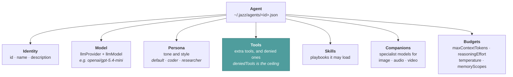
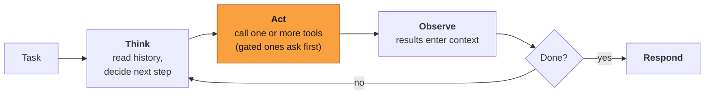

# Agents

An agent is the thing that does the work. Unlike a chatbot that answers one prompt and stops,
an agent runs a loop: it reads the situation, calls tools, observes what came back, and keeps
going until the task is done or its budget runs out.

One distinction worth being precise about: **Jazz itself is not an agent — it is the harness**,
the runtime agents run inside. An *agent* in Jazz is a configuration: a model, a persona, a
toolset, skills, and memory, saved as a file. Jazz hosts any number of them, runs their loops,
guards their budgets, and gates their tools — which is why `jazz agent create` makes another
agent, not another Jazz.

An agent is also not a running process or a conversation. Each invocation resolves the current
definition, builds the permitted toolset, then starts or resumes a conversation — so editing an
agent changes the next turn, with nothing to restart.

---

## What an agent is made of



The smallest agent that runs is three fields and a persona:

```json
{
  "id": "reviewer",
  "name": "Reviewer",
  "config": {
    "persona": "coder",
    "llmProvider": "openai",
    "llmModel": "gpt-5.4"
  }
}
```

`jazz agent create` writes one interactively. Files live under the active Jazz data directory
and are shared by every surface using that installation — the same agent answers in your
terminal, in CI, and on Telegram.

### Model

Written `provider/model` with a **slash** — `anthropic/claude-sonnet-4-5`,
`openrouter/qwen/qwen3-next-80b-a3b-instruct:free`, `ollama/qwen3`. Stored split into
`llmProvider` and `llmModel`. Eighteen providers are available, including local ones that need
no API key; see [Model providers](../configure/providers.md).

### Persona

Shapes *how* the agent communicates — tone, style, vocabulary — independently of the model.
Ships with `default`, `coder`, and `researcher`, and you can write your own. See
[Personas](./personas.md).

### Tools

Two fields, pulling in opposite directions:

- **`tools` is additive.** It grants capabilities *on top of* the built-in bundle the persona
  already permits. Listing a built-in tool changes nothing, and leaving one out does **not**
  withhold it.
- **`deniedTools` subtracts, last.** It is applied after every other grant, which makes it the
  reliable way to enforce a per-agent ceiling. An agent with `execute_command` denied cannot run
  shell commands, whatever the approval policy says.

Give each agent the fewest capabilities its job needs, and reach for `deniedTools` — not an
omission — when you mean it. See [Tools](./tools.md).

### Context budget

`maxContextTokens` caps how much conversation this agent may carry, in tokens, whatever the
model would allow. Unset, it uses the model's own window. Set it to keep cost and latency
predictable, or to stop a model degrading long before its advertised limit: the agent warns at
70% of the budget and auto-compacts at 80%, so a smaller ceiling means earlier, cheaper
compaction rather than a hard failure. See [Context lifecycle](../maintainers/context-lifecycle.md).

### Skills

Skills are **not** bundles of tools — they are playbooks: Markdown instructions the agent loads
on demand when a task matches. Two agents can have identical tools and differ entirely in which
skills they reach for. See [Skills](./skills.md).

### Companions

`companions` lets one identity borrow specialist models without switching its main model.
Analysis and generation bind independently, per medium:

```json
{
  "companions": {
    "analyze:image": "provider/vision-model",
    "analyze:audio": "provider/audio-model",
    "generate:image": "provider/image-generation-model"
  }
}
```

A companion run is bounded, tool-free, and isolated: analysis returns evidence, generation
returns a file, and neither creates a second identity or conversation. A cheap text model can
orchestrate the work while a vision model does the looking. See
[Model companions](../features/media.md).

---

## Project instructions (AGENTS.md)

Jazz reads [`AGENTS.md`](https://agents.md) — the cross-tool convention for telling an agent how
a project works: build and test commands, conventions, house rules. Drop one at the root of a
repository and every Jazz agent working there picks it up, with no per-agent configuration.

Discovery runs on each turn against the agent's current working directory:

| Order | File                    | Purpose                                        |
| ----- | ----------------------- | ---------------------------------------------- |
| 1     | `~/.agents/AGENTS.md`   | Your personal defaults, across every project   |
| 2     | `<repo root>/AGENTS.md` | How this project works                         |
| 3     | `<subdirectory>/AGENTS.md` | Overrides for one package or area           |

The walk climbs from the working directory to the repository root — the nearest ancestor with a
`.git` — and stops there, so a checkout never inherits an unrelated `AGENTS.md` from a directory
above it. Files enter the system prompt outermost-first, so **when two conflict, the more
specific one wins**. Each file is capped at 32 KB; keep them short and they stay effective.

Edits take effect on the next turn. Nothing to restart.

---

## The execution loop



Up to 100 iterations by default, with guards that keep a long run from spiralling: budget
pressure warnings, loop detection, and automatic context compaction. The full mechanism is in
[Run lifecycle](../maintainers/run-lifecycle.md).

---

## Patterns worth copying

| Pattern         | Shape                                          | Good for                                      |
| --------------- | ---------------------------------------------- | --------------------------------------------- |
| **Generalist**  | broad — files, git, web, shell                 | Daily driver in your terminal                 |
| **Specialist**  | narrow — reads and greps, everything else denied | CI review, anything unattended              |
| **Delegator**   | adds `spawn_subagent`                          | Deep research, work that would blow one window |
| **Mixed-model** | cheap main model plus `companions`             | Screenshots, recordings, generated assets     |

The delegator pattern is the one people underuse. `spawn_subagent` hands a task to a child with
its own context window, which returns a summary instead of 100k tokens of raw sources — and a
sub-agent never holds more tools than its parent. See
[Peers and sub-agents](./peers-and-subagents.md).

---

## Where it all lives

Agents are one JSON file each under the Jazz data directory (`~/.jazz/agents/<id>.json` by
default). Edit them with `jazz agent edit <id>`, or by hand.

Conversations persist separately, per conversation id. In the terminal, `/resume` browses past
ones, `/new` starts a fresh one, and `/fork` branches from the last message; headless callers
pass `--conversation <id>` and get the same thread back across invocations — which is what gives
a chat bridge memory without storing anything itself. Transcripts are plaintext JSON: treat that
directory as sensitive.

---

## Related

- [Create an agent](../getting-started/create-an-agent.md) — the practical walkthrough
- [Agent configuration](../configure/agents.md) — every field
- [Personas](./personas.md) · [Skills](./skills.md) · [Tools](./tools.md)
- [Run lifecycle](../maintainers/run-lifecycle.md) — what the harness does around a turn
