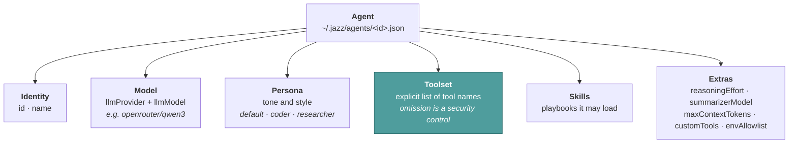
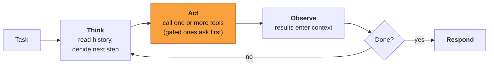

# Agents

This page explains what an agent is made of, so you can configure one deliberately.

An agent is the thing that does the work. Unlike a chatbot that answers one prompt and stops,
an agent runs a loop: it reads the situation, calls tools, observes what came back, and keeps
going until the task is done or its budget runs out.

One distinction worth being precise about: **Jazz itself is not an agent — it is the harness**
(the runtime agents run in). An *agent* in Jazz is a configuration: a model, a persona, a
toolset, skills, and memory, saved as a file. Jazz hosts any number of them, runs their loops,
guards their budgets, and gates their tools — which is why `jazz agent create` makes another
agent, not another Jazz. See [the agent loop](../internals/agent-loop.md) for what the harness
does around a run.

---

## What an agent is made of

### Model

Written `provider/model` with a **slash** — `openrouter/qwen/qwen3-next-80b-a3b-instruct:free`,
`anthropic/claude-sonnet-4-5`, `ollama/qwen3`. Stored split into `llmProvider` and `llmModel`.
Eighteen providers are available; see [Providers](../integrations/providers.md).

### Persona

Shapes *how* the agent communicates — tone, style, vocabulary — independently of the model.
See [Personas](./personas.md).

### Toolset

An explicit list of tool names the agent may call, e.g. `read_file`, `grep`, `execute_command`.
**This is the strongest safety control available:** an agent whose list omits
`execute_command` cannot run shell commands, no matter what approval policy is set. Give each
agent the fewest tools its job needs. See [Tools](./tools.md).

### Context budget

`maxContextTokens` caps how much conversation this agent may carry, in tokens, whatever the
model would allow. It is optional: unset, the agent uses the model's own window. Set it to
keep cost and latency predictable, or to stop a model degrading long before its advertised
limit. The agent warns at 70% of the budget and auto-compacts at 80%, so a smaller ceiling
means earlier, cheaper compaction rather than a hard failure. Edit it with `jazz agent edit`
→ **Max Context Tokens**. See [Context management](../internals/context-management.md).

### Skills

Skills are **not** bundles of tools — they are playbooks: markdown instructions the agent loads
on demand when a task matches. Two agents can have identical toolsets and differ entirely in
which skills they reach for. See [Skills](./skills.md).

---

## Project instructions (AGENTS.md)

Jazz reads [`AGENTS.md`](https://agents.md) — the cross-tool convention for telling an agent how
a project works: build and test commands, conventions, house rules. Drop one at the root of a
repository and every Jazz agent working there picks it up, with no per-agent configuration.

Discovery runs on each turn against the agent's current working directory:

| Order | File | Purpose |
| --- | --- | --- |
| 1 | `~/.agents/AGENTS.md` | Your personal defaults, across every project |
| 2 | `<repo root>/AGENTS.md` | How this project works |
| 3 | `<subdirectory>/AGENTS.md` | Overrides for one package or area |

The walk climbs from the working directory to the repository root (the nearest ancestor with a
`.git`) and stops there, so a checkout never inherits an unrelated `AGENTS.md` from a directory
above it. Files are placed in the system prompt outermost-first: **when two conflict, the more
specific one wins.** Each file is capped at 32 KB — keep them short and they stay effective.

Edits take effect on the next turn; no restart needed.

---

## The execution loop

Up to 100 iterations by default, with guards that keep long runs from spiralling — budget
pressure, loop detection, and automatic context compaction. The full mechanism:
[Agent loop](../internals/agent-loop.md).

---

## Patterns worth copying

| Pattern | Toolset | Good for |
| --- | --- | --- |
| **Generalist** | broad — files, git, web, shell | Daily driver in your terminal |
| **Specialist** | narrow — e.g. reads and greps only | CI review, anything unattended |
| **Delegator** | includes `spawn_subagent` | Deep research, work that would blow one context window |

The delegator pattern works today: `spawn_subagent` hands a task to a child agent with its own
context window, which returns a summary rather than 100k tokens of raw sources. A sub-agent runs
as the same agent under a chosen persona, and never holds more tools than its parent. See
[Sub-agents](../internals/subagents.md).

---

## Storage and memory

**Agents** live one JSON file each in `~/.jazz/agents/<id>.json`. Edit them with
`jazz agent edit <id>`, or by hand.

**Conversations persist.** Transcripts are stored per conversation id under
`~/.jazz/history/`, LRU-bounded to 100 conversations per agent. In the terminal you switch
between them with `/switch`; headless callers pass `--conversation <id>` and get the same thread
back across invocations — which is what gives a chat bridge memory without storing anything
itself. See [Headless](../surfaces/headless.md#memory-without-a-database).

Transcripts are plaintext JSON. Treat that directory as sensitive.

---

## Related

- [Creating agents](../guide/creating-agents.md) — the practical walkthrough
- [Personas](./personas.md) · [Skills](./skills.md) · [Tools](./tools.md)
- [Agent loop](../internals/agent-loop.md) — what happens during a run
- [Configuration](../reference/configuration.md) — every agent config field
