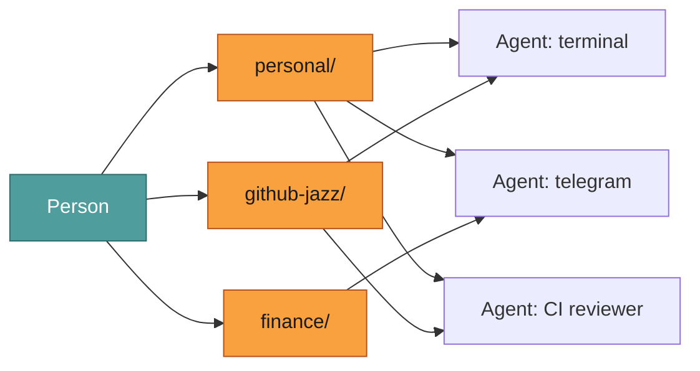
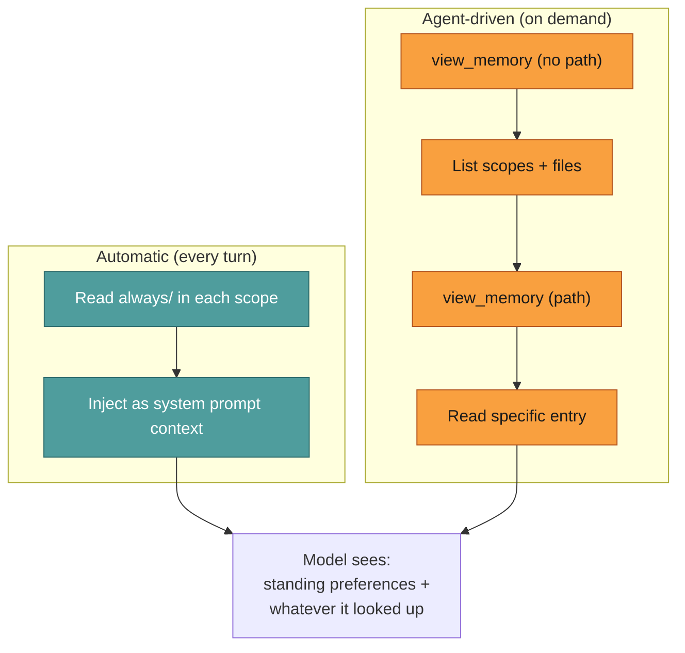
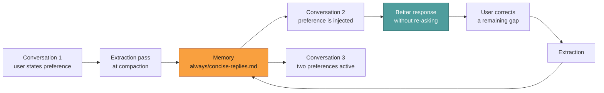

# Conversations, state, and memory

Jazz keeps five kinds of state, and they are separate on purpose. Collapsing any two of them
produces the same failure: something that mattered gets discarded, or something that stopped
being true gets carried forever.

| Kind                     | Written by                     | Scope            | Survives                  |
| ------------------------ | ------------------------------ | ---------------- | ------------------------- |
| **Conversation history** | the runtime, every turn        | one conversation | until compaction trims it |
| **Work state**           | the model, `update_work_state` | one conversation | compaction                |
| **Todos**                | the model, `manage_todos`      | one conversation | compaction                |
| **Scratchpad**           | the model, `manage_scratchpad` | one agent        | forever, until deleted    |
| **Memory**               | the model, `manage_memory`     | one memory scope | forever, until deleted    |

## Conversation history

The transcript: user, assistant, and tool messages in order. Interactive chat keeps one active
conversation. Headless callers opt in with a stable `--conversation` key, which is what gives a
chat bridge per-chat memory without the bridge storing anything itself. Without a key, a one-shot
run is stateless.

History is not permanent. When the context fills, older messages are summarized and the detail
in them is gone. That is what the next two exist to survive.

## Work state

The agent's account of what it is doing: the goal, the constraints, what it has decided, what is
still open, what it means to do next. One per conversation, discarded when the work ends.

Its job is to survive compaction. History records what was said; work state records _intent_,
which only the agent knows and only while it still holds it in context. Written as JSON rather
than prose because it is edited repeatedly, and models patch structured documents far more
reliably than they rewrite paragraphs.

**Work state is subjective; a run is objective.** Work state is the agent's diary and can be
stale or wrong. A run's state is a fact about a process. The two can disagree without either
being broken: a model can be planning its next step while the run it is planning inside has
already parked, waiting for an approval.

## Todos

The list of work, with status and priority, rendered in the interface. Work state deliberately
holds no second list, because carrying one left the model guessing which to update.

One field is worth knowing about: a todo records `verifiedBy`, so a completed item with nothing
in it says plainly that the work was written but never checked. Progress and evidence stay
separate, because "unverified" is not a stage of work and a status enum is the wrong place for it.

## Scratchpad

Durable scratch space, per agent, across every conversation. Large working drafts, research
dumps, intermediate artifacts: the things too big or too provisional for memory.

The convention that keeps both useful is to reference a scratchpad path from a memory entry once
the work is done, rather than copying the content into memory. Memory stays small and curated;
the bulk lives where bulk belongs.

Bounded so a runaway agent cannot fill the disk: 5 MB per file, 2,000 files, and 1 GB per agent
by default, which `workspaceMaxTotalBytesPerAgent` overrides.

---

## Memory

Memory is the part that compounds. Every other kind of state serves one conversation or one
agent; memory serves the person across all of them. A preference stated once — "concise
replies", "deploy to staging first", "I live in Paris" — should improve every future
interaction, regardless of which agent handles it or which model powers that agent.

That is the self-improvement thesis: **the model stays frozen; the harness gets better at
applying it to you.** No fine-tuning, no weight updates, no data leaving your machine. What
improves is what Jazz knows about the person, and how reliably it brings that knowledge to
bear.

### Layout: the tree is the index

```
~/.jazz/memory/
├── personal/                          ← scope: follows the user everywhere
│   ├── always/                        ← in force on every turn
│   │   ├── concise-replies.md
│   │   ├── home-timezone.md
│   │   └── deploy-staging-first.md
│   └── when/                          ← in force when the agent looks
│       ├── moodboard/
│       │   └── artboard-scaling.md
│       └── cooking/
│           └── no-cilantro.md
├── github-jazz/                       ← scope: this project only
│   ├── always/
│   │   └── run-evals-before-merge.md
│   └── when/
│       └── ci/
│           └── diff-truncation.md
└── finance/                           ← scope: personal finance work
    └── always/
        └── risk-tolerance.md
```

There is no database, no sidecar index, no cache. The filesystem _is_ the index. An entry is a
Markdown file. The directory it sits in determines when it applies:

- **`<scope>/always/<slug>.md`** — in force on every turn, injected automatically.
- **`<scope>/when/<topic>/<slug>.md`** — in force when the agent discovers it via `view_memory`.

A file created or deleted by hand behaves exactly like one the tool wrote. There is nothing to
drift, nothing to rebuild.

### Scopes: memory follows the person, not the agent



The default scope is `"personal"` — shared by every agent unless overridden with `memoryScopes`
in the agent config. A preference like "concise replies" follows the person across their
terminal agent, their Telegram bot, and their CI reviewer, because all three read the same
scope.

Scopes are an allowlist. An agent can only read and write the scopes it is configured for. Two
agents that should share durable context share a scope; two agents that should not, don't.

### Recall: what reaches the model



**Standing entries** (`always/`) are injected into the system prompt every turn. The agent never
has to ask for them — a preference the user stated is not something they should have to restate.

**Topic-scoped entries** (`when/<topic>/`) are the agent's responsibility to discover. The agent
calls `view_memory` to browse what exists, reads what looks relevant, and ignores the rest. This
is deliberate: automatic topic matching cannot do semantic association ("squats" does not match
"workout" lexically), and injecting a topic list biases the agent toward shoehorning into
existing topics instead of creating new ones when they're needed.

The cost of recall tracks how much is relevant, not how much has ever been remembered.

### Automatic extraction at compaction

When context fills and compaction runs, Jazz scans the about-to-be-compressed messages for facts
worth remembering long term. A preference the user stated forty messages ago survives compaction
only as summary gist, and vanishes entirely when the conversation ends — unless the extraction
pass catches it first.

The pass runs as a throwaway `memory-extractor` sub-agent using the real `view_memory` /
`manage_memory` tools, so it inherits their discipline: find the right scope, read before
writing, one file per subject, replace stale facts instead of appending duplicates. Only facts
the user themselves stated or decided qualify — the model's own inferences, in-progress task
state, and small talk do not. Writing nothing is the common, correct outcome.

See [Context lifecycle → Durable facts reach memory](../maintainers/context-lifecycle.md) for
the gating rules and the full mechanism.

### The self-improvement loop



Each conversation leaves the agent knowing more about the person than the last one did. The
model does not change; the context it operates in does. This is cheaper than fine-tuning, more
private than cloud-side personalization, and more composable than either — swap the model,
keep the memory.

The goal is an agent that gets measurably better at serving you over time, not because it was
retrained, but because it remembers what you care about and how you want things done.

### CLI access

Agents read and write permitted scopes themselves. You can inspect and prune with `jazz memory
list`, `jazz memory show`, and `jazz memory forget`.

## Choosing

Ask how long it has to be true.

- True for this exchange only: **history** already has it.
- True until this task is done, and must survive compaction: **work state** for intent, **todos**
  for the list.
- Too big to re-derive, useful later, not a fact about anyone: **scratchpad**.
- Still true in three weeks, and would make a later answer better: **memory**.

## Related

- [Context lifecycle](../maintainers/context-lifecycle.md): how the runner injects each one, and
  what compaction does
- [Lexicon](./lexicon.md): the precise word for each of these
- [Agents](./agents.md): `memoryScopes` and the rest of the configuration
