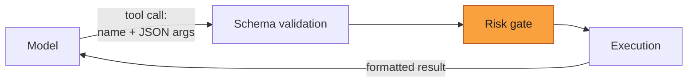

# Tools

**Reader job:** understand what a tool is, what the risk tiers mean for you, and how to add
your own.

For the exact list of tool names, see [Tools reference](../reference/tools.md). For the
machinery, see [Internals → Tools & approval](../internals/tools-and-approval.md).

---

## What a tool is

A tool is a typed function the model can call. Each one declares a name, a Zod schema for its
arguments, a risk level, and an implementation. The model never runs code — it emits a request
to call a named tool with arguments, and Jazz validates, gates, and executes it.



Tools come from four places:

| Source | Scope | Example |
| --- | --- | --- |
| **Built-in** | always available | `read_file`, `git_commit`, `web_search` |
| **Skills** | when the agent has skills | `find_skills`, `load_skill` |
| **MCP** | per agent, from configured servers | `mcp_notion_search` |
| **Custom** | per agent, defined by you | whatever you declare |

An agent's config lists which tools it may use. **Omitting a tool is the strongest control
there is** — an agent without `execute_command` cannot run shell commands no matter what
policy is set.

---

## Risk tiers

Every tool declares one of three levels. One dial (`--approval-policy`, or `autoApprove:` in a
workflow) decides what runs without asking.

| Tier | Tools | Count |
| --- | --- | --- |
| `read-only` | Reads, searches, web requests, non-mutating git | 26 |
| `low-risk` | `manage_todos`, `spawn_subagent` | 2 |
| `high-risk` | Anything that mutates: writes, deletes, moves, shell, git commit/push/merge | 15 |

> ⚠️ **`low-risk` is narrower than most people expect.** It is *not* "moderately dangerous
> things" — in the built-in toolset it is exactly two tools. Email, calendar, and Obsidian are
> skills that shell out via `execute_command`, so they are gated at `high-risk`. See
> [Tools reference](../reference/tools.md#what-is-not-a-built-in-tool).

### When a tier is too coarse

Rather than raising the whole tier, narrow the exception:

| Control | Where | Scope |
| --- | --- | --- |
| Per-tool allowlist | "Always approve this tool" in an approval prompt | this session |
| Per-command allowlist | `autoApprovedCommands` in `~/.jazz/config.json` | persisted, `execute_command` only |
| Toolset trimming | the agent's config | permanent, strongest |

```json
// ~/.jazz/config.json — let one binary through, keep the tier low
{ "autoApprovedCommands": ["himalaya", "khal"] }
```

Command matching uses a parsed key (binary + first subcommand), never a raw string prefix, so
approving `git status` does not also approve `git status && rm -rf /`.

---

## Gated tools act in two phases

A `high-risk` tool does not act when called. It returns a description of what it *would* do —
for edits, an actual preview diff — and only after approval does Jazz invoke the hidden
`execute_*` half of the pair.

This is why you see the exact diff before a file is written, and why an unattended run behaves
identically to an interactive one apart from who answers.

---

## Adding your own

### Custom tools (declarative)

Define a tool in an agent's config with `customTools` — a name, description, parameter schema,
and a command or HTTP call to run. No code, no rebuild. Full schema and validation rules:
[Configuration → customTools](../reference/configuration.md#agent-config-customtools).

### MCP servers (reuse an ecosystem)

If the capability already exists as an MCP server, that is almost always the better route —
you get its tools without writing anything. See [Integrations → MCP](../integrations/mcp.md).

### Built-in tools (contributing)

Adding a tool to Jazz itself means implementing the `Tool` interface and registering it in a
category. Gated tools use `defineApprovalTool` to produce the propose/execute pair. See
[Code map](../internals/code-map.md), and update
[Tools reference](../reference/tools.md) — a test fails if the docs and the registry drift.

---

## Related

- [Tools reference](../reference/tools.md) — every tool, every tier
- [Internals → Tools & approval](../internals/tools-and-approval.md) — registry, concurrency, timeouts
- [Skills](./skills.md) — packaged expertise, which is a different thing from a tool
- [Security](../../SECURITY.md) — the threat model for unattended runs
