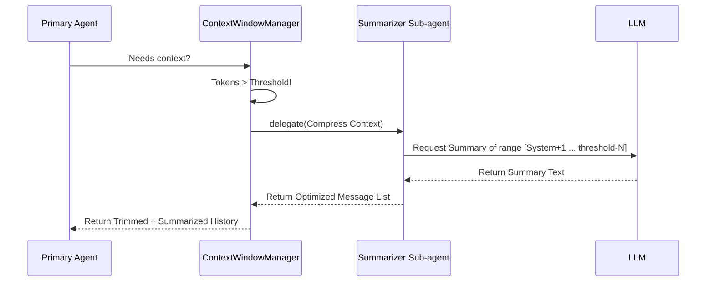

# Research: Adaptive Context Compression via Sub-agent Orchestration

## Objective

To implement an automated, token-aware context compression system that maintains agent performance over extremely long conversations by replacing older message history with concise, semantically-rich summaries produced by specialized sub-agents.

## The Problem

As identified, pure "trimming" is a destructive operation. While it prevents context window overflows and performance degradation, it causes the agent to "lose its memory" of earlier decisions, user preferences, and completed task states.

## Proposed Architecture: The "Summarizer" Sub-agent

Instead of a hard-coded trimming logic, we propose an orchestration flow where the primary agent triggers a specialized "Summarizer" sub-agent.

### 1. Triggering Mechanism

- **Threshold-based**: Trigger when estimated token count exceeds 80% of the model's comfortable limit.
- **Just-in-Time (JIT)**: Triggered by the `ContextWindowManager` before the primary agent makes its next LLM call.
- **Manual Control**: Triggered at any time by the user via a `/compact` command (or tool), allowing explicit memory management.

### 2. Orchestration Flow

### 3. Structural Integrity

To prevent "hallucination loops," the summarization must:

- **Keep System Prompts**: Never summarize the root identity/instructions.
- **Maintain Tool Pairs**: Ensure `tool_call` and `tool_result` are summarized as a completed action unit.
- **Identify Key States**: Preserve "Current Task Status" and "User Preferences" as high-priority bullet points.

## Why use a Sub-agent?

- **Cost Efficiency**: Use a faster/cheaper model (e.g., GPT-4o-mini or Claude Haiku) for the summarization task while the primary agent remains a high-reasoner (o1, Sonnet).
- **Separation of Concerns**: The summarization prompt is isolated from the primary agent's task-specific instructions.
- **Recursive Pattern**: This validates the "Sub-agent Trigger" primitive, which can then be reused for other specialized tasks (e.g., a "Security Guard" sub-agent or a "Code Auditor").

## Implementation Steps

1. **Refactor `AgentRunner`** to support `runRecursive` – a version of `run` that doesn't trigger UI status logs to the main terminal (silent execution).
2. **Define `SummarizerAgent`**: A system prompt focused strictly on reducing tokens while maintaining semantic fidelity.
3. **Integrate with `ContextWindowManager`**: Update `trim()` to call the summarizer instead of just slicing the array.
