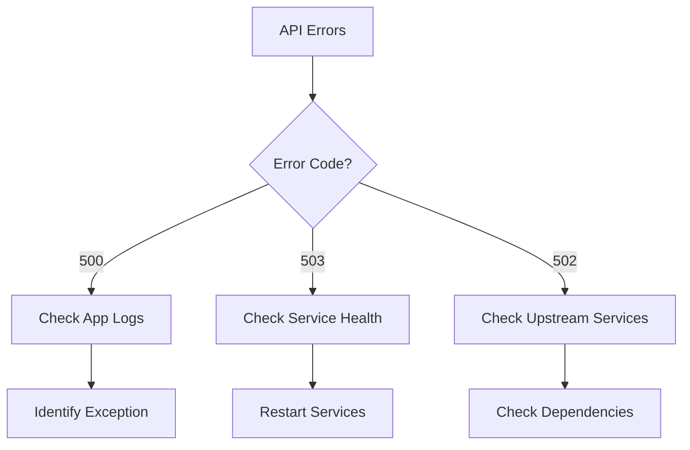

# Example: Incident Response Skill

A production-ready skill for handling system incidents with runbooks, diagnostics, and escalation
procedures.

## Directory Structure

```
skills/incident-response/
├── SKILL.md
├── severity-levels.md
├── escalation-matrix.md
├── runbooks/
│   ├── database-down.md
│   ├── high-cpu.md
│   ├── memory-leak.md
│   ├── api-errors.md
│   ├── disk-full.md
│   └── network-issues.md
├── scripts/
│   ├── diagnose.sh
│   ├── collect-logs.sh
│   ├── health-check.sh
│   └── notify-team.py
└── templates/
    ├── incident-report.md
    └── postmortem.md
```

## SKILL.md

````yaml
---
name: incident-response
version: 1.5.0
description: Rapid incident response with automated diagnostics, runbooks, and escalation
author: SRE Team
tags: [incident, sre, operations, monitoring, emergency, troubleshooting]
category: Operations
complexity: intermediate

tools:
  required:
    - execute_command
    - read_file
    - write_file
    - http_request
  optional:
    - send_email
    - git_log

triggers:
  keywords:
    - incident
    - down
    - outage
    - emergency
    - broken
    - not working
    - error
    - alert
    - critical
  patterns:
    - "(database|api|service|app) (is )?down"
    - "high (cpu|memory|load)"
    - "(disk|storage) (is )?full"
    - "production (issue|problem|incident)"
    - "users? (can't|cannot) (access|login|use)"
  context_hints: []

risk_level: high
approval_required: false  # Speed is critical in incidents

sections:
  - severity-levels.md
  - escalation-matrix.md
  - runbooks/database-down.md
  - runbooks/high-cpu.md
  - runbooks/api-errors.md

estimated_duration: 5-30 minutes
prerequisites:
  - Access to production systems
  - Monitoring dashboards
  - On-call contacts

last_updated: 2024-01-15
---

# Incident Response Skill

Rapidly diagnose and respond to production incidents with automated runbooks and escalation procedures.

## Overview

When production breaks, every second counts. This skill provides:
- Automated diagnostics and log collection
- Step-by-step runbooks for common incidents
- Intelligent escalation based on severity
- Incident documentation and reporting
- Post-incident analysis support

## Core Capabilities

1. **Rapid Diagnosis**
   - Automated health checks
   - Log analysis
   - Metrics collection
   - Root cause identification

2. **Runbook Execution**
   - Database incidents
   - High CPU/memory
   - API failures
   - Network issues
   - Disk space problems

3. **Team Coordination**
   - Automated notifications
   - Escalation management
   - Status updates
   - Communication templates

4. **Documentation**
   - Incident timeline
   - Actions taken
   - Resolution steps
   - Postmortem generation

## Severity Levels

### SEV1 - Critical 🔴
- **Impact**: Complete service outage
- **Examples**: Database down, all APIs failing
- **Response Time**: Immediate
- **Escalation**: Page on-call + management
- **Communication**: Status page + customer emails

### SEV2 - High 🟡
- **Impact**: Major functionality broken
- **Examples**: Payment processing down, login broken
- **Response Time**: < 15 minutes
- **Escalation**: Page on-call
- **Communication**: Internal alerts

### SEV3 - Medium 🟠
- **Impact**: Degraded performance
- **Examples**: Slow responses, intermittent errors
- **Response Time**: < 1 hour
- **Escalation**: Notify on-call
- **Communication**: Team Slack

### SEV4 - Low 🟢
- **Impact**: Minor issues
- **Examples**: Non-critical feature bug
- **Response Time**: Next business day
- **Escalation**: Create ticket
- **Communication**: Team channel

See [severity-levels.md](severity-levels.md) for detailed criteria.

## Basic Workflow

### Step 1: Assess Severity

```typescript
// Determine incident severity
const severity = assessSeverity({
  usersAffected: "all", // all, many, few, none
  functionality: "core", // core, important, minor
  businessImpact: "high", // high, medium, low
});

// severity = "SEV1"
````

### Step 2: Diagnose Issue

Run diagnostic script:

```bash
./scripts/diagnose.sh --service all --verbose

# Checks:
# - Service health endpoints
# - Database connectivity
# - API response times
# - System resources (CPU, memory, disk)
# - Recent deployments
# - Error rates
```

### Step 3: Load Relevant Runbook

Based on diagnosis, load appropriate runbook:

```typescript
if (diagnosis.includes("database connection failed")) {
  loadRunbook("database-down.md");
} else if (diagnosis.includes("high CPU")) {
  loadRunbook("high-cpu.md");
} else if (diagnosis.includes("disk usage 95%")) {
  loadRunbook("disk-full.md");
}
```

### Step 4: Execute Response Plan

Follow runbook steps systematically:

1. **Immediate mitigation** (stop the bleeding)
2. **Collect evidence** (logs, metrics, traces)
3. **Root cause analysis**
4. **Implement fix**
5. **Verify resolution**
6. **Document incident**

### Step 5: Communicate & Escalate

```bash
./scripts/notify-team.py \
  --severity SEV1 \
  --message "Database connection pool exhausted" \
  --status investigating \
  --channels slack,pagerduty,email
```

### Step 6: Document Timeline

Automatically track actions taken:

```markdown
## Incident Timeline

14:23 - Alert received: High error rate 14:24 - Agent began diagnosis 14:25 - Identified: Database
connection pool exhausted 14:26 - Mitigation: Restarted connection pool 14:28 - Verified: Error rate
back to normal 14:30 - Root cause: Recent traffic spike + low pool size 14:35 - Long-term fix:
Increased pool size from 10 to 50
```

## Runbook: Database Down

### Symptoms

- Connection errors in logs
- Timeout errors
- Health check failing
- Cannot query database

### Immediate Actions

1. **Check database status**

   ```bash
   # PostgreSQL
   pg_isready -h db.example.com -p 5432

   # MySQL
   mysqladmin ping -h db.example.com
   ```

2. **Check connection pool**

   ```bash
   # View active connections
   SELECT count(*) FROM pg_stat_activity;

   # Check for long-running queries
   SELECT pid, now() - query_start as duration, query
   FROM pg_stat_activity
   WHERE state = 'active'
   ORDER BY duration DESC;
   ```

3. **Check disk space**

   ```bash
   df -h /var/lib/postgresql
   ```

4. **Check logs**
   ```bash
   tail -n 100 /var/log/postgresql/postgresql.log
   ```

### Common Causes & Fixes

#### Connection Pool Exhausted

**Symptom**: "Too many connections" error

**Fix**:

```bash
# Restart connection pool
docker restart app-server

# Or increase pool size
ALTER SYSTEM SET max_connections = 200;
SELECT pg_reload_conf();
```

#### Database Crashed

**Symptom**: Database process not running

**Fix**:

```bash
# Check if running
ps aux | grep postgres

# Start database
sudo systemctl start postgresql

# Check logs for crash reason
grep "FATAL" /var/log/postgresql/postgresql.log
```

#### Disk Full

**Symptom**: "No space left on device"

**Fix**:

```bash
# Clean old logs
find /var/log -name "*.log" -mtime +7 -delete

# Archive old data
pg_dump old_data | gzip > /backup/old_data.sql.gz

# Expand disk (cloud)
aws ec2 modify-volume --volume-id vol-xxx --size 200
```

See [database-down.md](runbooks/database-down.md) for complete runbook.

## Runbook: High CPU Usage

### Symptoms

- CPU utilization > 80%
- Slow response times
- Timeout errors
- System lag

### Diagnosis

```bash
# Check CPU usage
top -b -n 1 | head -20

# Find top processes
ps aux --sort=-%cpu | head -10

# Check for specific issues
./scripts/diagnose.sh --cpu
```

### Common Causes

1. **Infinite Loop** - Code bug causing endless iteration
2. **High Traffic** - Legitimate spike in requests
3. **Inefficient Query** - Database query scanning full table
4. **Memory Thrashing** - Excessive garbage collection
5. **External Attack** - DDoS or bot traffic

### Immediate Mitigation

```bash
# Scale horizontally (add instances)
kubectl scale deployment app --replicas=5

# Rate limit traffic
# (Update load balancer rules)

# Kill problematic process (last resort)
kill -9 <PID>
```

### Analysis

```bash
# Profile application
node --prof app.js
# or
python -m cProfile app.py

# Check for slow endpoints
grep "duration > 1000" /var/log/app/access.log

# Review recent deployments
git log --since="1 day ago"
```

## Runbook: API Errors

### Symptoms

- 500 Internal Server Error
- 503 Service Unavailable
- Timeout errors
- High error rate

### Diagnosis Flow



### Quick Checks

```bash
# Check error rate
grep "error" /var/log/app/app.log | wc -l

# Check which endpoints
grep "500" /var/log/nginx/access.log | \
  awk '{print $7}' | sort | uniq -c | sort -rn

# Check recent changes
git log --since="2 hours ago" --oneline

# Check dependencies
curl https://api.dependency.com/health
```

### Common Solutions

1. **Application Crash** → Restart service
2. **Dependency Down** → Switch to backup/cache
3. **Resource Exhaustion** → Scale up
4. **Bug in Recent Deploy** → Rollback
5. **Rate Limit Hit** → Increase limits

## Code Resources

### scripts/diagnose.sh

Comprehensive system diagnostics.

**Usage:**

```bash
./scripts/diagnose.sh [options]

Options:
  --service <name>    Check specific service
  --cpu              Focus on CPU issues
  --memory           Focus on memory issues
  --network          Focus on network issues
  --all              Run all checks (default)
  --verbose          Detailed output
```

**Output Example:**

```
🔍 System Diagnostics Report

✅ Services:
  • API Server: Running (3 instances)
  • Database: Running (primary + 2 replicas)
  • Redis: Running

🟡 Resources:
  • CPU: 75% (high)
  • Memory: 60%
  • Disk: 45%
  • Network: Normal

❌ Issues Detected:
  1. High CPU on api-server-2 (92%)
  2. Slow queries in database (avg: 850ms)
  3. Error rate above threshold (5%)

📊 Metrics:
  • Requests/sec: 1200
  • P95 Latency: 450ms
  • Error Rate: 5%

💡 Recommendations:
  1. Investigate high CPU on api-server-2
  2. Optimize slow database queries
  3. Check recent deployments
```

### scripts/collect-logs.sh

Gather relevant logs for analysis.

**Usage:**

```bash
./scripts/collect-logs.sh \
  --since "1 hour ago" \
  --services api,database,worker \
  --output incident-logs.tar.gz
```

### scripts/notify-team.py

Send notifications to appropriate channels.

**Usage:**

```bash
python scripts/notify-team.py \
  --severity SEV1 \
  --title "Database Connection Pool Exhausted" \
  --status investigating \
  --assignee "@on-call"
```

## Escalation Matrix

| Severity | Time Elapsed | Action                     |
| -------- | ------------ | -------------------------- |
| SEV1     | Immediate    | Page on-call engineer      |
| SEV1     | 15 minutes   | Page engineering manager   |
| SEV1     | 30 minutes   | Page VP Engineering + CEO  |
| SEV2     | Immediate    | Notify on-call (Slack)     |
| SEV2     | 30 minutes   | Page on-call engineer      |
| SEV2     | 1 hour       | Notify engineering manager |
| SEV3     | Immediate    | Notify team channel        |
| SEV3     | 4 hours      | Assign to engineer         |

See [escalation-matrix.md](escalation-matrix.md) for complete procedures.

## Example Usage

### Example 1: Database Outage

```
User: "Database is down!"

Agent: [Loads incident-response skill]
Agent: "🚨 Incident Detected - Assessing severity..."

Agent: [Runs diagnose.sh]
Agent: "Diagnosis complete:
  • Severity: SEV1 (Critical)
  • Issue: Database connection failure
  • Impact: All users affected

Loading database-down runbook..."

Agent: [Loads runbooks/database-down.md]
Agent: "📋 Following Database Down Runbook

Step 1: Check database status
[Executes: pg_isready]
❌ Database not responding

Step 2: Check database logs
[Reads: /var/log/postgresql/postgresql.log]
Found: 'FATAL: connection pool exhausted'

🔍 Root Cause: Connection pool exhausted (all 10 connections in use)

Recommended Fix: Restart connection pool + increase size

Executing mitigation..."

Agent: [Executes: docker restart app-server]
Agent: "✅ Connection pool restarted

Verifying fix..."

Agent: [Runs health check]
Agent: "✅ Database responding normally
✅ Error rate back to 0%
✅ All health checks passing

Incident resolved!

📝 Incident Summary:
  Duration: 5 minutes
  Root Cause: Connection pool exhausted
  Fix Applied: Restarted pool, increased size 10→50
  Users Impacted: All (estimated 1,000)

Next Steps:
  1. ✅ Immediate fix applied
  2. TODO: Review connection pool sizing
  3. TODO: Add alerting for pool utilization
  4. TODO: Write postmortem

Notifying team..."

Agent: [Executes: notify-team.py]
Agent: "✅ Team notified on Slack #incidents
✅ Incident report created
✅ Postmortem template ready"
```

### Example 2: High CPU

```
User: "API is slow, high CPU usage"

Agent: [Loads incident-response skill]
Agent: "Investigating performance issue..."

Agent: [Runs diagnose.sh --cpu]
Agent: "📊 Diagnosis:
  • Severity: SEV2 (High)
  • CPU: 95% on api-server-2
  • Cause: Infinite loop in recent deployment

Loading high-cpu runbook..."

Agent: [Loads runbooks/high-cpu.md]
Agent: "Found recent deployment 15 minutes ago

Checking git log..."
Agent: [Runs git log]
Agent: "Latest commit by @john: 'Optimize user search'

Recommended: Rollback deployment

Proceed? [y/n]"

User: "yes"

Agent: [Rolls back deployment]
Agent: "✅ Rolled back to previous version
✅ CPU usage back to normal (45%)
✅ Response times improved

Notified @john about the issue in their recent commit."
```

### Example 3: Disk Full

```
User: "App is crashing with write errors"

Agent: [Loads incident-response skill]
Agent: [Runs diagnose.sh]
Agent: "🔍 Issue found:
  • Disk usage: 98% full
  • Log files taking 85GB

Loading disk-full runbook..."

Agent: "Cleaning up old logs..."
Agent: [Executes cleanup script]
Agent: "✅ Freed 60GB
✅ Disk now at 45%
✅ App restarted successfully

Recommended: Set up log rotation"
```

## Best Practices

1. **Stay Calm** - Follow the runbook systematically
2. **Communicate Early** - Notify stakeholders immediately
3. **Document Everything** - Timeline, actions, results
4. **Don't Assume** - Verify each step
5. **Learn & Improve** - Write postmortems

## Post-Incident Process

After resolving the incident:

1. **Document Timeline** - What happened, when, and why
2. **Write Postmortem** - Use template in `templates/postmortem.md`
3. **Identify Improvements** - Prevent recurrence
4. **Update Runbooks** - Add new scenarios
5. **Share Learnings** - Team meeting to discuss

## Configuration

`templates/incident-report.md`:

```markdown
# Incident Report: {{title}}

**Severity**: {{severity}} **Start Time**: {{start_time}} **Resolution Time**: {{resolution_time}}
**Duration**: {{duration}}

## Impact

- **Users Affected**: {{users_affected}}
- **Revenue Impact**: {{revenue_impact}}

## Timeline

{{timeline}}

## Root Cause

{{root_cause}}

## Resolution

{{resolution}}

## Action Items

{{action_items}}
```

## Related Skills

Works well with:

- **deployment**: Rollback procedures
- **monitoring**: Metrics and alerts
- **security-audit**: Security incidents

## Changelog

### v1.5.0 (2024-01-15)

- Added AI-powered diagnosis
- Improved runbook navigation
- Automated mitigation steps

### v1.2.0 (2023-11-01)

- Added postmortem templates
- Expanded runbook library
- Enhanced notifications

### v1.0.0 (2023-09-01)

- Initial release
- Basic runbooks
- Escalation procedures

```

---

This incident response skill demonstrates:
- ✅ Critical, time-sensitive operations
- ✅ Systematic troubleshooting approach
- ✅ Multiple runbooks for common scenarios
- ✅ Automated diagnostics and mitigation
- ✅ Team coordination and communication
- ✅ Post-incident documentation

```
