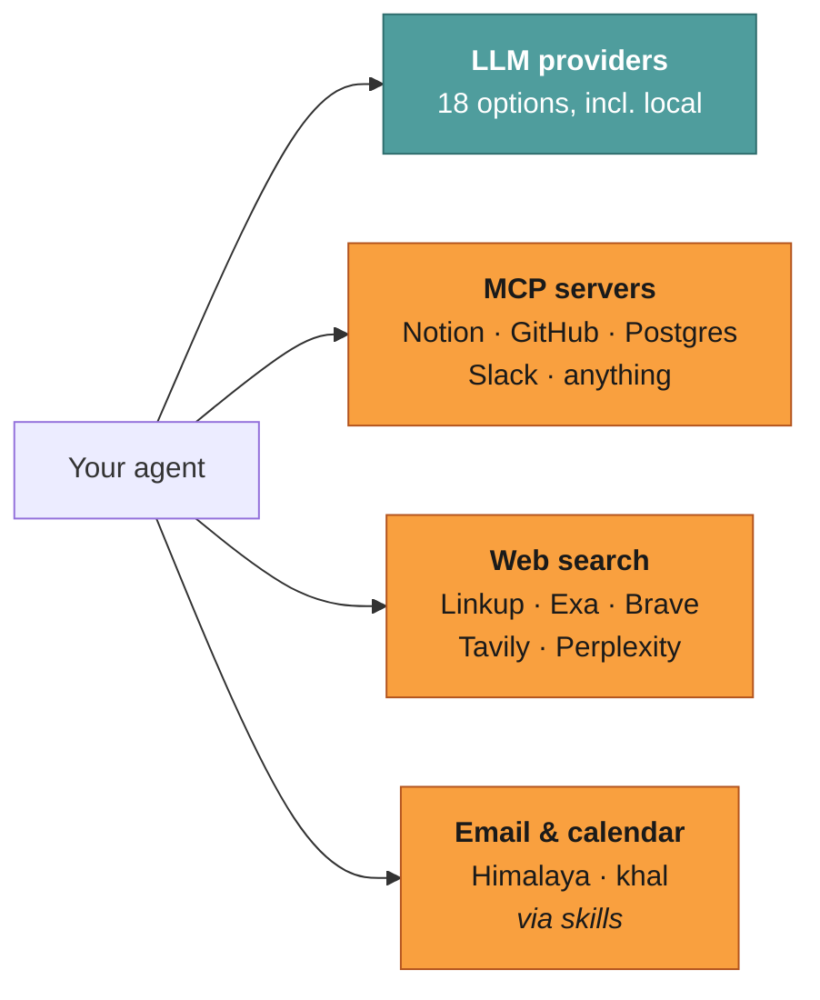

# Integrations

**Reader job:** connect Jazz to the model, service, or data source you need.



| Page | What it covers | Required? |
| --- | --- | --- |
| **[LLM Providers](./providers.md)** | OpenAI, Anthropic, Google, Mistral, xAI, DeepSeek, Groq, Cerebras, Fireworks, TogetherAI, OpenRouter, Vercel AI Gateway, Alibaba, Moonshot, MiniMax, Zhipu, **Ollama**, **llama.cpp** | ✅ At least one |
| **[MCP Servers](./mcp.md)** | Adding servers, assigning them to agents, popular servers, troubleshooting | Optional |
| **[Web Search](./web-search.md)** | Search provider setup for the `web_search` tool | Optional |
| **[Email & Calendar](./email-calendar.md)** | Himalaya and khal skills — and their approval consequence | Optional |

---

## Fastest paths

Jazz is free regardless — the provider is the only thing that can cost anything.

**No cost, no credit card:** [OpenRouter](https://openrouter.ai) with the
[`Free Models Router`](https://openrouter.ai/openrouter/free) model.

**Fully private, no cloud:** `ollama` with a tool-capable model pulled locally. Nothing
leaves your machine, and there is no per-token cost. See
[Airgapped & Self-Hosted](../guide/airgapped.md).

```bash
jazz            # → Update configuration → pick a provider, paste a key
jazz config show
```

Keys can also go straight into `~/.jazz/config.json` — see
[Configuration](../reference/configuration.md).

---

## Related

- [Internals → Providers & models](../internals/providers-and-models.md) — how the provider port, model catalog, and reasoning normalization work
- [Configuration](../reference/configuration.md) — config file locations, environment variables, `customTools`
- [Tools reference](../reference/tools.md) — which tools each integration adds
- [Airgapped & Self-Hosted](../guide/airgapped.md) — running with no outbound network
