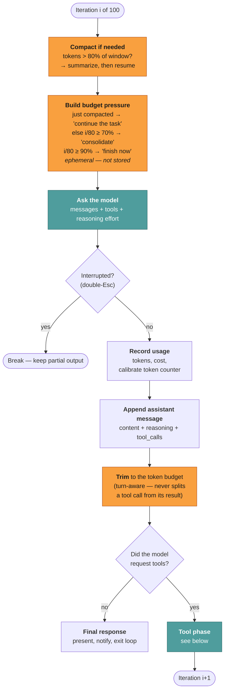
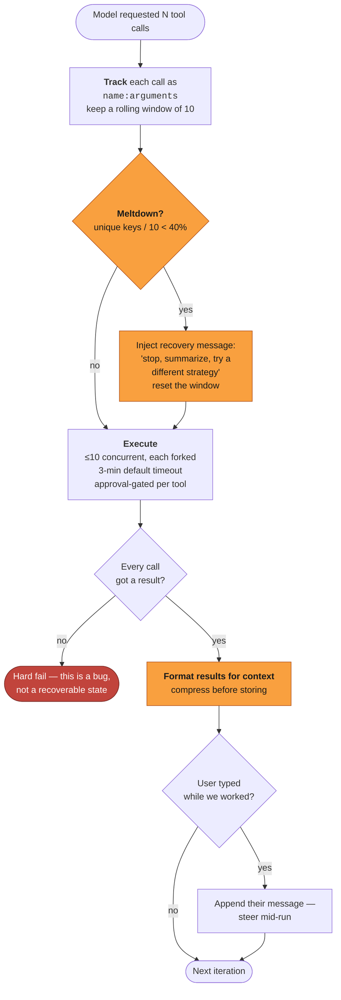
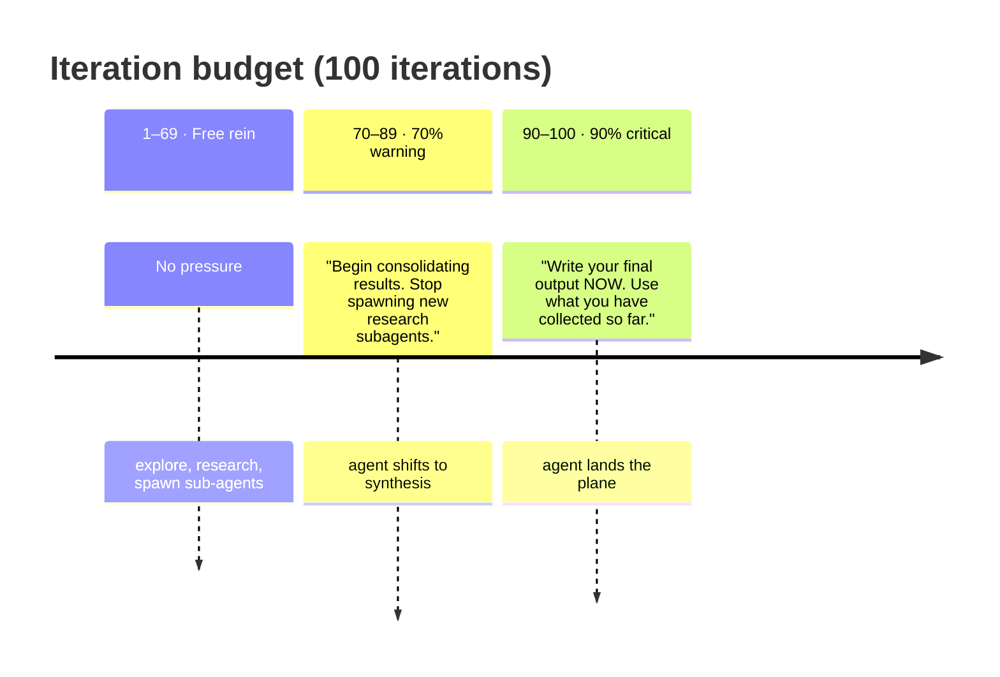
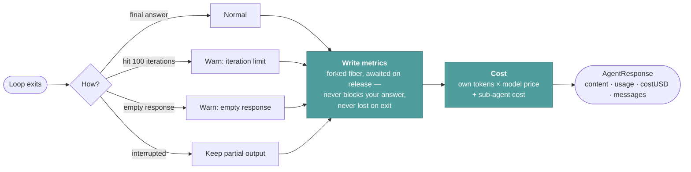

# The agent loop

This page explains what happens between "you press enter" and "you get an answer" —
especially on runs that take a long time.

Source: [`packages/core/src/agent/execution/agent-loop.ts`](../../packages/core/src/agent/execution/agent-loop.ts)

An agent run is a bounded loop: ask the model, execute whatever tools it asked for, feed
the results back, repeat until it stops asking for tools. The loop itself is twenty lines.
Everything that makes it survive a long autonomous run is in the guards around it.

---

## One full iteration



The loop runs at most `DEFAULT_MAX_ITERATIONS` (100) times. It exits early on a final
response (no tool calls) or a user interrupt.

---

## The tool phase



### Missing results are a hard failure

If any requested tool call comes back without a result, the run fails loudly. It would be
easy to paste in a placeholder and continue — but a message history where a `tool_calls`
entry has no matching `tool` message is invalid to most providers, and the resulting error
appears three iterations later somewhere unrelated. Failing at the source keeps the bug
findable.

### Mid-run steering

Tool execution is slow, and users type while it happens. Anything queued during the tool
phase is appended as a user message before the next iteration, so you can redirect a long
run without killing it.

---

## Guard 1 — budget pressure

An agent with 100 iterations and no sense of time will happily spend all 100 on research and
produce nothing. So Jazz tells it where it stands:



The important detail: **the pressure message is ephemeral.** It's appended to the array
sent to the model for that one call and never pushed into the stored conversation:

```ts
const budgetMsg = buildBudgetPressureMessage(iterationIndex + 1, maxIterations);
const messagesForLLM = budgetMsg ? [...state.currentMessages, budgetMsg] : state.currentMessages;
```

If it were stored, iteration 98 would carry eight escalating "FINISH NOW" messages, each
one costing tokens and confusing the transcript that later gets summarized. This way the
nudge steers the run without polluting its history.

---

## Guard 2 — meltdown detection

The classic agent failure isn't a crash, it's a groove: the same search, the same file
read, forever, until the budget is gone.

```ts
const keys = window.map((tc) => `${tc.name}:${tc.arguments}`);
const uniqueness = new Set(keys).size / windowSize;
return uniqueness < 0.4;
```

The key is composite — **tool name *plus* arguments**. This distinction is the whole
design:

| Recent calls                                              | Unique keys  | Verdict                                  |
| --------------------------------------------------------- | ------------ | ---------------------------------------- |
| `web_search("effect-ts")` × 10                            | 1/10 = 10%   | 🔴 Stuck — same query over and over       |
| `web_search(q1)` → `web_fetch(u1)` → `web_search(q2)` → … | 10/10 = 100% | 🟢 Productive — that's research           |
| `read_file(a)` `read_file(b)` … 10 distinct files         | 10/10 = 100% | 🟢 Productive — that's reading a codebase |
| `execute_command()` × 6, `read_file(x)` × 4               | 2/10 = 20%   | 🔴 Stuck                                  |

Keying on tool *name* alone would flag the second and third rows as meltdowns, which are
exactly the behaviors you want. When a meltdown does trip, Jazz injects a message telling
the agent to stop, summarize what it has, and either output or try a fundamentally
different approach — then clears the window so it gets a fair chance.

Unlike budget pressure, this message **is** stored. It's a real event in the run's history
and the agent should keep remembering that its last approach didn't work.

---

## Streaming vs batch

The loop is shared. Only how it talks to the model and renders output differs, expressed
as a `CompletionStrategy`:

|                    | Streaming                             | Batch                        |
| ------------------ | ------------------------------------- | ---------------------------- |
| Model call         | token-by-token stream                 | single response              |
| Rendering          | live, as tokens arrive                | markdown rendered at the end |
| Thinking indicator | yes                                   | no                           |
| Interruptible      | yes — double-Esc races tool execution | no                           |
| Used by            | terminal TUI, `--events` bridges      | `jazz run` piped output, CI  |

Adding a third mode means implementing one interface, not forking the loop. That's the
reason for the indirection.

---

## Finalization

After the loop, win or lose:



Two details worth noting:

- **Metrics are written on a forked fiber** that the loop's `release` step awaits. You get your answer immediately, and the telemetry still lands even if the process is shutting down.
- **Cost includes sub-agent spend.** A run whose own tokens are unpriced (a local model) but which spawned a priced sub-agent still reports a figure — otherwise the number would silently understate what you spent.

---

## Reading a run in the logs

| Log line                                        | Means                                                                      |
| ----------------------------------------------- | -------------------------------------------------------------------------- |
| `Sending LLM request`                           | Top of an iteration — includes iteration number, message count, tool count |
| `Agent decided to use tools`                    | Tool phase starting, with the chosen tool names                            |
| `Meltdown detected — injecting recovery signal` | Guard 2 fired; the agent was looping                                       |
| `Compacting context`                            | Crossed 80% of the window; a summary is being produced                     |
| `Tool timeout: <name>`                          | A tool exceeded its timeout; returned as a failed result, not a crash      |
| `Agent provided final response`                 | Loop exiting normally                                                      |
| `Missing tool results for some tool calls`      | Bug — please open an issue with the log                                    |

---

## Related

- [Context management](./context-management.md) — what "compact" and "trim" actually do
- [Tools & approval](./tools-and-approval.md) — the execution and gating detail
- [Sub-agents](./subagents.md) — what the loop does when the agent delegates
- [Design decisions](./design-decisions.md) — why these guards and not others
