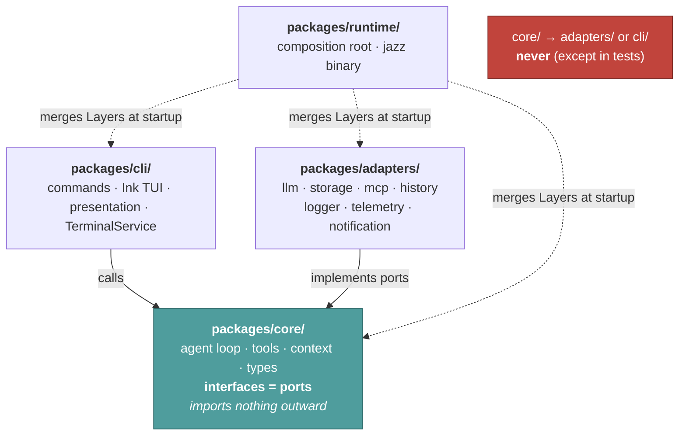
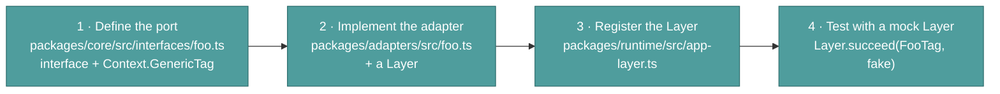

# Code map

This page helps you find where your change goes, and follow the conventions already there.

This is the contributor-facing counterpart to the rest of [Internals](./index.md): where
the code lives and how it's wired, rather than what the harness does at runtime.

---

## Core Principles

Jazz is a Bun workspace under `packages/*`. The dependency rule below is not just documented
convention — it's structurally enforced by TypeScript project references, so `tsc -b` rejects a
package importing from one it doesn't declare a reference to.

- **`packages/core/`** contains the domain, contracts (interfaces and types), and business logic.
  - No imports from `packages/adapters/` or `packages/cli/` allowed in core, except in tests.
  - Contracts are expressed as interfaces + Context tags (e.g., `AgentConfigServiceTag`).
  - Publishable standalone as `@jazz/core` — no workspace dependencies of its own.
- **`packages/adapters/`** implements adapters (database, LLM providers, Gmail, file system, logger, etc.).
  - Adapters provide Layers that satisfy the tags declared in `core/interfaces`.
  - Depends on `core` only.
- **`packages/cli/`** contains user-facing command implementations, Ink/OpenTUI presentation,
  and the terminal-rendering `TerminalService` implementation.
  - Depends on `core` only.
- **`packages/runtime/`** is the composition root — wires core, adapters, and cli into the
  Effect Layer graph that becomes the `jazz` binary.
  - Depends on `core`, `adapters`, and `cli`.
- **`packages/bot-shared/`**, **`packages/telegram-bot/`**, **`packages/discord-bot/`** are the
  chat-bridge integrations, each depending on `core`, `adapters`, and `bot-shared`.

## The dependency rule



Arrows point inward, always. That's what lets you swap a storage backend or add an LLM
provider by touching one package, and test the agent loop with plain mocks.

Adding a capability follows the arrows in reverse:



---

## Directory Structure

```text
packages/
├── cli/src/                      # @jazz/cli — user-facing CLI
│   ├── commands/                 # Command implementations (chat, agent, config)
│   ├── presentation/             # Output formatting (markdown, CLI renderer)
│   ├── chat-service.ts           # Chat orchestrator (UI-touching; lives here, not adapters)
│   ├── chat/                     # Chat service modules
│   │   ├── commands/             # Slash command handling
│   │   │   ├── parser.ts         # Parse /help, /new, etc.
│   │   │   └── handler.ts        # Execute commands
│   │   └── session/              # Session management
│   │       ├── manager.ts        # ID generation, logging
│   │       └── agent-setup.ts    # MCP connection setup
│   ├── terminal.ts               # TerminalService implementation (Ink/OpenTUI rendering)
│   └── ui/                       # Ink React components
│       ├── App.tsx               # Main app with store pattern
│       ├── ErrorBoundary.tsx     # Error boundary for graceful failures
│       ├── LineInput.tsx         # Readline-style input component
│       └── text-utils.ts         # Word boundary utilities
│
├── core/src/                     # @jazz/core — domain and contracts
│   ├── agent/                    # Agent execution engine
│   │   ├── agent-runner.ts       # Orchestrator (delegates to executors)
│   │   ├── types.ts              # Shared types (AgentRunnerOptions, etc.)
│   │   ├── context/              # Context management
│   │   │   └── summarizer.ts     # Auto-summarization for context window
│   │   ├── execution/            # LLM execution strategies
│   │   │   ├── streaming-executor.ts  # Real-time streaming
│   │   │   └── batch-executor.ts      # Non-streaming execution
│   │   ├── prompts/              # System prompts by agent type
│   │   └── tools/                # Tool implementations
│   │       ├── fs/               # Filesystem tools (read, write, grep, etc.)
│   │       ├── command-risk.ts   # execute_command risk classifier (LLM)
│   │       ├── tool-categories.ts # Builtin category ids + mappings
│   │       ├── register-tools.ts # Builtin tool registration
│   │       └── register-mcp-tools.ts # Per-agent MCP connect + register
│   ├── interfaces/               # Service contracts (Tag + Interface)
│   ├── types/                    # Domain types
│   └── utils/                    # Shared utilities
│
├── adapters/src/                 # @jazz/adapters — adapter implementations
│   ├── llm/                      # LLM provider adapters
│   ├── mcp/                      # MCP client + OAuth
│   ├── peers/                    # ask_peer ledger/token adapters
│   └── storage/                  # Persistence (JSON file storage)
│
├── runtime/src/                  # @jazz/runtime — composition root
│   ├── entry.ts                  # Binary entrypoint
│   ├── cli-app.ts                # Commander.js program, command registration
│   └── app-layer.ts              # Effect Layer composition
│
├── bot-shared/src/                # @jazz/bot-shared — shared bridge helpers
├── telegram-bot/src/              # Telegram bridge
└── discord-bot/src/               # Discord bridge
```

---

## Key modules

### Agent Runner (`packages/core/src/agent/`)

The agent runner is split into focused modules; runtime behavior is documented in
[Agent loop](./agent-loop.md) and [Context management](./context-management.md).

| Module                            | Purpose                                                                |
| --------------------------------- | ---------------------------------------------------------------------- |
| `agent-runner.ts`                 | Orchestrator - delegates to executors                                  |
| `types.ts`                        | Shared types: `AgentRunnerOptions`, `AgentResponse`, `AgentRunContext` |
| `context/summarizer.ts`           | Auto-compaction when context approaches token limit                    |
| `execution/streaming-executor.ts` | Real-time LLM streaming with tool calls                                |
| `execution/batch-executor.ts`     | Non-streaming execution with retry logic                               |

**Dependency Injection Pattern**: To avoid circular dependencies, the `summarizer.ts` accepts a `RecursiveRunner` function parameter instead of importing `AgentRunner` directly.

### Chat Service (`packages/cli/src/chat/`)

The chat service is split into focused modules:

| Module                   | Purpose                                 |
| ------------------------ | --------------------------------------- |
| `chat-service.ts`        | Session orchestrator                    |
| `commands/parser.ts`     | Parse slash commands from user input    |
| `commands/handler.ts`    | Execute individual commands             |
| `commands/types.ts`      | `SpecialCommand`, `CommandResult` types |
| `session/manager.ts`     | Session ID generation, logging          |
| `session/agent-setup.ts` | MCP server connections before chat      |

---

## Common Conventions

### Service Contracts

A service contract is an interface + a Context tag, defined under `packages/core/src/interfaces/`.

```typescript
// packages/core/src/interfaces/agent-config.ts
export interface AgentConfigService {
  getConfig(): Effect.Effect<AgentConfig, Error>;
}

export const AgentConfigServiceTag = Context.GenericTag<AgentConfigService>("AgentConfigService");
```

### Using Services in Effect

```typescript
const config = yield * AgentConfigServiceTag;
const value = yield * config.getConfig();
```

### Providing Layers

```typescript
Layer.effect(AgentConfigServiceTag, Effect.succeed(new ConfigServiceImpl(...)))
```

---

## How to Add a New Adapter/Service

1. Add the contract to `packages/core/src/interfaces/` (interface + Tag).
2. Implement the adapter in `packages/adapters/src/` and create a Layer.
3. Add registration in [`packages/runtime/src/app-layer.ts`](../../packages/runtime/src/app-layer.ts) by merging the new Layer.
4. Add tests with a mock Layer.

---

## Testing Patterns

### Pure Function Tests

For utilities like `parseSpecialCommand` or `generateSessionId`:

```typescript
import { describe, expect, it } from "bun:test";
import { parseSpecialCommand } from "./parser";

describe("parseSpecialCommand", () => {
  it("should parse /help command", () => {
    const result = parseSpecialCommand("/help");
    expect(result.type).toBe("help");
  });
});
```

### Effect Tests with Mocked Layers

```typescript
const mockLogger: LoggerService = {
  debug: () => Effect.void,
  info: () => Effect.void,
  // ...
};

const testLayer = Layer.succeed(LoggerServiceTag, mockLogger);

const result = await Effect.runPromise(myEffect.pipe(Effect.provide(testLayer)));
```

---

## UI Architecture

`@jazz/cli` uses [Ink](https://github.com/vadimdemedes/ink) (React for terminals) with a dual-pattern state management:

1. **External Store (`store` object)**: Imperative access for Effect-based services
2. **React Context (`AppContext`)**: Reactive state for components

The `ErrorBoundary` component wraps the app to catch rendering errors gracefully.

---

## Why This Structure

- **Separates policy (core) from mechanics (adapters)** — makes it easy to:
  - Swap LLM providers
  - Substitute storage backends
  - Test core logic with deterministic mocks
- **Good for open-source**: Contributors can implement providers/adapters without changing core logic.

---

## Troubleshooting

- **Missing tag at runtime**: Ensure the Layer providing that tag is included in `createAppLayer`.
- **Circular dependency**: Use dependency injection (pass functions as parameters) instead of direct imports.
- **Context overflow**: The `Summarizer` automatically compacts context when tokens approach 80% of the limit.
