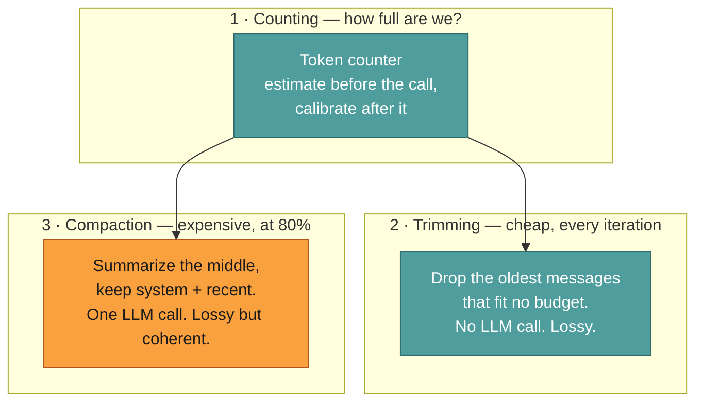
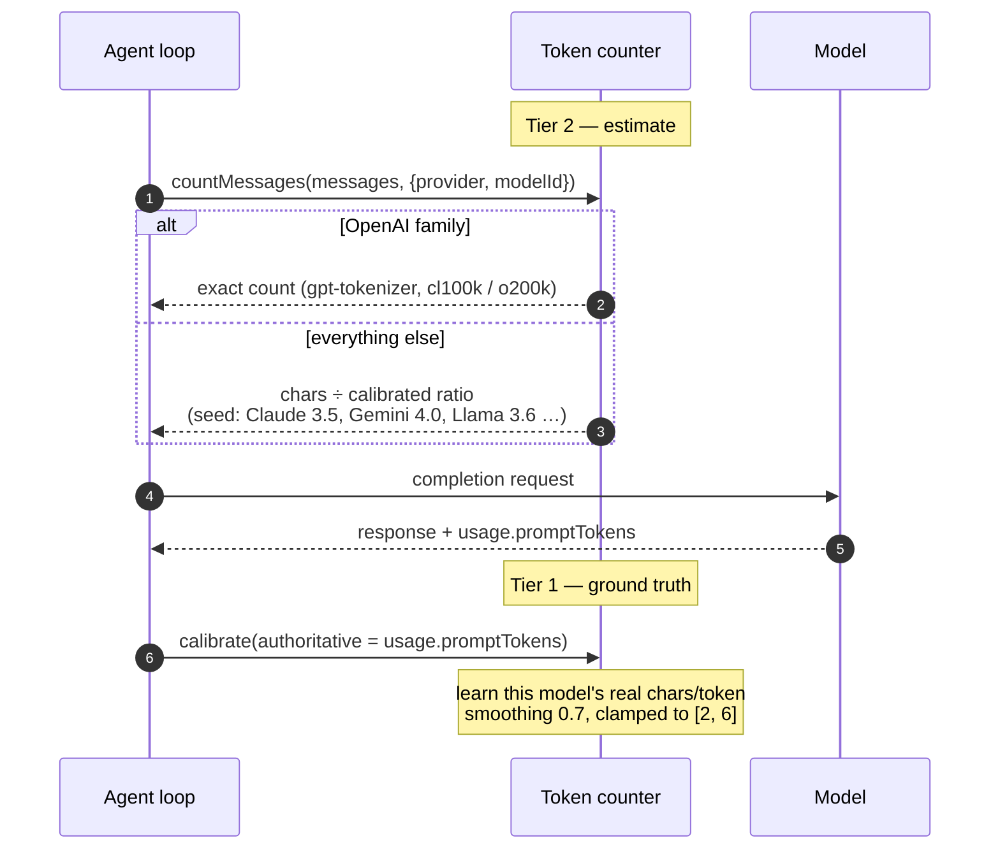
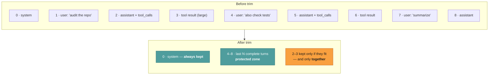
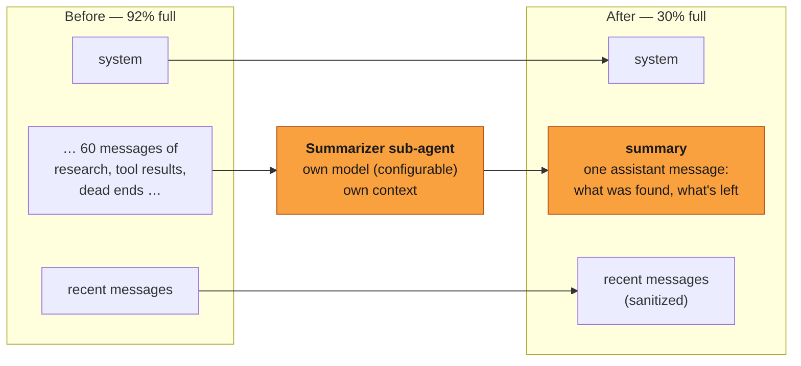

# Context management

**Reader job:** understand why a long Jazz run doesn't fall off the end of its context
window.

Source:
[`context/summarizer.ts`](../../src/core/agent/context/summarizer.ts) ·
[`context/context-window-manager.ts`](../../src/core/agent/context/context-window-manager.ts) ·
[`context/token-counter.ts`](../../src/core/agent/context/token-counter.ts)

Context is the scarce resource in an agent run. Tool results are large, they accumulate
every iteration, and running out means either a provider error or silently forgetting the
task. Jazz manages it with three mechanisms that do different jobs and are easy to
confuse.

---

## Three mechanisms, three jobs

| | Trimming | Compaction |
| --- | --- | --- |
| Runs | every iteration, after appending the assistant message | when tokens exceed 80% of the context budget (the model's window, or the agent's `maxContextTokens` ceiling when it is lower) |
| Costs | nothing | one LLM call |
| Budget | a fixed working-set target (50k tokens by default) | the context window the provider will actually honour |
| What's lost | old messages, entirely | detail — the gist survives as a summary |
| Preserves | system message + last N complete turns | system message + a summary + recent messages |

Trimming keeps the working set tidy. Compaction is what saves a run that genuinely has more
history than fits.

---

## 1 · Counting tokens

You can't decide whether to compact without knowing how full you are, and every provider
tokenizes differently. Jazz uses two tiers.

**Tier 1 — authoritative calibration.** After every call the provider reports
`usage.promptTokens`: its own count of exactly what we sent. Jazz feeds that back and the
counter learns a per-model chars-per-token ratio. Ground truth, free, one round trip.

**Tier 2 — pre-call estimate.** Before the *next* call, we need a number to compare against
the threshold. OpenAI-family encodings use `gpt-tokenizer` for an exact count. Everything
else uses the calibrated ratio if we have one, or a family seed if we don't.

Why no Anthropic tokenizer: `@anthropic-ai/tokenizer` is stale (Claude-2 era) and the
official `count_tokens` endpoint is a network call on the hot path. Calibration converges
after one exchange and costs nothing.

Per-message overheads are counted too — 4 tokens for role tags and separators, plus 10 more
for tool-result messages, which are numerous enough that ignoring their framing drifts the
estimate.

---

## 2 · Trimming: turn-aware, never mid-tool-call

Trimming runs every iteration against a fixed token budget. The subtlety isn't *what* to
drop, it's what must never be split.

The algorithm:

1. **System message is index 0 and always survives.** It carries the agent's identity and rules.
2. **Identify the protected zone** — the last N complete *turns*, scanning backwards for user messages (default 3). A "turn" is a user message plus every assistant and tool message after it until the next user message. Complete interaction cycles, not a raw message count.
3. **Walk backwards** from just before the protected zone, keeping messages while they fit the budget.
4. **Validate tool integrity.** An assistant message with `tool_calls` and its corresponding `tool` result messages are kept or dropped as a unit.

Step 4 is the one that matters. A history containing `tool_calls` with no matching `tool`
message is *invalid* to most providers — you get a 400 several iterations later, far from
the cause. Turn-awareness makes that structurally impossible rather than something to
remember.

---

## 3 · Compaction: summarize, don't truncate

At 80% of the model's real context window, Jazz stops discarding and starts summarizing.

The rebuild is literally `[system, summary, ...recentMessages]`. The middle — where the
bulk of the tokens live — becomes one message describing what was learned.

**Why summarize rather than slide a window?** A sliding window drops the *plan*. Forty
minutes into a research run, the early messages contain the task definition and the
strategy; the recent ones contain a tool result about page 14 of a PDF. Truncating keeps
the trivia and throws away the point. Summarizing keeps the point.

**The cost, honestly stated:** compaction is an extra LLM call, it adds latency mid-run, and
a summary is lossy — a detail the agent needed might not survive. Mitigations:

- **`summarizerModel` is configurable per agent.** Point compaction at a cheap fast model while the main agent runs an expensive one. Falls back to the agent's own model, with a warning if the configured value is unparseable.
- **It's visible.** You get a `Context window ~80% full — auto-compacting…` warning, then `Compacted 64 → 12 messages (saved ~48000 tokens)`. Never silent.
- **You can force it.** `/compact` in chat, or the `summarize_context` tool, which the agent can call itself when it knows it's about to go deep.
- **It's skipped when pointless.** If there's nothing in the middle worth summarizing, the messages come back untouched.

Window size comes from the model catalog (models.dev), falling back to 128k when unknown —
so the threshold tracks the actual model rather than a guess.

**Local providers are the exception, and getting this wrong is the worst failure mode there
is.** A cloud provider honours the window its catalog advertises. Ollama does not: it loads
the model with whatever `num_ctx` the request carries, or with the server's
`OLLAMA_CONTEXT_LENGTH` default — `qwen3.6:27b` advertises 262144 tokens and is routinely
served at 131072 or less. Accounting against the advertised number means Jazz compacts long
after the server has started dropping the middle of the conversation, and the agent keeps
answering from a context it no longer has.

So for `ollama` and `llamacpp` the threshold is taken from the agent's pinned `numCtx` when
it has one (that value overrides the server default for the request, so it *is* the runtime
window), and from the window the local server reported otherwise — llama-server's `/props`
gives its `-c` value directly. An unpinned Ollama agent gets a warning at run start rather
than a silent assumption, because Ollama exposes a loaded model's window on `/api/ps` but
has no endpoint for the server default before anything is loaded.

The catalog is no help here at all: models.dev carries no `ollama` or `llamacpp` provider,
so a local model resolves to the 128k unknown-model placeholder rather than to a real
maximum. That placeholder is never treated as a ceiling — a pinned window above it is
honoured, because the user pinned it and configured the server to serve it. Only a
*genuinely known* maximum caps a runtime window.

### The per-agent ceiling

`config.maxContextTokens` caps the window for *any* provider. It is the answer to "this
agent should never carry more than 60k tokens of history, even though the model would hold
200k" — useful for keeping cost and latency predictable, for models whose quality sags long
before their advertised limit, and for staying under a provider tier's real limit.

The ceiling only ever lowers the window: `min(runtime window, maxContextTokens)`. Asking for
more than the server will honour is ignored, because that is exactly the silent-truncation
failure above. Everything downstream then follows the capped number — the warning, the
compaction threshold, the summarizer's recent-message budget, and `/context`.

Set it with `jazz agent edit` → **Max Context Tokens**; leave the prompt blank to remove the
ceiling and go back to the model's own window.

### Warn first, compact second

Two thresholds share one budget, both defined in `context-window-manager.ts`:

| | Warning | Compaction |
| --- | --- | --- |
| Fires at | 70% of the budget (`CONTEXT_WARN_THRESHOLD_RATIO`) | 80% (`CONTEXT_COMPACT_THRESHOLD_RATIO`) |
| Costs | nothing | an extra LLM call |
| Effect | `context 74% full of 60,000 tokens — will auto-compact soon`, once per run | history is summarized |

The warning exists so that compaction is never a surprise: there is a window where you can
still `/compact` on your own terms, narrow the task, or raise the ceiling before the
summarizer decides what to keep. `ContextWindowManager` owns both decisions — `usage()`
returns the current tokens, the budget, and both flags from a single count.

---

## Tool results are reformatted before storage

The largest single lever on context in a long run isn't the conversation — it's tool
output. Every tool result passes through `formatToolResultForContext` before it's appended,
which shapes it for a model reader rather than dumping a raw payload.

Result sizes are also recorded per tool name in the run metrics, so `/context` can show you
which tool is actually eating your window. Usually it's one, and usually it's a surprise.

---

## Inspecting it live

| Command | Shows |
| --- | --- |
| `/context` | Current tokens, window size, and the biggest consumers |
| `/compact` | Force compaction now |
| `/cost` | Tokens and USD for this session, including sub-agents |

And in the logs: `Conversation context approaching limit`, `Context compacted successfully`
(with tokens saved), and trim decisions at debug level.

---

## Related

- [Agent loop](./agent-loop.md) — where compaction and trimming sit in an iteration
- [Sub-agents](./subagents.md) — the other way to keep the parent's context small
- [Design decisions](./design-decisions.md) — the trade-offs behind these choices
