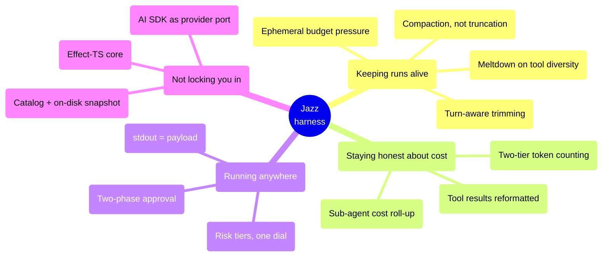

# Design decisions

**Reader job:** understand _why_ the harness is built this way — and what each choice
gives up.

Every decision below is a real trade-off, not a free win. This page states the alternative
that was rejected and the cost that was accepted, because a harness is only trustworthy if
you can see where its edges are.

---

## Map

---

## Keeping long runs alive

### Iteration budget with ephemeral pressure injection

**Decision.** 80 iterations per run. At 70% Jazz injects "begin consolidating"; at 90%,
"write your final output now". The message is appended to the request array for that one
call and never stored.

**Alternatives rejected.** A hard cap with no signalling — the agent gets cut off
mid-thought and you get nothing. Storing the warnings — by iteration 78 the history carries
eight escalating FINISH NOW messages that cost tokens, contradict each other, and poison the
next summarization.

**Cost accepted.** The agent can't see the pressure history, so it can't reason about "I've
been told this twice". In practice escalating tiers cover that.

📄 [`agent-loop.ts:40`](../../src/core/agent/execution/agent-loop.ts#L40) · [Agent loop](./agent-loop.md#guard-1--budget-pressure)

### Meltdown detection keyed on name + arguments

**Decision.** Over the last 10 tool calls, if unique `name:arguments` keys fall below 40%,
inject a recovery message and reset the window.

**Alternatives rejected.** Counting repeats of the tool _name_ — that flags
`web_search(q1) → web_fetch(u1) → web_search(q2)` as a meltdown, which is what research
looks like, and flags reading ten files in a row, which is what understanding a codebase
looks like. Both are the behaviors you're trying to encourage.

**Cost accepted.** An agent that loops with _slightly_ varied arguments — appending a
counter to the same query — slips through. Catching that needs semantic similarity, which
costs a model call per check.

📄 [`agent-loop.ts:101`](../../src/core/agent/execution/agent-loop.ts#L101) · [Agent loop](./agent-loop.md#guard-2--meltdown-detection)

### Compaction at 80%, not truncation

**Decision.** When tokens pass 80% of the model's window, summarize the middle of the
conversation into one message and rebuild as `[system, summary, ...recent]`.

**Alternatives rejected.** A sliding window — it drops the oldest messages, which is where
the task definition and the plan live. Forty minutes in you keep a tool result about page 14
of a PDF and lose the reason you were reading it.

**Cost accepted.** An extra LLM call, added mid-run latency, and genuine information loss.
Mitigated by a configurable `summarizerModel` (point it at something cheap), by making it
visible rather than silent, and by letting the agent trigger it deliberately via
`summarize_context`.

📄 [`summarizer.ts:222`](../../src/core/agent/context/summarizer.ts#L222) · [Context management](./context-management.md#3--compaction-summarize-dont-truncate)

### Turn-aware trimming

**Decision.** Trimming protects the system message plus the last N _complete turns_, and
keeps an assistant message's `tool_calls` together with its `tool` results as a unit.

**Alternatives rejected.** Dropping the oldest K messages. It eventually splits a tool call
from its result, which is invalid to most providers — and the 400 shows up several
iterations later, far from the cause.

**Cost accepted.** Trimming is coarser: sometimes a whole turn is dropped where a couple of
messages would have sufficed.

📄 [`context-window-manager.ts:94`](../../src/core/agent/context/context-window-manager.ts#L94) · [Context management](./context-management.md#2--trimming-turn-aware-never-mid-tool-call)

---

## Staying honest about cost

### Two-tier token counting with per-model calibration

**Decision.** Exact counts via `gpt-tokenizer` for OpenAI families; for everyone else a
family-seeded chars-per-token ratio that calibrates against the provider's own reported
`usage.promptTokens` after each call, smoothed and clamped to `[2, 6]`.

**Alternatives rejected.** One universal ratio (≈4 chars/token) — under-counts Claude by
~15%, so you overrun the window you thought you were under. Anthropic's tokenizer package —
stale, Claude-2 era. Their `count_tokens` API — a network round trip on the hot path.

**Cost accepted.** The first call against an unfamiliar model uses a seed estimate and can
be off. It self-corrects after one exchange.

📄 [`token-counter.ts`](../../src/core/agent/context/token-counter.ts) · [Context management](./context-management.md#1--counting-tokens)

### Tool results reformatted before entering context

**Decision.** Every tool result passes through `formatToolResultForContext` before being
appended, and its size is recorded per tool name.

**Alternatives rejected.** Storing raw payloads. Tool output — not conversation — is the
dominant context cost in long runs, and raw JSON is the least token-efficient way to say
anything.

**Cost accepted.** Formatting is lossy; a tool whose output genuinely needs full fidelity
must say so in its own formatter.

📄 [`tool-result-formatter.ts`](../../src/core/utils/tool-result-formatter.ts)

### Sub-agent cost rolls up into the parent

**Decision.** A parent run reports its own cost plus all child cost, and emits a figure
whenever _either_ side is known.

**Alternatives rejected.** Reporting only the parent's own tokens — a local-model parent
that spawned three cloud sub-agents would report `$0.00` while your bill said otherwise.

**Cost accepted.** You can't read per-child spend off the top-level number; that lives in
the telemetry records.

📄 [`agent-loop.ts:221`](../../src/core/agent/execution/agent-loop.ts#L221)

---

## Running anywhere

### stdout is the payload, stderr is everything else

**Decision.** `jazz run` writes only the answer (or exactly one JSON object) to stdout.
Status notices, tool chatter, headers, footers, and `--events` NDJSON all go to stderr.
`JAZZ_NO_TUI=1` is forced so Ink never touches stdout.

**Alternatives rejected.** A `--quiet` flag over the normal output path — you're still
filtering, and one new log line breaks every downstream parser. A dedicated `--format json`
that only _mostly_ suppresses chatter — same problem, later.

**Cost accepted.** Two streams to wire up in a bridge instead of one. That's the entire
cost, and it's what makes every non-terminal surface possible.

📄 [`run-agent.ts:16`](../../src/cli/commands/run-agent.ts#L16) · [Headless](../surfaces/headless.md)

### Risk tiers instead of a tool allowlist

**Decision.** Every tool declares a risk level (`read-only` / `low-risk` / `high-risk`), and
one policy dial decides what runs unattended.

**Alternatives rejected.** A per-tool allowlist as the primary mechanism. It doesn't
generalize across surfaces — you'd maintain a different list for CI, cron, and each bridge,
and a new tool defaults to invisible rather than gated.

**Cost accepted.** Tiers are coarse: `high-risk` covers both `git push` and `rm -rf`.
Sharper control comes from the two escape hatches — a per-tool session allowlist and a
per-command allowlist for `execute_command` — and from trimming the agent's toolset, which
is the strongest control available.

📄 [`types/tools.ts:19`](../../src/core/types/tools.ts#L19) · [Tools & approval](./tools-and-approval.md)

### Two-phase execution (propose → approve → execute)

**Decision.** A gated tool doesn't act. It returns an approval request describing what it
_would_ do — including a preview diff for edits. Approval (human or policy) then invokes the
real execution tool.

**Alternatives rejected.** A boolean `dangerous` flag checked before calling. You can't show
a meaningful preview without doing the work, and "would this be destructive" gets evaluated
before the arguments are resolved.

**Cost accepted.** Every gated tool is two registry entries instead of one, and the registry
carries the propose→execute mapping.

**What it buys:** interactive and unattended runs use _the same code path_. There is no
separate headless mode that can drift from the interactive one — the only difference is who
answers.

📄 [`tool-executor.ts:192`](../../src/core/agent/execution/tool-executor.ts#L192)

### Command approval matches on a parsed key, never a raw prefix

**Decision.** "Always approve `git status`" stores a key extracted from the command (binary

- first subcommand) and matches exactly or on a word boundary.

**Alternatives rejected.** Prefix-matching the raw command string. Then approving
`git status` also approves `git status && rm -rf /`.

**Cost accepted.** Approving `git` broadly takes several confirmations instead of one.

📄 [`tool-executor.ts:601`](../../src/core/agent/execution/tool-executor.ts#L601)

---

## Not locking you in

### Vercel AI SDK as the provider port

**Decision.** One adapter (`ai-sdk-service.ts`) behind the `LLMService` interface, giving 18
providers including local Ollama and llama.cpp.

**Alternatives rejected.** Hand-written clients per provider — every new provider becomes a
project, and streaming plus tool-calling plus reasoning quirks get reimplemented each time.

**Cost accepted.** Jazz is bounded by what the SDK normalizes, and inherits its bugs.
Provider-specific behavior that leaks through — reasoning-effort semantics especially — is
normalized in `services/llm/reasoning/`. AI SDK's internal retries are turned off
(`AI_SDK_MAX_RETRIES = 0`) so Jazz owns retry policy via Effect rather than having two
retry loops fighting.

📄 [`ai-sdk-service.ts`](../../src/services/llm/ai-sdk-service.ts) · [Providers & models](./providers-and-models.md)

### Model catalog from models.dev, with an on-disk snapshot

**Decision.** Context windows and pricing come from models.dev, cached to
`~/.jazz/cache/models-dev.json`. Offline mode reads the snapshot; `JAZZ_MODELS_DEV_URL`
points at an internal mirror.

**Alternatives rejected.** Vendoring a pricing table — stale within weeks, and wrong pricing
is worse than none. Requiring the network — breaks airgapped installs, which are a supported
deployment.

**Cost accepted.** A brand-new model may be missing from the catalog; Jazz falls back to
provider-reported metadata and a 128k default. Ollama and llama.cpp need no catalog at all —
model lists, context windows, and tool support are read from the local server.

📄 [`models-dev.ts`](../../src/core/utils/models-dev.ts) · [Airgapped](../guide/airgapped.md)

### Effect-TS for the entire runtime

**Decision.** Typed errors, tracked effects, `Layer`-based dependency injection throughout.

**Alternatives rejected.** Plain `async/await` with thrown exceptions. In an agent runtime
the failure paths _are_ the product — a tool that times out, a provider that 429s, a
malformed tool argument. With exceptions those become `undefined` three frames away.

**Cost accepted.** A real learning curve. Effect is unfamiliar to most contributors and the
type errors are intimidating. That's precisely why [Code map](./code-map.md) leads with the
DI and Layer patterns, and why `core/` is kept dependency-free so it can be tested with
plain mocks.

### Lazy MCP connection

**Decision.** MCP servers are not connected at startup. Tools are registered per-agent based
on the agent's tool list, and a server connects the first time one of its tools is actually
invoked.

**Alternatives rejected.** Connecting everything at boot. MCP servers are child processes;
half a dozen of them turn `jazz` into a several-second startup and a CLI that hangs when one
server misbehaves.

**Cost accepted.** The first call to an MCP tool pays the connection cost, and a broken
server surfaces mid-run instead of at startup.

📄 [`register-tools.ts`](../../src/core/agent/tools/register-tools.ts)

### Progressive skill loading

**Decision.** Three tools: `find_skills` (names + descriptions), `load_skill` (full
instructions), `load_skill_section` (a referenced file).

**Alternatives rejected.** Preloading every skill's instructions into the system prompt. A
hundred skills would consume the window before the user says anything.

**Cost accepted.** Two extra round trips before the agent starts working with a skill.

📄 [`skill-tools.ts`](../../src/core/agent/tools/skill-tools.ts) · [Skills loading](./skills-loading.md)

---

## Related

- [Agent loop](./agent-loop.md) · [Context management](./context-management.md) · [Tools & approval](./tools-and-approval.md)
- [Code map](./code-map.md) — where the code for all of this lives
- [Discussions](https://github.com/lvndry/jazz/discussions) — decisions not yet made
