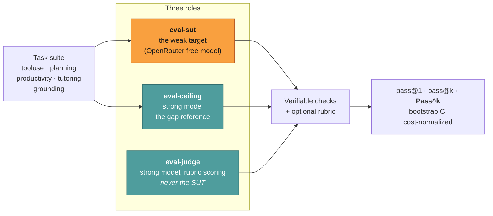

# Evals — measuring the harness

**Reader job:** find out whether a harness change actually made agents better, rather than
assuming it did.

Source: [`evals/`](../../evals/) · run instructions: [`evals/README.md`](../../evals/README.md)

---

## The question the harness exists to answer

Given a weak model and a strong one, how much of the gap between them is closable by the
*harness* — better context management, better prompting, better tool design — rather than by
paying for a bigger model?

That framing drives the whole design. Every run measures a **system under test** against a
**ceiling**, so an improvement is expressed as a fraction of a known gap rather than as an
absolute score that means nothing on its own.



The judge is never the model under test — a model grading itself measures its own confidence,
not its competence.

---

## Why Pass^k, not just pass@1

An agent that succeeds one time in three is not two-thirds of a working feature; it's an
unreliable one. So the harness reports:

| Metric | What it tells you |
| --- | --- |
| **pass@1** | Did it work on the first try |
| **pass@k** | Did it work at least once in k tries — an *optimistic* bound |
| **Pass^k** | Did it work on **every** one of k tries — the reliability number |
| **bootstrap CI** | Whether the difference you're looking at survives sampling noise |
| **cost-normalized** | Whether the improvement is real or just bought with more tokens |

`pass@k` rewards a lucky roll. **Pass^k** is the one to quote when claiming an agent is
dependable, because unattended surfaces — cron, CI, a chat bridge — get one attempt.

The bootstrap CI matters because eval suites are small. A jump from 6/10 to 7/10 is usually
noise, and reporting it as a win is how a harness accumulates changes that do nothing.

---

## Verifiable checks over vibes

Each task seeds a temp workspace, runs the agent, and checks **state** rather than asking a
model whether the answer looked good. Four check families live in
[`evals/checks.ts`](../../evals/checks.ts):

- **State checks** — did the file actually end up in the right place with the right content
- **Constraint checks** — did it avoid doing the thing it was told not to do
- **Citation grounding** — are the cited sources real and do they support the claim
- **Comprehension proxies** — did it understand the task, not just pattern-match the wording

### The grounding suite is the interesting one

[`evals/tasks/grounding/`](../../evals/tasks/grounding/) tests whether the agent resolves
indexical references — "this machine", "this repo", "the latest version" — against the real
environment instead of answering generically from training data. This is the failure mode most
likely to make an assistant feel useless while scoring fine on benchmarks.

Two checks are worth understanding because they encode a general principle:

- **`machineSpecGroundingCheck`** asserts against ground truth from `node:os`. Asking "how much RAM does this machine have" passes if the answer cites the real figure *or* the agent probed the system (`system_profiler`, `sysctl`). It **fails** on generic RAM-bucket advice, and it fails on asking the user to look it up themselves — because the agent has `execute_command` and could have just checked.
- **`toolGroundedAnswerCheck`** requires **both** a matching tool call **and** answer content consistent with it. Calling the tool proves nothing if the answer still guesses; this is the check that catches an agent going through the motions.

Web-dependent tasks use record-replay cassettes under `evals/fixtures/web/`, so
"what's the latest version of X" fails against the *actual* current version rather than
passing on a stale training-data guess.

---

## Judge calibration

Rubric scores come from an LLM judge, which is only trustworthy if it agrees with humans.
[`evals/judge/calibration.jsonl`](../../evals/judge/) holds human-labeled rows, and the runner
checks the judge correlates at **Pearson ≥ 0.7** before any rubric score is trusted.

An uncalibrated judge is a random number generator with good manners. Gating on correlation
means a drifting judge surfaces as a failed precondition rather than as quietly wrong results.

---

## Running it

```bash
cp evals/agents/*.json ~/.jazz/agents/      # install sut / ceiling / judge

bun run evals --agent eval-sut --samples 3 --stamp sut-baseline
bun run evals --agent eval-ceiling --samples 1 --stamp ceiling
```

**The A/B is the point.** Same tasks, two configs, so a harness change's lift is attributable
rather than asserted:

```bash
bun run evals --agent eval-sut --ab eval-sut-variant --samples 3 --stamp ab
```

Reports land in `evals/report/` (gitignored). Full flags and task-authoring guide:
[`evals/README.md`](../../evals/README.md).

---

## If you change the harness

Run the A/B. A change to context management, prompting, tool descriptions, or the agent loop
is exactly what this measures, and "it seems better in my testing" is not a result. If the
change is neutral on the suite, that's worth knowing too — it may mean the suite needs a task
that captures what you improved.

---

## Related

- [Agent loop](./agent-loop.md) · [Context management](./context-management.md) — the things most worth measuring
- [Design decisions](./design-decisions.md) — choices that should be defended with numbers
- [`evals/README.md`](../../evals/README.md) — flags, task authoring, agent configs
