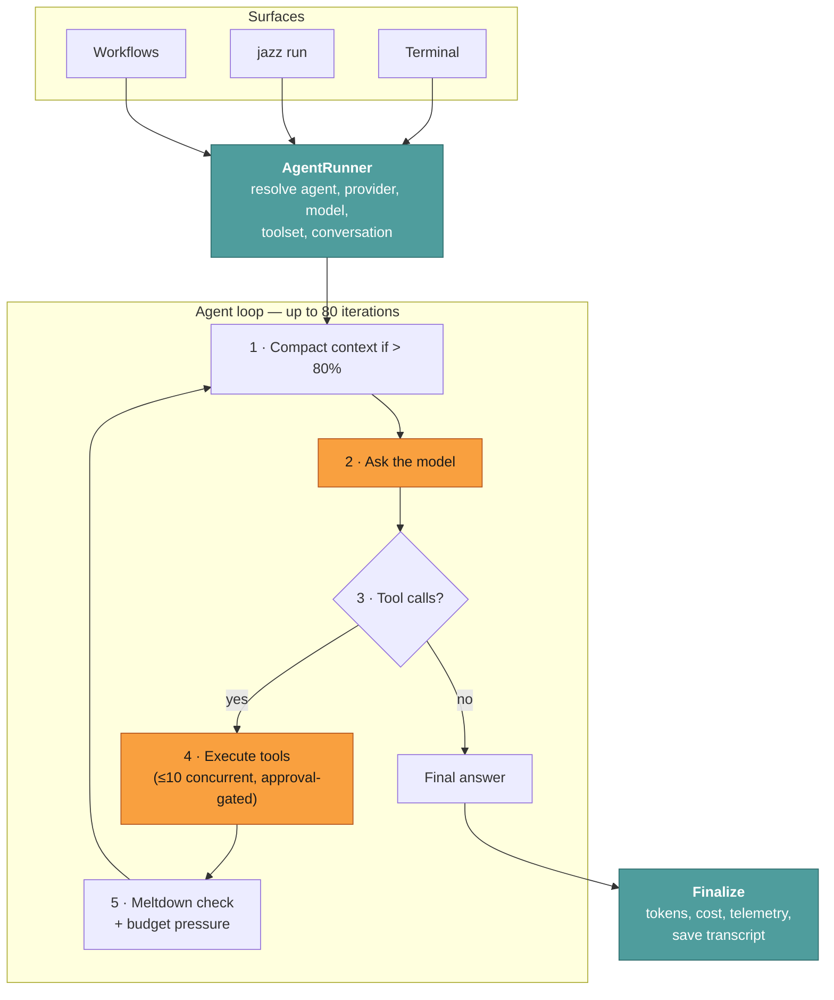
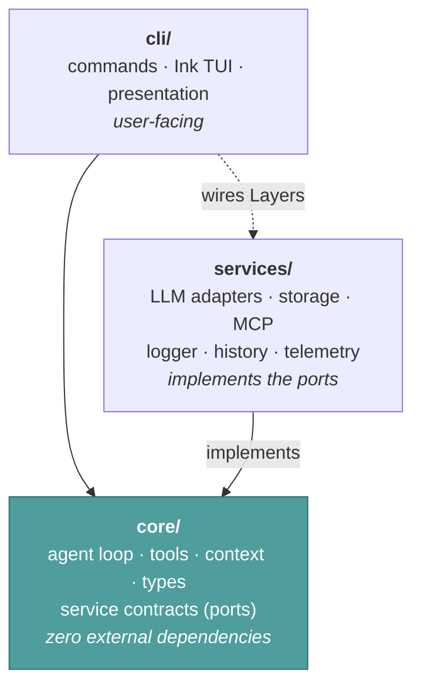

# Internals — how Jazz works

**Reader job:** understand the machine well enough to trust it, debug it, or extend it.

Two different people need this section:

- **Evaluating Jazz?** You want to know whether it survives a forty-minute autonomous run or spirals into a loop and burns $40. Read [Agent loop](./agent-loop.md) and [Context management](./context-management.md).
- **Contributing to Jazz?** You want to know where your code goes. Read [Code map](./code-map.md).

Everyone should read [Design decisions](./design-decisions.md) — the harness choices and
what each one trades away. If you're changing the harness, [Evals](./evals.md) is how you find
out whether it helped.

---

## The 10,000-foot view

Everything interesting happens in that loop, and the interesting parts are the guards
around it — compaction, meltdown detection, and budget pressure — not the request itself.

---

## The layers

Jazz follows Clean / Hexagonal architecture. The dependency rule is enforced: `core/`
imports nothing from `services/`.

`core/` defines an interface plus an Effect `Context.Tag`; `services/` provides a `Layer`
that satisfies it; `cli/` merges the Layers at startup. That's why swapping a storage
backend or adding an LLM provider touches one directory.

Details and conventions: [Code map](./code-map.md).

---

## Pages

| Page | What it covers |
| --- | --- |
| [Agent loop](./agent-loop.md) | Iterations, budget pressure, meltdown detection, tool phase, streaming vs batch, finalization |
| [Context management](./context-management.md) | Two-tier token counting, calibration, turn-aware trimming, 80% compaction, tool-result formatting |
| [Tools & approval](./tools-and-approval.md) | Registry, risk tiers, two-phase execution, concurrency, timeouts, command allowlisting |
| [Sub-agents](./subagents.md) | Context isolation, personas, cost roll-up, when the model reaches for one |
| [Memory](./memory.md) | Per-agent file-backed memory, path-safety choke point, locking, why it's opt-in |
| [Reminders](./reminders.md) | Per-agent scheduled reminders, timezone-aware `when` specs, disk persistence |
| [Skills loading](./skills-loading.md) | Progressive disclosure: `find_skills` → `load_skill` → `load_skill_section` |
| [Providers & models](./providers-and-models.md) | The AI SDK port, model catalog, reasoning normalization, retries, cost |
| [Evals](./evals.md) | Measuring whether a harness change helped: Pass^k, A/B, grounding checks, judge calibration |
| [Design decisions](./design-decisions.md) | Every harness choice, and what it trades away |
| [Code map](./code-map.md) | Directory structure, Effect patterns, how to add an adapter, testing |

---

## Key numbers

Useful when reading logs or sizing a deployment. All from
[`src/core/constants/agent.ts`](../../src/core/constants/agent.ts).

| Constant | Value | Meaning |
| --- | --- | --- |
| `DEFAULT_MAX_ITERATIONS` | 80 | Reason→act cycles per run before the loop stops |
| Budget pressure thresholds | 70% / 90% | Where Jazz tells itself to consolidate / finish |
| Compaction threshold | 80% | Of the model's context window, before summarizing |
| `MELTDOWN_WINDOW_SIZE` | 10 | Recent tool calls examined for repetition |
| Meltdown uniqueness floor | 40% | Below this, the run is judged stuck |
| `MAX_CONCURRENT_TOOLS` | 10 | Parallel tool executions per iteration |
| `TOOL_TIMEOUT_MS` | 3 min | Default per-tool timeout |
| Sub-agent timeout | 30 min | Ceiling on one delegated task |
| `DEFAULT_MAX_LLM_RETRIES` | 10 | Retries on transient provider failures |
| `LLM_TIMEOUT_SECONDS` | 900 | Whole completion call, including backoff |
| `MAX_CONVERSATION_HISTORY_PER_AGENT` | 100 | LRU-bounded stored conversations per agent |
| `DEFAULT_MAX_CATCH_UP_AGE_SECONDS` | 24 h | Past this, a missed scheduled run is skipped |
