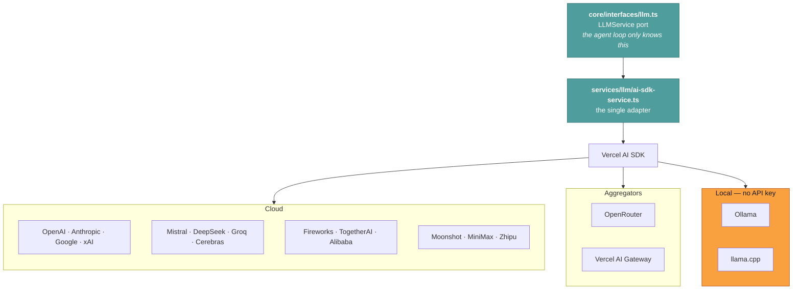
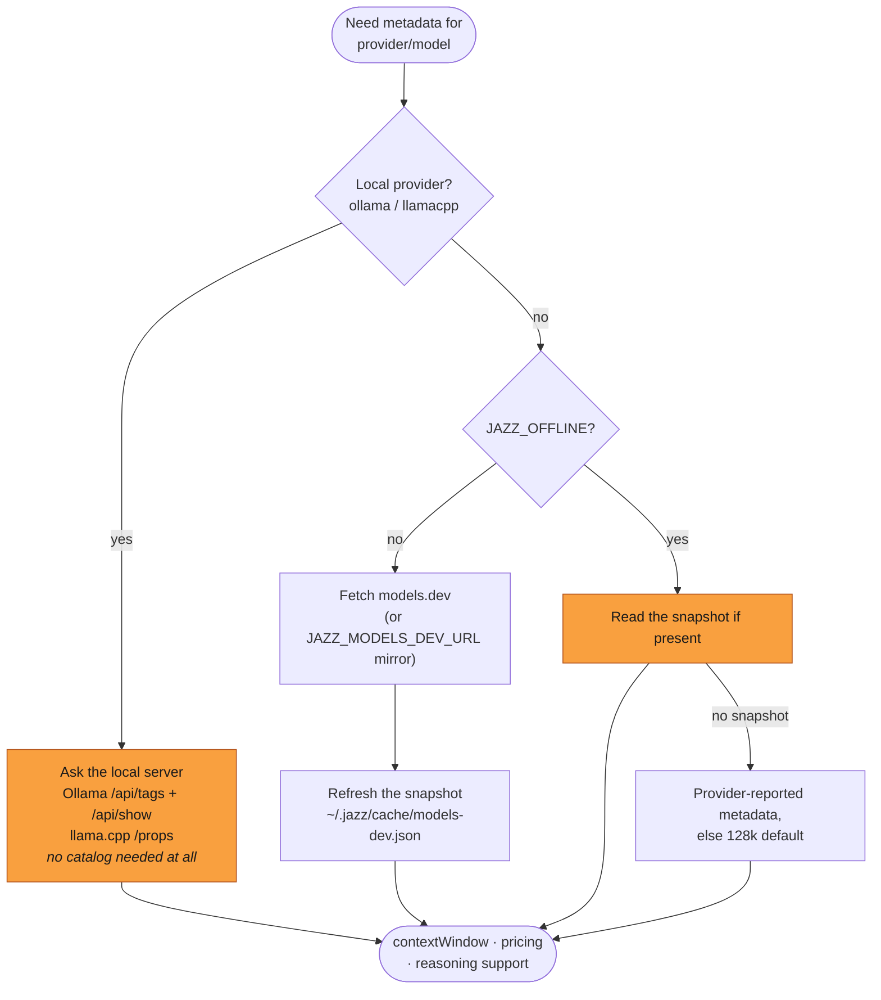
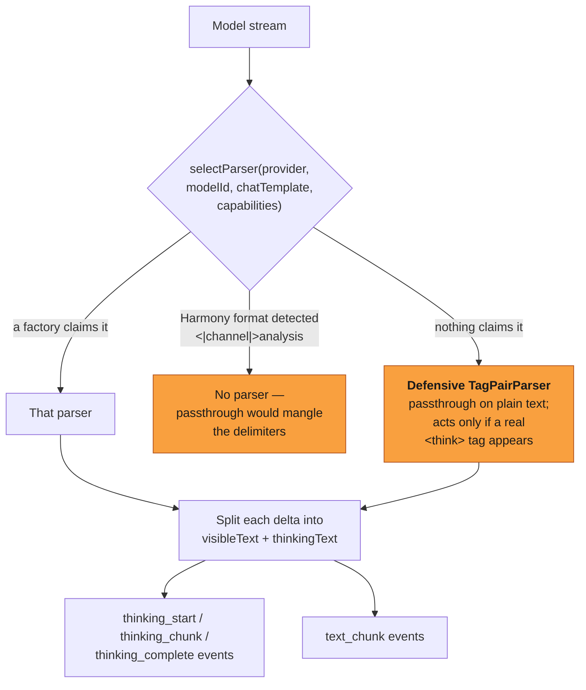

# Providers & models

**Reader job:** understand how Jazz stays provider-agnostic, and what it does about the
places providers genuinely differ.

Source:
[`services/llm/ai-sdk-service.ts`](../../src/services/llm/ai-sdk-service.ts) ·
[`services/llm/reasoning/`](../../src/services/llm/reasoning/) ·
[`core/utils/models-dev.ts`](../../src/core/utils/models-dev.ts)

---

## One port, 18 providers

`core/` defines an `LLMService` interface. `services/llm/ai-sdk-service.ts` is the only
implementation, and it delegates to the Vercel AI SDK.



Adding a provider means adding an SDK package and a catalog entry — not a new streaming
implementation, not a new tool-calling translation. The cost is that Jazz is bounded by what
the SDK normalizes, and inherits its bugs.

Configuration and API keys: [Integrations](../integrations/index.md).

---

## The model catalog

Jazz needs two things per model that providers don't reliably report: **context window** and
**pricing**. Both come from [models.dev](https://models.dev), with an on-disk snapshot so
this never becomes a hard dependency.



Consequences worth knowing:

- **Local models need no catalog.** Model lists, context windows, and tool-calling support are read straight from the local server. An airgapped install works with an empty cache.
- **The 80% compaction threshold tracks the real window.** A 1M-context model gets a 1M-based threshold, not a guess.
- **A brand-new model may be missing.** You get the provider's own metadata or a 128k default, and pricing display may be blank. Nothing breaks.
- **`JAZZ_MODELS_DEV_URL`** points at an internal mirror for airgapped networks that still want metadata. See [Airgapped](../guide/airgapped.md).

---

## Reasoning: the messiest difference

Providers expose "thinking" in incompatible ways. Some return it as a structured field. Some
interleave `<think>…</think>` tags in the text stream. Some reject a reasoning-effort
parameter outright. Local models frequently emit reasoning tags that their own advertised
capabilities never mention.



The default is **defensive rather than strict**, and that's a deliberate call. A strict
factory gate — only parse when metadata says the model reasons — silently leaks
`<think>` tags into the user-visible answer for the many local models that don't declare it.
The fallback parser is a passthrough until it actually sees an opening tag, so the cost of
being wrong is zero. The one format explicitly refused is Harmony, where naive tag-pair
parsing would visibly corrupt the channel delimiters.

Parsers are stateful per request and buffer across chunk boundaries, so a `<think>` tag split
across two network packets is stitched correctly rather than half-rendered.

**Reasoning effort** (`low` / `medium` / `high` / `disable`) is normalized per provider.
Models without reasoning support error if you ask for it — which is why `--reasoning disable`
exists and why the Telegram bridge sets it automatically when you switch to a non-reasoning
local model.

---

## Retries and timeouts

Jazz owns retry policy. The AI SDK's internal retries are turned **off**
(`AI_SDK_MAX_RETRIES = 0`) so there aren't two retry loops with different opinions about
backoff.

| Setting | Value | Meaning |
| --- | --- | --- |
| `DEFAULT_MAX_LLM_RETRIES` | 10 | Attempts on transient failures (429, 5xx, network) |
| `MAX_RETRY_DELAY_SECONDS` | 30 | Caps exponential backoff between attempts |
| `LLM_TIMEOUT_SECONDS` | 900 | The whole call including every retry and all backoff |
| `LLM_SLOW_MODEL_HINT_SECONDS` | 45 | Show a "this model is slow" hint; not a failure |

A 15-minute ceiling exists because slow reasoning models on a long prompt genuinely take
minutes, and a tighter timeout would fail runs that were about to succeed. Rate-limit errors
are typed (`LLMRateLimitError`) so they're distinguishable from real failures.

---

## Cost accounting

Pricing comes from the catalog, per million input and output tokens:

```text
ownCost = promptTokens/1e6 × inputPrice + completionTokens/1e6 × outputPrice
total   = ownCost + Σ(sub-agent cost)
```

A figure is emitted whenever *either* side is known — a free local parent that delegated to a
paid cloud sub-agent still reports real spend. When neither side is priced (an uncatalogued
local model), cost is omitted rather than reported as `$0.00`, because those aren't the same
claim.

Per-run records land in `~/.jazz/telemetry/` as local JSON. Nothing is transmitted anywhere.

---

## Switching models

| Where | How |
| --- | --- |
| Mid-conversation | `/model` |
| Per agent | the agent's `llmProvider` / `llmModel` fields |
| For compaction only | the agent's `summarizerModel` — run a cheap model for summaries |
| For one headless run | `--reasoning` (effort); model comes from the agent config |
| Whole install | `~/.jazz/config.json` |

Running a cheap model for compaction while the main agent runs an expensive one is the
highest-value version of this, and it's one field.

---

## Related

- [Integrations: providers](../integrations/index.md#llm-providers) — API keys and setup
- [Airgapped & self-hosted](../guide/airgapped.md) — local-only operation
- [Context management](./context-management.md) — what the context window is used for
- [Design decisions](./design-decisions.md#not-locking-you-in) — the trade-offs
