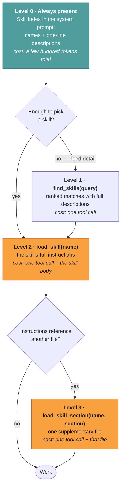
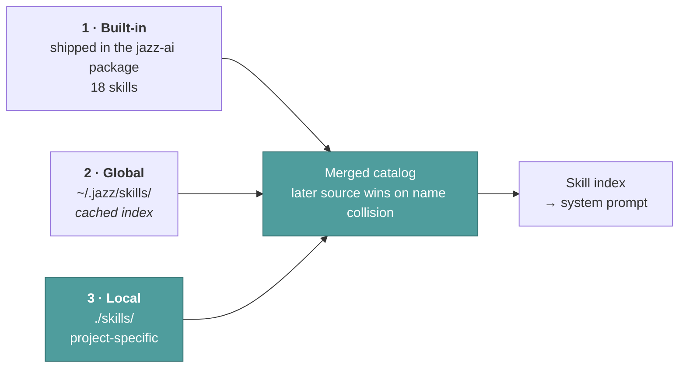

# Skills loading — progressive disclosure

This page explains how Jazz can have a hundred skills installed without paying for
them in every request.

Source:
[`tools/skill-tools.ts`](../../src/core/agent/tools/skill-tools.ts) ·
[`core/skills/skill-service.ts`](../../src/core/skills/skill-service.ts)

For what skills *are* and how to write one, see [Skills](../concepts/skills.md). This page
is about the loading mechanism.

---

## The problem

A skill is a markdown playbook — often long, sometimes with supplementary files. Preloading
every installed skill into the system prompt is the obvious design and it doesn't scale: a
hundred skills would consume the context window before the user has said anything.

Jazz solves it with three levels of detail, each fetched only when the previous level isn't
enough.

Most runs stop at level 0 — the index is enough to decide no skill applies, or to name the
one that does and load it directly. You pay for depth only when depth is used.

---

## The three tools

| Tool                 | Input                                         | Returns                                        | Risk        |
| -------------------- | --------------------------------------------- | ---------------------------------------------- | ----------- |
| `find_skills`        | `query`, optional `limit` (max 10, default 5) | Ranked `name: description` lines               | `read-only` |
| `load_skill`         | `skill_name`                                  | The skill's full instructions                  | `read-only` |
| `load_skill_section` | `skill_name`, `section_name`                  | One supplementary file referenced by the skill | `read-only` |

A detail worth noticing: **`skill_name` is a `z.enum` built from the actually-discovered
skill names**, not a free string. The model literally cannot hallucinate a skill name — an
invalid one is a schema violation caught before execution rather than a "skill not found"
round trip.

`find_skills` ranks with a scoring function over names and descriptions, and when nothing
matches it says so and points at `load_skill` for exact names, rather than returning an empty
result the model has to interpret.

---

## Where skills come from

Three sources, merged by precedence. Later wins, so you can shadow a built-in skill with
your own.

The global directory's index is cached at `~/.jazz/global-skills-index.json` so startup
doesn't re-scan a large skill library every time. Local skills are scanned per project, which
is what makes a checked-in `./skills/` directory work — clone the repo, get the team's
skills.

Jazz follows the [`.agents` convention](https://agentskills.io), so skills written for other
agents work here. `npx skills add` installs from the ecosystem; `/skills` in chat lists
what's available.

---

## Cost profile

| Scenario                        | Tool calls | Context cost                  |
| ------------------------------- | ---------- | ----------------------------- |
| No skill needed                 | 0          | the index only                |
| Agent knows the skill by name   | 1          | index + skill body            |
| Agent needs to search first     | 2          | index + matches + skill body  |
| Skill pulls in a reference file | 3          | index + matches + body + file |

**The trade-off:** up to two extra round trips before the agent starts working. That's the
price of not spending the window on skills nobody asked for. When the agent already knows
the name from the index — the common case — it's one call.

---

## Related

- [Skills](../concepts/skills.md) — writing and installing skills
- [Tools & approval](./tools-and-approval.md) — the registry these live in
- [Design decisions](./design-decisions.md#progressive-skill-loading) — the trade-off stated plainly
