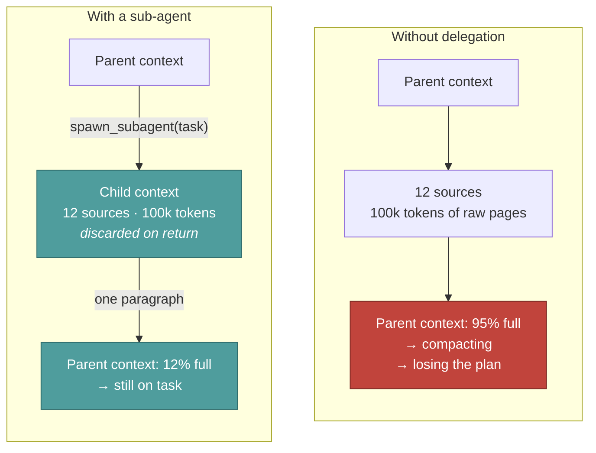
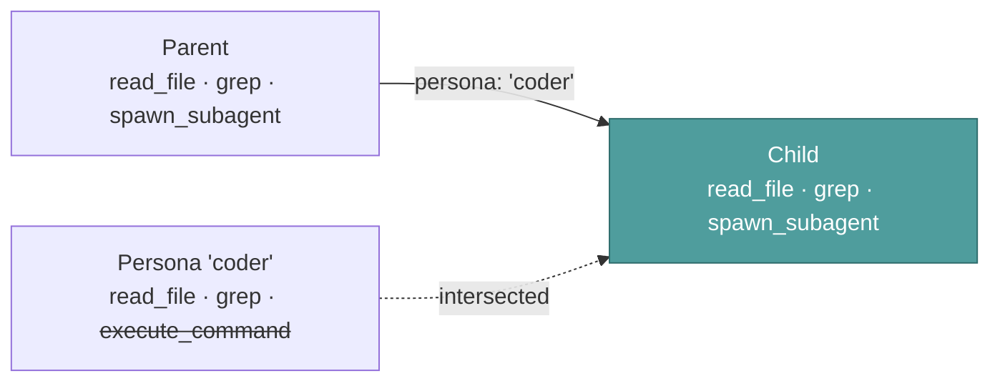
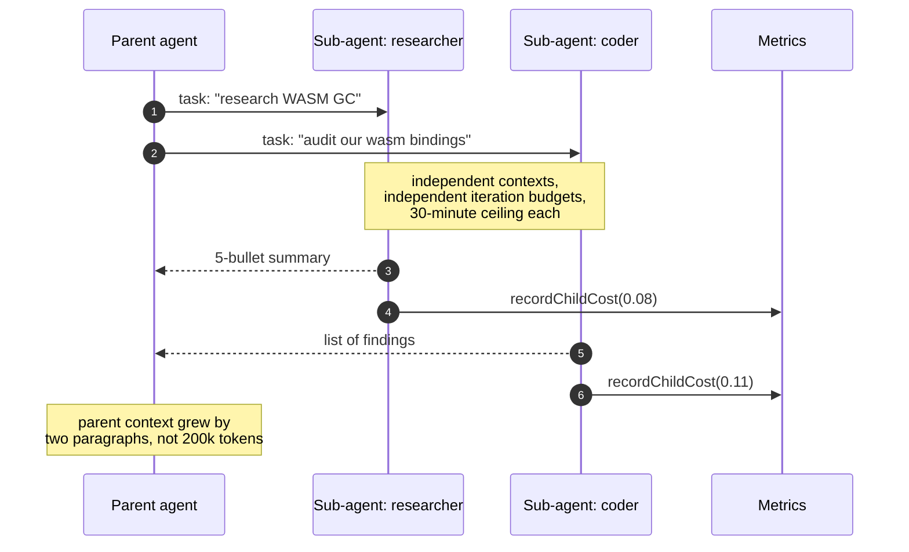

# Sub-agents

**Reader job:** understand how Jazz delegates, and why delegation is a context strategy
rather than a parallelism trick.

Source: [`tools/subagent-tools.ts`](../../src/core/agent/tools/subagent-tools.ts)

---

## The point is isolation, not speed

A sub-agent gets **its own context window**. That's the whole idea. Deep research burns
100,000 tokens reading twelve sources — and if that happens in the parent's context, the
parent is compacting by iteration fifteen and has forgotten the task. Delegated, the same
work costs the parent one paragraph.



---

## Spawning

```ts
spawn_subagent({
  task: "Research the current state of WASM GC proposals. Return a 5-bullet summary with source URLs.",
  name: "WASM researcher",        // optional — label for the UI panel
  persona: "researcher",           // "default" | "coder" | "researcher"
})
```

| Field     | Purpose                                                                                                                                                         |
| --------- | --------------------------------------------------------------------------------------------------------------------------------------------------------------- |
| `task`    | The full brief, **including the expected output shape**. The child cannot see the parent's conversation, so an underspecified task produces an unusable answer. |
| `name`    | Short role label shown in the sub-agent panel, so parallel children are distinguishable.                                                                        |
| `persona` | `coder` for code and git work, `researcher` for investigation, `default` for general.                                                                           |

A sub-agent always runs as the parent agent itself — same provider, same model, same config —
varying only the persona. Delegating to a *different* saved agent, or running the child on a
different model, is deliberately not offered.

---

## The tool ceiling

A child never holds a tool its parent lacks. `spawn_subagent` passes the parent's effective
tool names down as the child's allowlist, and the child's own toolset is intersected with it
after personas and built-in categories resolve.



The parent chooses the child's persona, and a persona resolves its own built-in tool
categories — so without the intersection, a read-only CI reviewer could reach
`execute_command` by spawning a child under a broader persona. This is what keeps the claim in
[Agents](../concepts/agents.md) true: that omitting a tool is the strongest safety control
available. Withheld tools are logged at `info`.

Because the ceiling lives in the runner rather than at the call site, it holds for any future
caller of a nested run, not just `spawn_subagent`.

---

## Nesting depth

A child gets its **own** iteration budget — `maxSubagentIterations`, default 30 — not its
parent's remainder. A sub-agent spawned on the parent's last iteration would be useless with one
round to work in, and the point of delegation is a clean context with room to use it. It is set
well below a top-level run's 100 because a sub-agent answers one scoped task; a child still
working after 30 iterations has usually misunderstood the brief rather than found more to do.

That means the parent's remaining budget bounds nothing. Depth does. Each run carries how many
levels sit above it, and `spawn_subagent` refuses once the limit is reached:

```text
Sub-agent nesting limit reached (depth 3 of 3). Do this task yourself instead of delegating it further.
```

It refuses rather than silently running the child at the wrong depth: a parent told its
delegation was declined can do the work itself, whereas one handed a child that quietly ignored
the limit cannot tell. Refusal is a normal tool error the parent can act on in its next
iteration, and no sub-agent panel opens.

The limit is `maxSubagentDepth` in `~/.jazz/config.json` (or `./.jazz/config.json`), defaulting
to **3** — enough for orchestrator → specialist → helper:

```json
{
  "maxSubagentDepth": 3
}
```

Set it to `0` to stop agents delegating at all. The runner resolves the value once per run, so
every level of a tree obeys the same number.

Breadth is bounded separately: `MAX_CONCURRENT_TOOLS` (10) caps how many tool calls — sub-agents
included — run at once within a single iteration.

Because the parent can issue several tool calls in one iteration, sub-agents run in parallel
up to the concurrency cap — each with its own panel in the TUI.



---

## What crosses the boundary

| Crosses in                         | Crosses out                       | Never crosses                    |
| ---------------------------------- | --------------------------------- | -------------------------------- |
| The `task` string                  | The child's final answer          | The parent's message history     |
| The chosen persona                 | Its cost, into the parent's total | The parent's tool results        |
| The agent's provider/model         |                                   | The child's intermediate work    |
| The parent's toolset, as a ceiling |                                   | Any tool the parent itself lacks |

**Cost rolls up.** Each child reports spend via `recordChildCost`, and the parent's
`costUSD` is its own tokens plus all child cost. A run on a free local model that delegated
to a cloud model still reports a real number.

**The isolation cuts both ways.** A child that needed a detail from the parent's history
can't see it. Put everything it needs in `task`. This is the main failure mode, and the
usual symptom is a confidently wrong answer to a question the child misunderstood.

---

## Limits

| Limit        | Value                            | Why                                                                              |
| ------------ | -------------------------------- | -------------------------------------------------------------------------------- |
| Timeout      | 30 min                           | A delegated task that hasn't finished in half an hour isn't going to             |
| Iterations   | 30, via `maxSubagentIterations`  | Its own budget, not the parent's remainder — and far below a top-level run's 100 |
| Nesting      | 3 levels, via `maxSubagentDepth` | Depth is what bounds total spend, since each level gets a fresh budget           |
| Toolset      | at most the parent's             | A child must never be an escalation path                                         |
| Panel height | 12 lines                         | UI only                                                                          |

Budget pressure interacts deliberately with delegation: at 70% of its iteration budget the
parent is told to **stop spawning new research sub-agents** and start consolidating. Without
that, a parent can spend its whole budget delegating and never write the answer — see
[Agent loop](./agent-loop.md#guard-1--budget-pressure).

---

## `summarize_context` — the other context tool

Registered alongside `spawn_subagent`, `summarize_context` lets the agent compact its *own*
history on purpose rather than waiting for the automatic 80% threshold. Useful when it knows
it's about to go deep and would rather enter that phase with a clean window.

Automatic compaction is the safety net. This is the deliberate version. See
[Context management](./context-management.md).

---

## When delegation is the wrong call

- **Small, well-scoped work.** Two extra round trips and a fresh context cost more than just reading the file.
- **Anything needing the conversation so far.** If the task can't be written down without "as we discussed", the child will misunderstand it.
- **Work that must mutate shared state in order.** Parallel children have no coordination between them.

---

## Related

- [Context management](./context-management.md) — the other half of the context strategy
- [Agent loop](./agent-loop.md) — how the parent's budget bounds delegation
- [Personas](../concepts/personas.md) — what `coder` and `researcher` change
