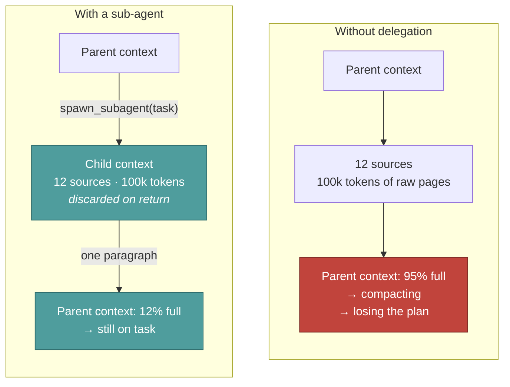
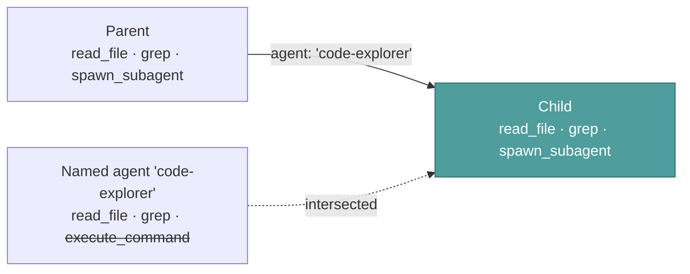
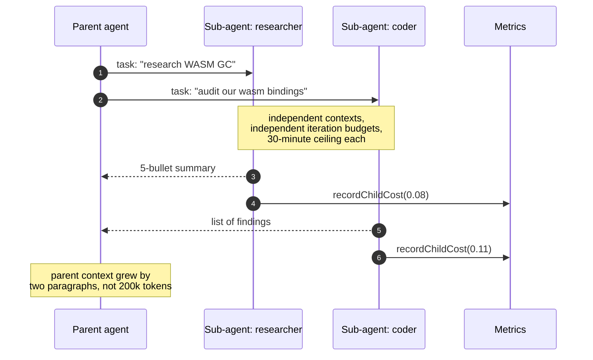

# Sub-agents

**Reader job:** understand how Jazz delegates, and why delegation is a context strategy
rather than a parallelism trick.

Source: [`tools/subagent-tools.ts`](../../src/core/agent/tools/subagent-tools.ts)

---

## The point is isolation, not speed

A sub-agent gets **its own context window**. That's the whole idea. Deep research burns
100,000 tokens reading twelve sources — and if that happens in the parent's context, the
parent is compacting by iteration fifteen and has forgotten the task. Delegated, the same
work costs the parent one paragraph.



---

## Spawning

```ts
spawn_subagent({
  task: "Research the current state of WASM GC proposals. Return a 5-bullet summary with source URLs.",
  name: "WASM researcher",        // optional — label for the UI panel
  persona: "researcher",           // "default" | "coder" | "researcher"
})
```

| Field | Purpose |
| --- | --- |
| `task` | The full brief, **including the expected output shape**. The child cannot see the parent's conversation, so an underspecified task produces an unusable answer. |
| `name` | Short role label shown in the sub-agent panel, so parallel children are distinguishable. |
| `persona` | `coder` for code and git work, `researcher` for investigation, `default` for general. |
| `agent` | Name of a saved **delegatable** agent to run the task as. Mutually exclusive with `persona`. |

---

## Delegating to a saved agent

`persona` varies one thing: tone. Model, reasoning effort, and toolset all come from the
parent. That is often enough — but when a task wants a *different* model or a narrower
toolset, the thing that already describes that combination is a saved agent.

Mark one delegatable and it appears in every other agent's system prompt:

```json
{ "delegatable": true, "whenToUse": "use for tracing call sites; reads only" }
```

```ts
spawn_subagent({
  task: "Map every caller of resolveEffectiveContextWindow. Return file:line for each.",
  agent: "code-explorer",
})
```

The child then runs with that agent's model, reasoning effort, and persona — but **not** its
toolset, which is capped at the parent's (below). Naming an agent that isn't in the roster is an
error listing the valid names, not a silent fall back to a persona: a task routed to the wrong
specialist looks like it succeeded, which is worse than an error the parent can correct on its
next iteration.

Delegation is opt-in because `description` is written for humans while `whenToUse` is written
for the router, and because the roster costs prompt tokens every turn. Details and limits:
[Configuration](../reference/configuration.md#agent-config-delegatable-and-whentouse).

---

## The tool ceiling

A child never holds a tool its parent lacks. `spawn_subagent` passes the parent's effective
tool names down as the child's allowlist, and the child's own toolset is intersected with it
after personas and built-in categories resolve.



This is what keeps the claim in [Agents](../concepts/agents.md) true — that omitting a tool is
the strongest safety control available. Without the intersection, a read-only CI reviewer could
reach `execute_command` by delegating to an agent that has it. Withheld tools are logged.

Because the parent can issue several tool calls in one iteration, sub-agents run in parallel
up to the concurrency cap — each with its own panel in the TUI.



---

## What crosses the boundary

| Crosses in | Crosses out | Never crosses |
| --- | --- | --- |
| The `task` string | The child's final answer | The parent's message history |
| The chosen persona, or a named agent's config | Its cost, into the parent's total | The parent's tool results |
| The provider/model — the parent's, or the named agent's | | The child's intermediate work |
| The parent's toolset, as a ceiling | | Any tool the parent itself lacks |

**Cost rolls up.** Each child reports spend via `recordChildCost`, and the parent's
`costUSD` is its own tokens plus all child cost. A run on a free local model that delegated
to a cloud model still reports a real number.

**The isolation cuts both ways.** A child that needed a detail from the parent's history
can't see it. Put everything it needs in `task`. This is the main failure mode, and the
usual symptom is a confidently wrong answer to a question the child misunderstood.

---

## Limits

| Limit | Value | Why |
| --- | --- | --- |
| Timeout | 30 min | A delegated task that hasn't finished in half an hour isn't going to |
| Iterations | inherits the parent's budget | A child can't outlive the run that spawned it |
| Nesting | children can delegate further | Bounded in practice by the parent's iteration budget |
| Toolset | at most the parent's | A child must never be an escalation path |
| Roster size | 24 delegatable agents | The roster is re-sent every turn |
| Panel height | 12 lines | UI only |

Budget pressure interacts deliberately with delegation: at 70% of its iteration budget the
parent is told to **stop spawning new research sub-agents** and start consolidating. Without
that, a parent can spend its whole budget delegating and never write the answer — see
[Agent loop](./agent-loop.md#guard-1--budget-pressure).

---

## `summarize_context` — the other context tool

Registered alongside `spawn_subagent`, `summarize_context` lets the agent compact its *own*
history on purpose rather than waiting for the automatic 80% threshold. Useful when it knows
it's about to go deep and would rather enter that phase with a clean window.

Automatic compaction is the safety net. This is the deliberate version. See
[Context management](./context-management.md).

---

## When delegation is the wrong call

- **Small, well-scoped work.** Two extra round trips and a fresh context cost more than just reading the file.
- **Anything needing the conversation so far.** If the task can't be written down without "as we discussed", the child will misunderstand it.
- **Work that must mutate shared state in order.** Parallel children have no coordination between them.

---

## Related

- [Context management](./context-management.md) — the other half of the context strategy
- [Agent loop](./agent-loop.md) — how the parent's budget bounds delegation
- [Personas](../concepts/personas.md) — what `coder` and `researcher` change
