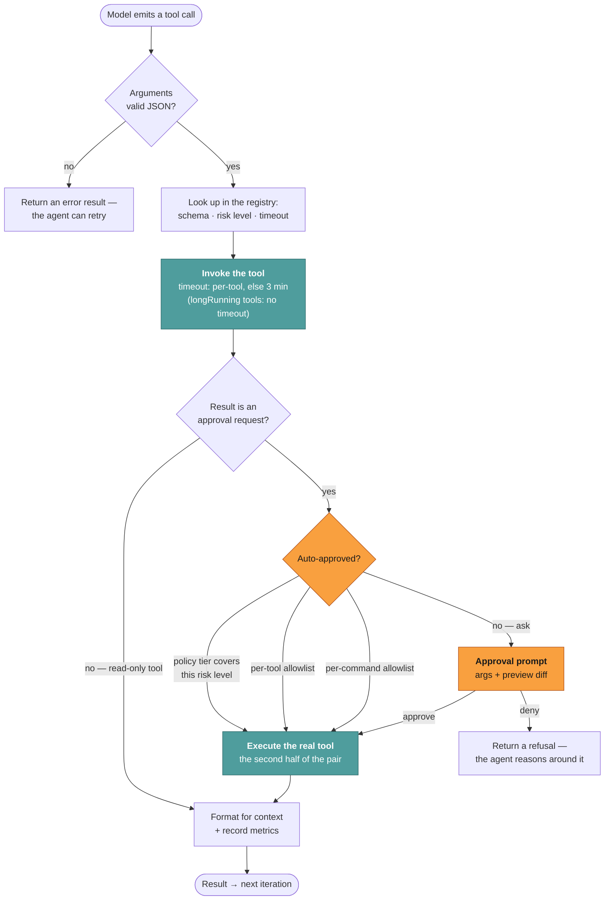
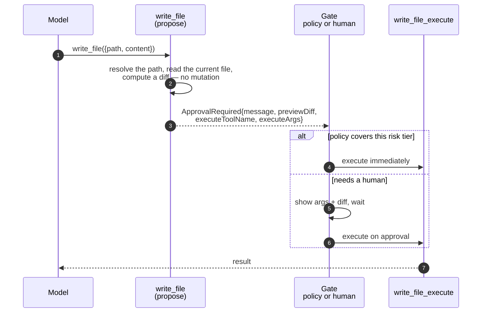
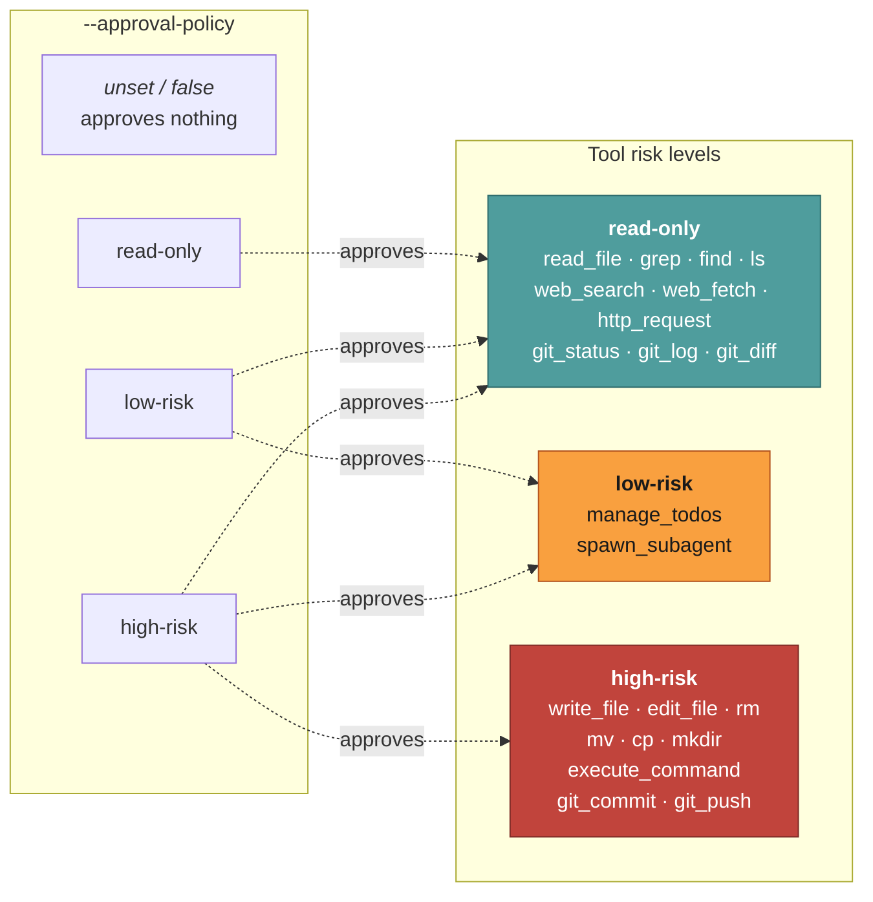
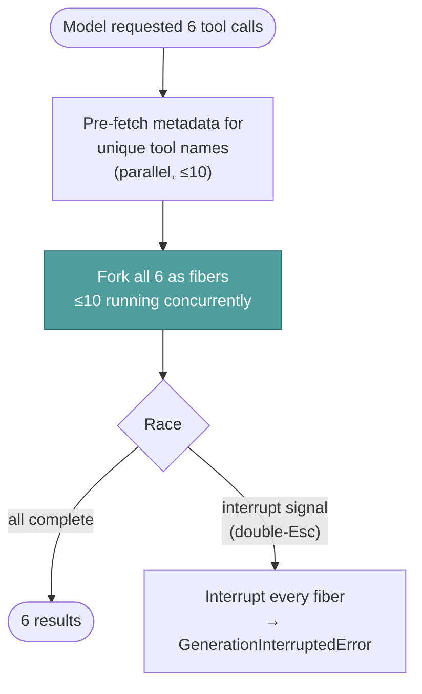

# Tools & approval

**Reader job:** understand how a tool call becomes an action, and what stands between the
two.

Source:
[`execution/tool-executor.ts`](../../src/core/agent/execution/tool-executor.ts) ·
[`tools/tool-registry.ts`](../../src/core/agent/tools/tool-registry.ts) ·
[`tools/register-tools.ts`](../../src/core/agent/tools/register-tools.ts) ·
[`tools/register-mcp-tools.ts`](../../src/core/agent/tools/register-mcp-tools.ts) ·
[`types/tools.ts`](../../src/core/types/tools.ts)

---

## The lifecycle of one tool call



---

## Two-phase execution

A gated tool doesn't act when the model calls it. It returns a description of what it
*would* do:



**Why a pair rather than a `dangerous: true` flag.** You cannot show a useful preview
without doing the work — computing a diff means reading the target and resolving the path.
Two phases let the propose step do real work and *still* not mutate anything, which is what
makes "here is the exact diff, approve?" possible.

**What it buys.** Interactive and unattended runs go down the *same* path. The only
difference is who answers the gate. There is no separate headless mode to drift out of sync
with the interactive one.

---

## Risk tiers

Every tool declares a level. One dial decides what runs without asking.



The policy is read through a **getter**, not captured once, so a mid-run change takes effect
immediately — that's how Shift+Tab mode switching works in the TUI, and why a tool queued
behind another can pick up a policy that changed while it waited.

### Two sharper controls

Tiers are coarse on purpose. When you need precision:

| Control | Scope | Behavior |
| --- | --- | --- |
| **Per-tool allowlist** | this session | "Always approve this tool" — chosen from an approval prompt |
| **Per-command allowlist** | persisted | "Always approve this command" — `execute_command` only |

The command allowlist does **not** prefix-match raw strings. It extracts an approval key
(binary + first subcommand) and matches exactly or on a word boundary:

```text
approved: "git status"
  ✅ git status
  ✅ git status --short
  ❌ git statusfoo
  ❌ git status && rm -rf /     ← the reason prefix matching was rejected
```

The strongest control isn't a policy at all: **an agent whose toolset omits
`execute_command` cannot run shell commands regardless of tier.** Trim the toolset in the
agent config when the blast radius matters — see [Chat platforms](../surfaces/chat-platforms.md#security-for-chat-surfaces).

---

## Concurrency and timeouts



| Setting | Value | Notes |
| --- | --- | --- |
| `MAX_CONCURRENT_TOOLS` | 10 | Prevents resource exhaustion when a model asks for 40 file reads |
| `TOOL_TIMEOUT_MS` | 3 min | Default; a tool can declare its own |
| `longRunning` tools | no timeout | e.g. `ask_user_question` — waiting for a human isn't a hang |

A timeout is **not** a crash. It comes back as a failed result with the message, the agent
sees it, and the run continues. A tool that can't finish shouldn't take the whole run down.

Approval prompts are queued rather than raced, and re-checked at dequeue time — a parallel
tool's "always approve" may have changed the answer while this one waited.

---

## Two shell-specific defenses

`execute_command` gets two protections beyond the approval gate, both in
[`shell-tools.ts`](../../src/core/agent/tools/shell-tools.ts).

### A 56-pattern denylist

Commands are matched against a denylist *before* execution — privilege escalation (`sudo`,
`su`), filesystem destruction (`rm -rf /`), remote code execution (`curl … | sh`),
power/runlevel changes (`shutdown`), and reads or copies of `/etc/passwd`, `/etc/shadow`,
`/etc/sudoers`. A blocked command returns the specific reason, so the agent learns why rather
than retrying blindly.

It carries one carve-out worth knowing: `tmp="$(mktemp -d)"; …; rm -rf "$tmp"` passes, because
temp-dir cleanup is routine and blocking it trains users to disable the denylist. `rm -rf`
against a real path — or a mix of temp and real paths — still blocks.

**This is explicitly not a sandbox.** From the implementation:

> It cannot stop a determined attacker — variable expansion, base64 obfuscation, eval, and
> other indirection paths can route around any string matcher.

Its purpose is catching an accident from a confused model. Approval is the real control, and
container isolation is the real boundary. The known bypasses are documented as a regression
suite in [`shell-tools.security.test.ts`](../../src/core/agent/tools/shell-tools.security.test.ts) —
worth reading before you rely on the denylist for anything.

### Environment sanitization

Shell commands do not inherit your full environment. Variables whose *names* match
`API|KEY|SECRET|TOKEN|PASSWORD|CREDENTIAL|AUTH` (case-insensitive), plus everything prefixed
`SSH_`, are stripped before the command runs — so a command that echoes its environment cannot
exfiltrate your provider keys.

When a command genuinely needs one, an agent's `envAllowlist` exempts specific names. The
allowlist can only un-hide a variable that already exists in the parent environment; it never
invents a value, and the `SSH_` block applies regardless. Implementation:
[`env.ts`](../../src/core/utils/env.ts).

---

## The tool registry

Tools are registered by category at startup, except MCP:

| Category | Tools | Examples |
| --- | --- | --- |
| File Management | 17 | `read_file` `write_file` `edit_file` `find` `grep` `read_pdf` `pdf_page_count` `mkdir` `rm` `mv` `cp` |
| Git | 15 | `git_status` `git_diff` `git_commit` `git_push` `git_branch` `git_merge` `git_blame` `git_reflog` `git_tag` `git_add` `git_pull` `git_rm` `git_checkout` `git_tag_list` |
| Shell Commands | 1 | `execute_command` |
| Web Search / Web Fetch | 2 | `web_search` `web_fetch` |
| HTTP | 1 | `http_request` |
| Todo | 2 | `manage_todos` `list_todos` |
| Memory | 2 | `view_memory` `manage_memory` |
| Reminders | 3 | `add_reminder` `list_reminders` `cancel_reminder` |
| Context | 2 | `context_info` `get_time` |
| Sub Agents | 2 | `spawn_subagent` `summarize_context` |
| User Interaction | 2 | `ask_user_question` `ask_file_picker` |
| Web App | 1 | `create_web_app` |
| **Total agent-facing** | **50** | plus 15 hidden `execute_*` counterparts |
| **Skills** | 3 | `find_skills` `load_skill` `load_skill_section` — per agent |
| **MCP** | dynamic | `mcp_<server>_<tool>` — per agent, connected lazily |

**MCP is lazy by design.** Servers are child processes; connecting six of them at boot makes
`jazz` slow to start and hangs the CLI when one misbehaves. Instead, an agent's MCP tools are
registered from its tool list and the server connects on first invocation. Connected servers
are tracked so they can be cleaned up when the conversation ends.

**Captured process output is bounded.** `execute_command`, git, and find/grep each keep at
most 256 KB of stdout and 256 KB of stderr, collected as bytes so a flood cannot grow until
the timeout. Truncated `execute_command` streams include a marker. Git and grep parsers keep
stdout clean (so a partial last line is not treated as a path or match) and set `truncated`
on the tool result. Custom `command` tools use the same collector with a 16 KB cap — they
are typically small, trusted argv programs, not a general shell.

Current tool list: [Tools reference](../reference/tools.md).

---

## Related

- [Agent loop](./agent-loop.md) — where the tool phase sits
- [Headless](../surfaces/headless.md) — setting the policy for unattended runs
- [Security](../../SECURITY.md) — the threat model and hardening guidance
- [Design decisions](./design-decisions.md#risk-tiers-instead-of-a-tool-allowlist) — why tiers, why two phases
