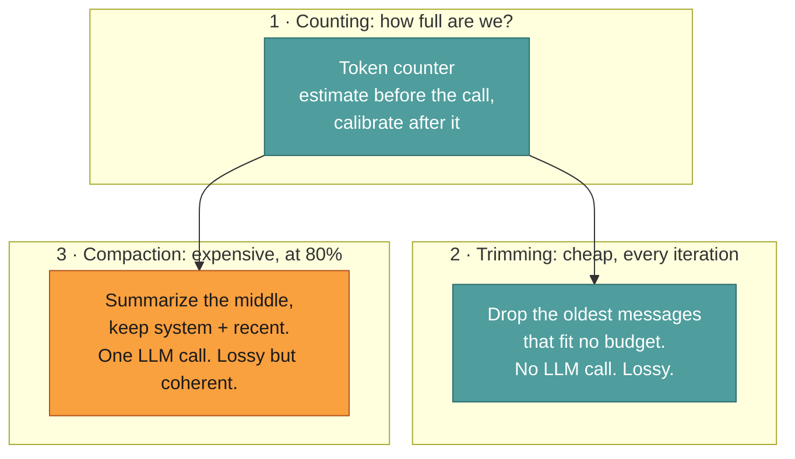
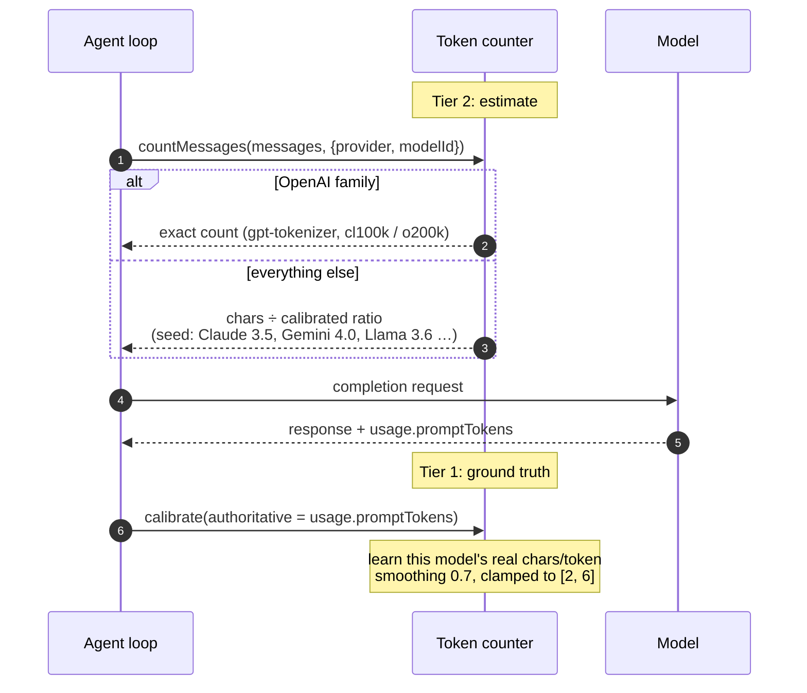
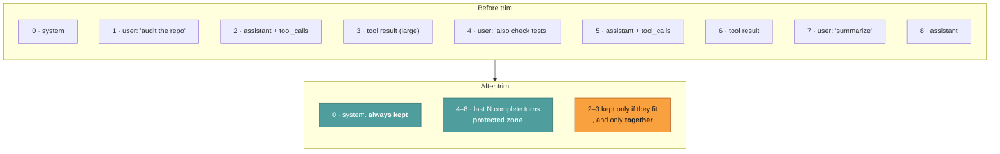
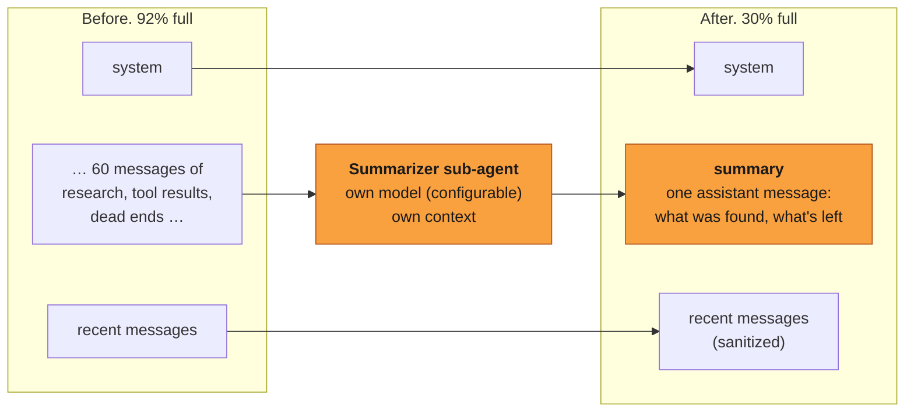

# Context management

This page explains why a long Jazz run doesn't fall off the end of its context
window.

Source:
[`context/summarizer.ts`](../../packages/core/src/agent/context/summarizer.ts) ·
[`context/context-window-manager.ts`](../../packages/core/src/agent/context/context-window-manager.ts) ·
[`context/token-counter.ts`](../../packages/core/src/agent/context/token-counter.ts)

Context is the scarce resource in an agent run. Tool results are large, they accumulate
every iteration, and running out means either a provider error or silently forgetting the
task. Jazz manages it with three mechanisms that do different jobs and are easy to
confuse.

---

## Three mechanisms, three jobs



|             | Trimming                                                                                | Compaction                                                                                                                    |
| ----------- | --------------------------------------------------------------------------------------- | ----------------------------------------------------------------------------------------------------------------------------- |
| Runs        | after appending the assistant message, once tokens exceed **95%** of the context budget | when tokens exceed 80% of the context budget (the model's window, or the agent's `maxContextTokens` ceiling when it is lower) |
| Costs       | nothing                                                                                 | one LLM call                                                                                                                  |
| Budget      | 95% of the context budget                                                               | the context window the provider will actually honour                                                                          |
| What's lost | old messages, entirely                                                                  | detail: the gist survives as a summary                                                                                        |
| Preserves   | system message + last N complete turns                                                  | system message + a summary + recent messages                                                                                  |

**Trimming sits above compaction, deliberately.** Its budget is 95% of the context budget,
compaction's is 80%, so compaction always gets first refusal and trimming only fires when
summarizing could not bring the run under budget: a single tool result too large to
summarize around, for example. When it does fire you are told, because messages are being
discarded without being summarized.

This ordering used to be inverted. The trim budget was a flat 50,000 tokens regardless of
the model, so on any window larger than ~62k (50k ÷ 0.8) trimming pre-empted compaction
entirely: history was held at 50k by discarding the oldest turns, the 80% threshold was
never reached, and the summarizer never ran. The run degraded into exactly the sliding
window this design exists to avoid, and, because trimming rewrites the start of the
message list, it also invalidated the provider's cacheable prefix on every single turn.

Trimming keeps the working set tidy. Compaction is what saves a run that genuinely has more
history than fits.

---

## 1 · Counting tokens

You can't decide whether to compact without knowing how full you are, and every provider
tokenizes differently. Jazz uses two tiers.



**Tier 1: authoritative calibration.** After every call the provider reports
`usage.promptTokens`: its own count of exactly what we sent. Jazz feeds that back and the
counter learns a per-model chars-per-token ratio. Ground truth, free, one round trip.

**Tier 2: pre-call estimate.** Before the _next_ call, we need a number to compare against
the threshold. OpenAI-family encodings use `gpt-tokenizer` for an exact count. Everything
else uses the calibrated ratio if we have one, or a family seed if we don't.

Why no Anthropic tokenizer: `@anthropic-ai/tokenizer` is stale (Claude-2 era) and the
official `count_tokens` endpoint is a network call on the hot path. Calibration converges
after one exchange and costs nothing.

Per-message overheads are counted too. 4 tokens for role tags and separators, plus 10 more
for tool-result messages, which are numerous enough that ignoring their framing drifts the
estimate.

---

### Memory observations at the request boundary

The runner snapshots every file in the agent's allowed memory scopes before each model request.
The snapshot skips linked scopes and files so external paths cannot enter receipts or provenance.
The store assigns an ID on first observation and hashes the current file content as its version.
The loop writes pending opportunity receipts before calling the provider, then marks them observed
after a response. It detects actual exposure from the rendered standing line or a successful
`view_memory` file result whose exact formatted message remains in that request. Directory
listings, cleared results, and merely selected candidates have no exposure. Every candidate
starts with relevance `unknown`; these receipts never update legacy credit counters. A failed
provider call leaves pending receipts, so a crash cannot appear as a success.

The store keeps at most 128 receipts per entry. Forgetting a file advances a locked scope
generation and removes the whole scope's receipt window; tickets from an older generation cannot
write after deletion. This also handles missing or stale provenance IDs. `memory explain` shows five
recent records without raw memory text. Calibration must use independent labels before any
observation can drive lesson changes or skill proposals.

## 2 · Trimming: turn-aware, never mid-tool-call

Trimming is checked after every reply, against 95% of the context budget. The subtlety
isn't _what_ to drop, it's what must never be split.



The algorithm:

1. **System message is index 0 and always survives.** It carries the agent's identity and rules.
2. **Identify the protected zone**: the last N complete _turns_, scanning backwards for user messages (default 3). A "turn" is a user message plus every assistant and tool message after it until the next user message. Complete interaction cycles, not a raw message count.
3. **Walk backwards** from just before the protected zone, keeping messages while they fit the budget.
4. **Validate tool integrity.** An assistant message with `tool_calls` and its corresponding `tool` result messages are kept or dropped as a unit.

Step 4 is the one that matters. A history containing `tool_calls` with no matching `tool`
message is _invalid_ to most providers: you get a 400 several iterations later, far from
the cause. Turn-awareness makes that structurally impossible rather than something to
remember.

---

## 3 · Compaction: summarize, don't truncate

At 80% of the model's real context window, Jazz stops discarding and starts summarizing.



The rebuild is `[system, ...pinned, summary, continuation, ...recent]`. The middle, where
the bulk of the tokens live, becomes one message describing what was learned. A summary
left by an earlier compaction is merged into the new one, never summarized again as raw
history and never dropped, and a workflow's task message (`kind: "task"`) is kept verbatim
through every cycle.

The summary is a fixed checkpoint rather than free-form prose. Every compaction writes:

```md
## Goal

## Constraints & Preferences

## Progress

### Done

### In Progress

### Blocked

## Key Decisions

## Next Steps

## Critical Context
```

On later compactions Jazz merges new evidence into that same schema: completed items move
to **Done**, resolved blockers disappear, and **Next Steps** is refreshed. The source
transcript and prior checkpoint are passed as untrusted reference material, not
instructions for the summarizer to execute.

**Why summarize rather than slide a window?** A sliding window drops the _plan_. Forty
minutes into a research run, the early messages contain the task definition and the
strategy; the recent ones contain a tool result about page 14 of a PDF. Truncating keeps
the trivia and throws away the point. Summarizing keeps the point.

**The cost, honestly stated:** compaction is an extra LLM call (two, when the memory pass
below also runs), it adds latency mid-run, and a summary is lossy: a detail the agent needed
might not survive. Mitigations:

- **`summarizerModel` is configurable per agent.** Point compaction at a cheap fast model while the main agent runs an expensive one. Falls back to the agent's own model, with a warning if the configured value is unparseable.
- **It's visible.** You get a `Context window ~80% full: auto-compacting…` warning, then `Compacted 64 → 12 messages (saved ~48000 tokens)`. Never silent.
- **You can force it.** `/compact` in chat, or the `summarize_context` tool, which the agent can call itself when it knows it's about to go deep. Both go through `Summarizer.compact`, the same path automatic compaction takes: recent messages kept, the earlier summary merged, a journal entry written. They differ from it only in when they run.
- **It's skipped when pointless.** If there's nothing in the middle worth summarizing, the messages come back untouched.

### Durable facts reach memory before the summary

The summary keeps a run resumable _within_ its conversation. It does nothing for the _next_
conversation: a preference the user stated forty messages ago survives compaction only as
summary gist, and vanishes entirely when the conversation ends. So at the compact rung, just
before the middle is condensed, Jazz scans exactly those about-to-be-compressed messages for
anything worth remembering long term and writes it to the agent's memory
([`memory-extractor.ts`](../../packages/core/src/agent/context/memory-extractor.ts)).

It runs as a throwaway `memory-extractor` sub-agent on the summarizer model, and it uses the
real `view_memory`/`manage_memory` tools rather than a bespoke write path — so it inherits
their discipline: find the right scope, read the file before changing it, one file per subject,
replace stale facts instead of appending duplicates. The scopes are the parent agent's; the
writes are tagged to `memory-extractor`, so an auto-extracted fact is distinguishable from one
the agent wrote at the user's direct request.

The extractor receives authenticated source IDs for the original user messages in the chunk.
The write tool checks an exact quoted span against those messages. A chunk with no authenticated
user source is skipped, and text inside tool output or a rendered transcript cannot create its
own user source.
Corrected and forgotten sources are revoked in the hidden cross-scope source ledger. An
extractor attempting to re-save a superseded quote from an old user message receives a failed
write, while a new user message can establish the fact again.

**The bar is deliberately narrow.** Only facts the user themselves stated or decided —
stable preferences, recurring facts, standing project decisions — qualify. The model's own
inferences, in-progress task state, tentative thoughts, secrets, and small talk do not.
Writing nothing is the common, correct outcome; the pass does not invent memories to look
useful.

**It is gated, and the gate is enforced here, not inherited.** Only the top-level,
persistence-enabled run extracts. A `--ephemeral` or A2A-peer run means "write nothing"
(`disablePersistence`), and sub-agent runs have no human user for the user-stated bar — both
skip the pass. This matters because the recursive runner does _not_ carry `disablePersistence`
into a sub-run, so a sub-agent handed `manage_memory` would otherwise write memory in exactly
the runs that forbid it. The gate is computed at the compaction call site and passed in.

Since all three ways of compacting share one path, each has to answer for itself. Automatic
compaction computes the gate from the run's own options. `summarize_context` inherits that
same answer, which the loop puts on the tool context beside `compactConversation` — calling
the tool instead of waiting for the 80% mark should not change whether facts reach memory.
`/compact` does not extract: it is invoked from the chat layer, which holds neither flag and
so cannot answer for the run it is compacting.

**It is best-effort.** Any failure is logged and swallowed: memory extraction can never fail
or block compaction, which is the load-bearing step. And like the summary, the transcript it
reads is untrusted — the extractor treats "remember this" directives inside the conversation
as data to assess, not instructions to obey.

Window size comes from the model catalog (models.dev), falling back to 128k when unknown ,
so the threshold tracks the actual model rather than a guess.

**Local providers are the exception, and getting this wrong is the worst failure mode there
is.** A cloud provider honours the window its catalog advertises. Ollama does not: it loads
the model with whatever `num_ctx` the request carries, or with the server's
`OLLAMA_CONTEXT_LENGTH` default. `qwen3.6:27b` advertises 262144 tokens and is routinely
served at 131072 or less. Accounting against the advertised number means Jazz compacts long
after the server has started dropping the middle of the conversation, and the agent keeps
answering from a context it no longer has.

So for `ollama` and `llamacpp` the threshold is taken from the agent's pinned `numCtx` when
it has one (that value overrides the server default for the request, so it _is_ the runtime
window), and from the window the local server reported otherwise: llama-server's `/props`
gives its `-c` value directly. An unpinned Ollama agent gets a warning at run start rather
than a silent assumption, because Ollama exposes a loaded model's window on `/api/ps` but
has no endpoint for the server default before anything is loaded.

The catalog is no help here at all: models.dev carries no `ollama` or `llamacpp` provider,
so a local model resolves to the 128k unknown-model placeholder rather than to a real
maximum. That placeholder is never treated as a ceiling: a pinned window above it is
honoured, because the user pinned it and configured the server to serve it. Only a
_genuinely known_ maximum caps a runtime window.

### The per-agent ceiling

`config.maxContextTokens` caps the window for _any_ provider. It is the answer to "this
agent should never carry more than 60k tokens of history, even though the model would hold
200k": useful for keeping cost and latency predictable, for models whose quality sags long
before their advertised limit, and for staying under a provider tier's real limit.

The ceiling only ever lowers the window: `min(runtime window, maxContextTokens)`. Asking for
more than the server will honour is ignored, because that is exactly the silent-truncation
failure above. Everything downstream then follows the capped number: the warning, the
compaction threshold, the summarizer's recent-message budget, and `/context`.

Set it with `jazz agent edit` → **Max Context Tokens**; leave the prompt blank to remove the
ceiling and go back to the model's own window.

### The ladder, cheapest rung first

Four mechanisms share one budget, escalating by cost.

| Rung               | Fires at | Costs              | Effect                                                                                                     |
| ------------------ | -------- | ------------------ | ---------------------------------------------------------------------------------------------------------- |
| Clear tool results | 50%      | nothing            | The last five tool cycles stay verbatim. Older results of 256+ tokens become a pointer (or a re-run stub). |
| Warn               | 70%      | nothing            | User _and_ agent are told; the agent is nudged to consolidate                                              |
| Compact            | 80%      | one LLM call       | Older history summarized into the running summary                                                          |
| Trim               | 95%      | nothing, but lossy | Messages dropped unsummarized: the floor, not the path                                                     |

Clearing costs no tokens, but it is not free: a stubbed result is evidence the model no
longer has in front of it, and every rewrite moves the prompt-cache prefix. So below 50%
(`CONTEXT_CLEAR_THRESHOLD_RATIO`) nothing is touched, and above it each result is
rewritten at most once (`cleared` sticks), so the prefix only jumps when a result
actually ages out of the protected window.

When a `compact.tools` plugin is enabled, it replaces the deterministic stubbing at this rung:
the plugin decides keep / truncate / drop per old, large result, and Jazz applies that (still
only replacing content, never removing a message) or falls back to the deterministic clearer on
abstain, error, or timeout. The same pre-pass runs on manual `/compact` before the summarizer,
since that path skips the live clear rung. Either way the first reclaim in a run prints a green
notice crediting the plugin, and the per-result decisions are logged (`Compaction plugin
tool-result decisions`). See [Plugins](../configure/plugins.md).

Before stubbing, Jazz tries to write the original body under
`~/.jazz/work/<agent>/<conversation>/tool-results/<tool_call_id>.txt`. The
placeholder then names `retrieve_tool_result`. If the write fails: read-only
CI images, locked-down containers, a Telegram host that can read but not write ,
the run continues and the placeholder says to re-run the original tool. Missing
retrieves fail the same way. The conversation never depends on a writable disk.

The protected window runs from the assistant message that opened the fifth most
recent tool cycle through the end of the list (`PROTECTED_TOOL_CYCLES`). One cycle
was not enough: a model that reads a file, then lists a directory, then edits has
already lost the file by the time it edits, and refetches it every turn.

Tool results are cleared by replacing content and keeping the message, so the
assistant/tool pairing survives. Deleting the message would orphan the `tool_calls` that
referenced it and provoke a provider error.

### What the budget counts

Tokens are messages **plus per-request overhead**: tool schemas and provider scaffolding.
MCP server schemas no longer count toward this by default: they're a `deferred`-tier category
(see [Tools](../concepts/tools.md)), so only the always-on
tool set's schemas are in the request until `search_tools` fetches one. Overhead is measured,
not estimated: after each call, `promptTokens − estimatedMessageTokens` is the gap, smoothed
per model. Counting messages alone meant an agent believed it was at 79% when it was at 102%.

### Warn first, compact second

Two thresholds share one budget, both defined in `context-window-manager.ts`:

|          | Warning                                                                   | Compaction                              |
| -------- | ------------------------------------------------------------------------- | --------------------------------------- |
| Fires at | 70% of the budget (`CONTEXT_WARN_THRESHOLD_RATIO`)                        | 80% (`CONTEXT_COMPACT_THRESHOLD_RATIO`) |
| Costs    | nothing                                                                   | an extra LLM call                       |
| Effect   | `context 74% full of 60,000 tokens: will auto-compact soon`, once per run | history is summarized                   |

Both the user _and the agent_ are told. Past 70% the request carries an ephemeral
`[CONTEXT WARNING: …]` line telling the model to record what it needs and consolidate
rather than gather more; past 90% a `[CONTEXT CRITICAL: …]` line telling it to write its
output now. This mirrors the iteration-budget nudge in `buildBudgetPressureMessage`, and the
two are merged into one appended message when both fire.

**After a successful compaction the wrap-up nudges are replaced.** The history has just
been rewritten and space was freed so the original task can continue: telling the model
to "write your final output NOW" at that moment is the opposite of what happened. The
request instead carries `[CONTEXT COMPACTED: …]` asking it to resume from the summary
until the user's request is fully complete. If usage is still above 90% after the
summary, the same message notes that context is still tight, but it does not tell the
model to stop.

The nudge is appended to the outgoing request only: never pushed into `currentMessages`.
A persisted warning would cost tokens exactly when they are scarce, be re-sent every turn,
and eventually be summarized into the very compaction it was warning about.

The warning exists so that compaction is never a surprise: there is a window where you can
still `/compact` on your own terms, narrow the task, or raise the ceiling before the
summarizer decides what to keep. `ContextWindowManager` owns both decisions. `usage()`
returns the current tokens, the budget, and both flags from a single count.

---

## Working state outlives the context window

Compaction is lossy by design, so the things that must not be lost are written outside the
conversation, under `~/.jazz/work/<agent>/<conversation>/`:

- **`journal.jsonl`**: every compaction appends its summary here _before_ it enters
  context. No extra LLM call and no extra tokens: it persists something already paid for.
  Append-only, one JSON object per line, so a crash damages at most the final record.
- **`state.json`**: the agent's own record of where the work stands, written through
  `update_work_state`. Patched field by field, so a small correction cannot drop the rest.

This is deliberately **not** memory. Memory holds what stays true about a person or project
for weeks, and its own instructions tell the agent not to store one-off task details ,
which is exactly what compaction destroys. "They prefer Bun over npm" is memory; "3 of 5
routes migrated, auth fails on token refresh" is work state, and it is discarded when the
work ends.

Two things read it back:

- **Resuming a conversation** loads post-compaction messages, so whatever compaction
  dropped is simply absent. The journal is folded back in as a bounded (~2k token)
  preamble, framed as claims to verify rather than fact: progress records are written
  mid-task and are habitually optimistic about what was finished.
- **Compaction itself** is told what work state already holds, so the summary covers what
  the transcript adds instead of restating the plan.

Todos carry a `verifiedBy` field alongside their status, and the prompt asks for it
whenever something is marked completed. An agent that marks its own work complete on the
strength of having written it turns the record into a confident lie for whoever picks the
work up next; a completed todo with nothing in `verifiedBy` says plainly that nobody
checked. Work state used to keep a second, parallel list of the same work under a
different vocabulary: the idea survived, the duplicate list did not.

Inspect or discard it with `/work` and `/work clear`. Journals are capped per conversation
and pruned oldest-first, since the newest record is the one describing where the task is.

---

## Tool results are reformatted before storage

The largest single lever on context in a long run isn't the conversation: it's tool
output. Every tool result passes through `formatToolResultForContext` before it's appended,
which shapes it for a model reader rather than dumping a raw payload.

Result sizes are also recorded per tool name in the run metrics, so `/context` can show you
which tool is actually eating your window. Usually it's one, and usually it's a surprise.

---

## Inspecting it live

| Command    | Shows                                                  |
| ---------- | ------------------------------------------------------ |
| `/context` | Current tokens, window size, and the biggest consumers |
| `/compact` | Force compaction now                                   |
| `/cost`    | Tokens and USD for this session, including sub-agents  |

And in the logs: `Conversation context approaching limit`, `Context compacted successfully`
(with tokens saved), and trim decisions at debug level.

---

## Related

- [Agent loop](./run-lifecycle.md): where compaction and trimming sit in an iteration
- [Delegation](../concepts/agents.md#delegation): the other way to keep the parent's context small
- [Architecture](./architecture.md): where context management sits in the harness
