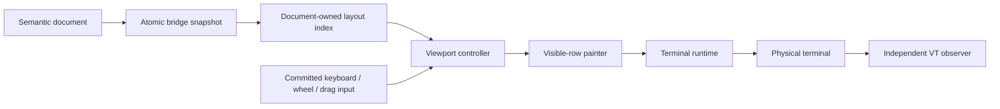

# Fullscreen ownership

Read [Conversation presentation](./presentation-documents.md) for source and
persistence contracts. The mounted fullscreen view owns navigation; its painter
and the native scrollbox cannot independently change the reading position.

## Reading position

[App](../../packages/cli/src/ui/fullscreen/App.tsx) owns focus and committed input
callbacks. [Viewport controller](../../packages/cli/src/ui/fullscreen/viewport-controller.ts)
stores live-follow intent or an anchor for each visited document. Scrolling up
detaches; navigating to the bottom, pressing End, or submitting a message follows
live output. Incoming text alone cannot change an anchored reader's intent.

An anchor identifies a source block, a part, and a UTF-16 position in displayed
text after Markdown interpretation. Wrapping supplies grapheme-safe boundaries.
Prose and reasoning therefore follow the same content through width changes.
Complex fence, table, and receipt rows use stable row-part fallbacks; these do
not promise arbitrary character-level anchoring through structural rewrites.
Removing an anchored block tries surviving neighboring blocks, then clamps the
old position. Occlusion by an overlay pauses observation without changing follow
intent. The unseen-content baseline follows a semantic tail, so reflow or
expansion above it does not count as newly arrived text.

Child documents have separate reading positions. Their layout is disposed when
the mounted document changes, while only small navigation records are retained.
Drag timers and selection are canceled on document change, occlusion, and
unmount. [Transcript surface](../../packages/cli/src/ui/fullscreen/transcript-surface.ts)
retains native selection/layout support but disables competing native keyboard,
wheel, and automatic scrolling.

## Layout budgets

[Transcript layout](../../packages/cli/src/ui/fullscreen/transcript-layout.ts)
is an explicit instance, not a process-global row cache. Call `update` with an
immutable block list and an epoch containing width, glyphs, theme revision, and
a captured palette. `window` realizes intersecting chunks; `flatten` deliberately
realizes everything and belongs in tests or benchmarks. Dispose the instance
when its document retires.

The default painted-row LRU retains at most 2,048 rows across 32 chunks. Streaming
wrap/highlight reuse is limited to 2,048 rows and 524,288 UTF-16 characters.
Compact height and source-offset metadata still grows with history. An update
visits the block list and relayouts dirty chunks. A single oversized block or
packed receipt run still wraps transiently in full; it is excluded from the
painted cache. These bounds limit retained derived state, not source size or
the maximum temporary allocation for an individual block.

Palette and glyph context belong to a layout epoch. Realizing an older index
after a theme change must use its captured palette. Do not temporarily replace
global theme state while laying out rows.

## Verification

Run controller and viewport integration tests for history hold during streaming,
resize, folds, child visits, selection, and End. Run layout tests for bounded
caches, disposal, and epoch coherence. The [terminal oracle](./terminal-rendering-tests.md)
checks emitted bytes independently. Resource qualification uses
`bench/ui-pipeline.bench.ts` and `bench/conversation-memory.bench.ts`; compare
matched workloads and report peak RSS separately from retained heap.
