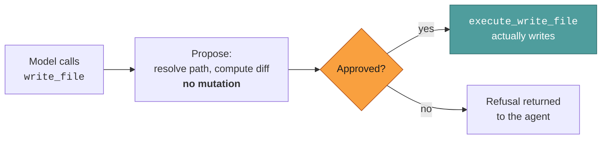

# Tools Reference

**Reader job:** find the exact name, risk tier, and behavior of a tool.

Every tool an agent can call, generated from the registry. Risk tiers determine what runs
unattended — see [Tools & approval](../internals/tools-and-approval.md) for the mechanism
and [Security](../../SECURITY.md) for the threat model.

> This page is verified by a test (`bun test src/core/agent/tools/register-tools.docs.test.ts`)
> that fails if the registry and this table drift apart. If you add a tool, update this page.

---

## At a glance

|                                                                         | Count  |
| ----------------------------------------------------------------------- | ------ |
| **Agent-facing tools**                                                  | **34** |
| Hidden `execute_*` counterparts (the second half of each approval pair) | 7      |
| Total registered                                                        | 41     |
| `read-only`                                                             | 20     |
| `low-risk`                                                              | 7      |
| `high-risk`                                                             | 7      |

Plus, registered per agent rather than globally:

| Source     | Tools                                             | Notes                                                                                              |
| ---------- | ------------------------------------------------- | -------------------------------------------------------------------------------------------------- |
| **Skills** | `find_skills`, `load_skill`, `load_skill_section` | Present when the agent has skills available — see [Skills loading](../internals/skills-loading.md) |
| **MCP**    | `mcp_<server>_<tool>`                             | Discovered from the agent's tool list, connected lazily — see [MCP](../integrations/mcp.md)        |
| **Custom** | whatever you define                               | Agent-config `customTools` — see [Configuration](./configuration.md#agent-config-customtools)      |

---

## How approval pairs work

Seven tools are **gated**: calling them does not act. They return a description of the
intended action (including a preview diff for edits), and only after approval — from a human
or from `--approval-policy` — does Jazz invoke the hidden `execute_*` counterpart.



You never call `execute_*` names yourself; they are hidden from the model's tool list.

---

## The tools

### File Management

| Tool             | Risk        | Approval pair        | What it does                                                                                                              |
| ---------------- | ----------- | -------------------- | ------------------------------------------------------------------------------------------------------------------------- |
| `cd`             | `read-only` | —                    | Change the working directory for this session. Persists across subsequent tool calls.                                     |
| `cp`             | `high-risk` | `execute_cp`         | Copy a file or directory. Equivalent to shell cp/cp -r. Directories are copied recursively.                               |
| `edit_file`      | `high-risk` | `execute_edit_file`  | Edit file via replace_lines, replace_pattern, insert, or delete_lines. Applied in order. IMPORTANT: Use rep…              |
| `find`           | `read-only` | —                    | Find files/directories by name, glob, or regex. Also advertised as `glob`. Searches names/paths, NOT contents (use grep). |
| `grep`           | `read-only` | —                    | Search file contents for text patterns (ripgrep with grep fallback). Supports regex, file filters, context…               |
| `ls`             | `read-only` | —                    | List directory contents. Supports recursive traversal, name filtering, hidden files. Default 200 results, c…              |
| `mkdir`          | `high-risk` | `execute_mkdir`      | Create a directory. Parents created automatically by default.                                                             |
| `mv`             | `high-risk` | `execute_mv`         | Move or rename a file or directory. Equivalent to shell mv.                                                               |
| `pdf_page_count` | `read-only` | —                    | Get total page count of a PDF without reading content.                                                                    |
| `pwd`            | `read-only` | —                    | Print the current working directory.                                                                                      |
| `read_file`      | `read-only` | —                    | Read a UTF-8 text file with numbered lines. startLine/endLine; negative startLine reads from the end.                     |
| `read_pdf`       | `read-only` | —                    | Extract text and tables from a PDF. Use pdf_page_count first for large files. Supports page ranges.                       |
| `rm`             | `high-risk` | `execute_rm`         | Remove a file or directory. May be irreversible.                                                                          |
| `stat`           | `read-only` | —                    | Check file/directory existence and get metadata (type, size, times).                                                      |
| `write_file`     | `high-risk` | `execute_write_file` | Write content to a file, creating it if needed. Replaces entire file content.                                             |

### Shell Commands

| Tool              | Risk        | Approval pair             | What it does                                                                                                                                                  |
| ----------------- | ----------- | ------------------------- | ------------------------------------------------------------------------------------------------------------------------------------------------------------- |
| `execute_command` | `high-risk` | `execute_execute_command` | Run a shell command when no dedicated tool exists. Inspect-only commands may be classified `read-only` for auto-approve. Stdout/stderr capped at 256 KB each. |

### Web Search

| Tool         | Risk        | Approval pair | What it does                              |
| ------------ | ----------- | ------------- | ----------------------------------------- |
| `web_search` | `read-only` | —             | Search the web for real-time information. |

### Web Fetch

| Tool        | Risk        | Approval pair | What it does                               |
| ----------- | ----------- | ------------- | ------------------------------------------ |
| `web_fetch` | `read-only` | —             | Fetch and extract text content from a URL. |

### HTTP

| Tool           | Risk        | Approval pair | What it does                                                                       |
| -------------- | ----------- | ------------- | ---------------------------------------------------------------------------------- |
| `http_request` | `read-only` | —             | Send HTTP requests. Supports all methods, headers, query params, and body formats. |

### Todo

| Tool                | Risk        | Approval pair | What it does                                                                                                 |
| ------------------- | ----------- | ------------- | ------------------------------------------------------------------------------------------------------------ |
| `list_todos`        | `read-only` | —             | Read the current todo list. Returns all items with their status and priority.                                |
| `manage_todos`      | `low-risk`  | —             | Create or update the todo list. Send the FULL list of items each time (replaces the previous list). Use thi… |
| `update_task_state` | `low-risk`  | —             | Record where you are in the current task so it survives compaction and resuming later. Patches o…            |

### Memory

Opt-in per agent (like File Management) rather than always-on — see [Memory](../internals/memory.md).

| Tool            | Risk        | Approval pair | What it does                                                                                      |
| --------------- | ----------- | ------------- | ------------------------------------------------------------------------------------------------- |
| `view_memory`   | `read-only` | —             | Read what you've saved about this person or project from earlier conversations. Call with no pa…  |
| `manage_memory` | `low-risk`  | —             | Create, edit, rename, or delete files under your persistent memory directory — the durable notes… |

`update_task_state` lives with the todo tools (always-on). It is scoped to one conversation and discarded when the task ends, unlike memory which persists across conversations — see [Context management](../internals/context-management.md).

### Reminders

Opt-in per agent. Reminders persist on disk and fire later on the same surface that scheduled them — see [Reminders](../internals/reminders.md).

| Tool              | Risk        | Approval pair | What it does                                                                            |
| ----------------- | ----------- | ------------- | --------------------------------------------------------------------------------------- |
| `add_reminder`    | `low-risk`  | —             | Schedule a reminder from a duration (`30m`), clock time (`18:00`), or `tomorrow HH:MM`. |
| `list_reminders`  | `read-only` | —             | List this person's pending reminders, including their id, fire time, and text.          |
| `cancel_reminder` | `low-risk`  | —             | Cancel a pending reminder by id (get the id from list_reminders first).                 |

### Context

| Tool           | Risk        | Approval pair | What it does                                                                                            |
| -------------- | ----------- | ------------- | ------------------------------------------------------------------------------------------------------- |
| `context_info` | `read-only` | —             | Get current context window token usage statistics.                                                      |
| `get_time`     | `read-only` | —             | Get current date and time. Use for scheduling, relative times (yesterday, next Monday), and timestamps. |

### Sub Agents

| Tool                | Risk        | Approval pair | What it does                                                                                                 |
| ------------------- | ----------- | ------------- | ------------------------------------------------------------------------------------------------------------ |
| `spawn_subagent`    | `low-risk`  | —             | Spawn a sub-agent with fresh context for a specific task. Personas: coder, researcher, default. Pass a shor… |
| `summarize_context` | `read-only` | —             | Compact conversation by summarizing older messages to free token budget. Always performs summarization when… |

### User Interaction

| Tool                | Risk        | Approval pair | What it does                                                                            |
| ------------------- | ----------- | ------------- | --------------------------------------------------------------------------------------- |
| `ask_file_picker`   | `read-only` | —             | Show an interactive file picker for the user to select a file.                          |
| `ask_user_question` | `read-only` | —             | Ask the user a question with interactive selectable suggestions. One question per call. |

### Web App

Opt-in per agent via `tools`. Used by chat bridges that can render a Mini App or a static image.

| Tool             | Risk       | Approval pair | What it does                                                                                                                           |
| ---------------- | ---------- | ------------- | -------------------------------------------------------------------------------------------------------------------------------------- |
| `create_web_app` | `low-risk` | —             | Create an interactive UI — a chart, form, dashboard, small game, or any other webpage — for delivery as a static image or a live page. |

---

## What is *not* a built-in tool

A common and consequential misreading. These capabilities exist, but **not as built-in
tools** — they are [skills](../concepts/skills.md) that shell out through
`execute_command`, which is `high-risk`:

| Capability                  | How it actually works                                                                      | Effective risk tier |
| --------------------------- | ------------------------------------------------------------------------------------------ | ------------------- |
| Email (read, archive, send) | `email` skill → [Himalaya](https://github.com/pimalaya/himalaya) CLI via `execute_command` | `high-risk`         |
| Calendar (list, create)     | `calendar` skill → [khal](https://github.com/pimutils/khal) via `execute_command`          | `high-risk`         |
| Obsidian vault writes       | `obsidian` skill → CLI via `execute_command`, or `write_file`                              | `high-risk`         |

So a scheduled workflow set to `autoApprove: low-risk` **cannot archive an email** — every
himalaya invocation is declined. The fix is usually *not* to raise the whole tier to
`high-risk` (which also unlocks `rm` and `git push`), but to allowlist the specific binary:

```json
// ~/.jazz/config.json
{ "autoApprovedCommands": ["himalaya", "khal"] }
```

That keeps the tier low while letting the one command through. Matching is on a parsed key
(binary + first subcommand), never a raw prefix — see
[Tools & approval](../internals/tools-and-approval.md#two-sharper-controls).

---

## Notes

- **`find` vs `grep`** — `find` locates files by name, glob, or path pattern. `grep` searches *inside* file contents. Non-overlapping on purpose.
- **`execute_command` classifier** — there are no `git_*` tools. Under `autoApprove: read-only` or `low-risk`, a harness-model classifier may treat an inspect-only command as `read-only`. Timeouts and ambiguous replies stay `high-risk`. See [Tools & approval](../internals/tools-and-approval.md#command-classifier).
- **`http_request` is `read-only`** by risk classification even though it can issue POSTs. It reaches whatever URL the agent targets; network policy belongs at the firewall, not the tier. Treat it accordingly on surfaces that accept untrusted input.
- **Timeouts** — 3 minutes by default per tool. `ask_user_question` and `ask_file_picker` are `longRunning` and never time out, because waiting for a human is not a hang.
- **Concurrency** — up to 10 tools execute in parallel per iteration.
- **`create_web_app` needs a browser for `mode: "static"`** — it screenshots the page through `puppeteer-core`, which deliberately ships no bundled Chrome so that installing Jazz never downloads one. It uses `PUPPETEER_EXECUTABLE_PATH` if set, otherwise an installed Google Chrome; with neither it fails and says so. `mode: "interactive"` needs no browser.

---

## Related

- [Tools & approval](../internals/tools-and-approval.md) — the execution and gating machinery
- [Concepts: tools](../concepts/tools.md) — what a tool is and how to add one
- [CLI Reference](./cli.md) — `--approval-policy` and friends
- [Configuration](./configuration.md) — `customTools`, `envAllowlist`, `autoApprovedCommands`
