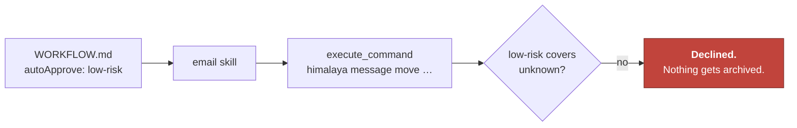

# Workflow frontmatter

How to get the `WORKFLOW.md` YAML fields exactly right.

Verified against
[`packages/core/src/workflows/workflow-service.ts`](../../packages/core/src/workflows/workflow-service.ts).
For what a workflow *is*, see [Workflows](../concepts/workflows.md); for ready-made ones, the
[Cookbook](../cookbook/index.md).

---

## Fields

```yaml
---
name: daily-standup-prep
description: Prepare my daily standup notes
schedule: "0 9 * * 1-5"
agent: my-dev-agent
autoApprove: read-only
skills:
  - github-action
catchUpOnRestart: true
maxCatchUpAge: 7200
maxIterations: 40
maxCostUSD: 0.20
maxTokens: 200000
maxDurationMs: 1800000
---
```

| Field              | Type        | Required | Purpose                                                                           |
| ------------------ | ----------- | -------- | --------------------------------------------------------------------------------- |
| `name`             | string      | ✅        | Workflow identifier used by every `jazz workflow` command                         |
| `description`      | string      | ✅        | One-line summary shown in `jazz workflow list`                                    |
| `agent`            | string      | —        | Agent id or name to run this workflow with. Overridable at runtime with `--agent` |
| `schedule`         | cron string | —        | When to run. Required only if you intend to `jazz workflow schedule` it           |
| `autoApprove`      | see below   | —        | Autonomy tier for unattended runs                                                 |
| `skills`           | string[]    | —        | Skills to make available to the agent for this workflow                           |
| `catchUpOnRestart` | boolean     | —        | Whether a recent missed run may be replayed after daemon restart                  |
| `maxCatchUpAge`    | seconds     | —        | Past this age a missed run is skipped. Default 86400 (24 h)                       |
| `maxIterations`    | number      | —        | Iteration cap for this workflow. Default 100. Overridable with `--max-iterations`  |
| `maxCostUSD`       | number      | —        | Spend cap in USD, checked between iterations. Unset = uncapped. Overridable with `--max-cost-usd` |
| `maxTokens`        | number      | —        | Cap on cumulative prompt + completion tokens for this run (not sub-agents), checked between iterations. Unset = uncapped. Overridable with `--max-tokens` |
| `maxDurationMs`    | ms          | —        | Wall-clock budget with 50/80/90% agent pressure nudges. Unset = uncapped. Overridable with `--max-duration-ms` |

`maxCostUSD`, `maxTokens`, and `maxDurationMs` are soft checkpoints, evaluated between
iterations — not preemptive interrupts. See
[Configuration → `maxCostUSD`, `maxTokens`, and `maxDurationMs`](./configuration.md#maxcostusd-maxtokens-and-maxdurationms)
for the full enforcement model and how `maxDurationMs` differs from `--timeout`.

There is **no** `autoApprovedCommands` field in frontmatter — that is a global config setting.
See [the note below](#the-low-risk-trap).

---

## `autoApprove`

Accepts a boolean or a tier string.

| Value       | Auto-approves                                                                               |
| ----------- | ------------------------------------------------------------------------------------------- |
| `false`     | Nothing. Not useful for a scheduled run — it will stall on the first gated tool             |
| `read-only` | Reads, search, web requests, `git status`/`log`/`diff`/`blame`/`branch`                     |
| `low-risk`  | + `manage_todos`, `spawn_subagent`                                                          |
| `high-risk` | + every gated tool: `write_file`, `edit_file`, `rm`, `mv`, `cp`, `mkdir`, `execute_command` |
| `true`      | Same as `high-risk`                                                                         |

Exact per-tool tiers: [Tools reference](./tools.md).

---

## The `low-risk` trap

`low-risk` is narrower than it sounds. In the built-in toolset it adds **three** tools
(`manage_todos`, `update_work_state`, and `spawn_subagent`). It does **not** cover email, calendar, or file writes.

This matters because the capabilities people most want on a schedule are skills that shell
out through `execute_command`, which is `unknown`:



Two ways out, and the second is usually right:

**1. Raise the tier to `high-risk`** — also unlocks `rm`, `git push`, and arbitrary shell.
Rarely what you want on a schedule.

**2. Allowlist the specific binary** and keep the tier low:

```json
// ~/.jazz/config.json
{ "autoApprovedCommands": ["himalaya", "khal"] }
```

Matching is on a parsed key (binary + first subcommand), never a raw prefix — so `himalaya`
is allowed while `himalaya && rm -rf /` is not. See
[Tools & approval](../internals/tools-and-approval.md#two-sharper-controls).

---

## `schedule`

Standard 5-field cron. **macOS caveat:** launchd's `StartCalendarInterval` supports only plain
integers and wildcards — no step values (`*/15`), ranges (`1-5`), or lists (`1,3,5`). Jazz
expands what it can into multiple entries and rejects what it can't with an explicit error
rather than silently scheduling something else.

Neither launchd nor cron fires a job whose slot passed while the machine was asleep — see
[Scheduling](../concepts/scheduling.md) and [Surfaces → Scheduled](../surfaces/scheduled.md).

---

## Where workflows live

Discovered in this order; later overrides earlier on name collision:

1. **Built-in** — shipped with the `jazz-ai` package
2. **Global** — `~/.jazz/workflows/<name>/WORKFLOW.md`
3. **Local** — `./workflows/<name>/WORKFLOW.md`, scanned up to depth 4 from the cwd

---

## Related

- [Workflows](../concepts/workflows.md) — the concept and the body of the file
- [Cookbook](../cookbook/index.md) — seven complete recipes
- [Surfaces → Scheduled](../surfaces/scheduled.md) — running them unattended
- [CLI Reference](./cli.md#jazz-workflow) — the commands
