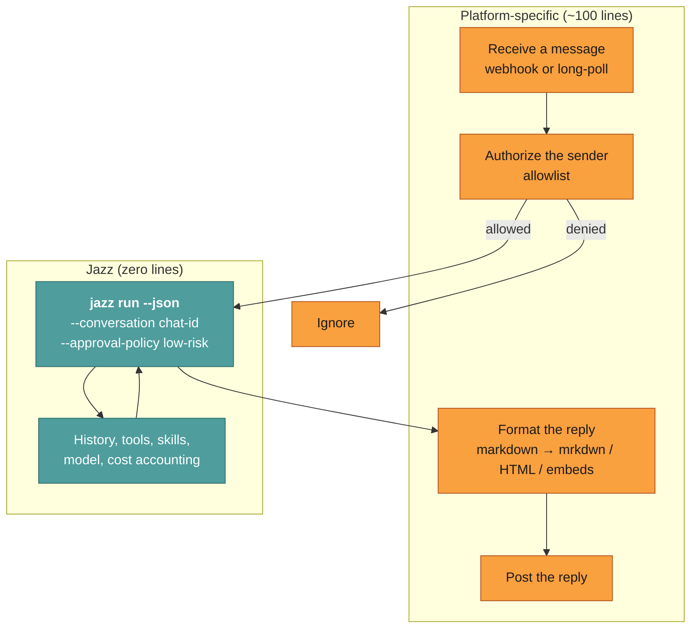
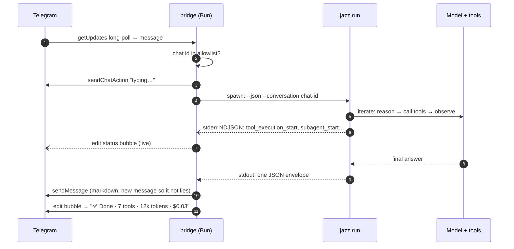
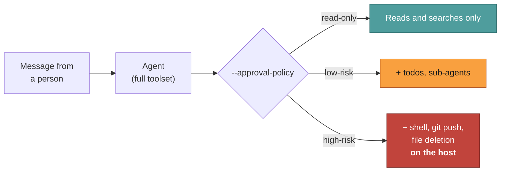

# Chat platforms — Telegram, Discord, Slack, your own app

How to put a real tool-using agent into a chat thread.

A Jazz agent in a chat window isn't a chatbot with your logo on it. It's the same agent
that reads your filesystem, runs git, searches the web, and spawns sub-agents — reachable
from your phone.

| Platform         | Status                        | Where                                                            |
| ---------------- | ----------------------------- | ---------------------------------------------------------------- |
| **Telegram**     | ✅ Deployable reference bridge | [`integrations/telegram-bot/`](../../integrations/telegram-bot/) |
| **Discord**      | ✅ Deployable reference bridge | [`integrations/discord-bot/`](../../integrations/discord-bot/)   |
| **Slack**        | 🔧 Bring your own bridge       | pattern below                                                    |
| **Google Chat**  | 🔧 Bring your own bridge       | pattern below                                                    |
| **Your own app** | 🔧 Bring your own bridge       | pattern below                                                    |

**Be clear on what ships.** Telegram and Discord are complete, production-deployed
services with a Dockerfile, per-conversation model switching, reminders, and live
progress. Slack and Google Chat do not ship an adapter. What they share is the
contract — and the transport-specific part of a bridge is small enough that copying
a shipped one and swapping the transport is the intended path, not a workaround.

---

## The bridge pattern

Every chat bridge is the same three responsibilities. Only the middle one is
platform-specific.



You write the orange boxes. You do not write session storage, context management, tool
dispatch, approval logic, or cost tracking — `--conversation` and `--approval-policy`
cover those. See [Headless](./headless.md) for the contract in full.

---

## Telegram (shipped)

```bash
cd integrations/telegram-bot
cp .env.example .env     # set TELEGRAM_BOT_TOKEN + TELEGRAM_ALLOWED_CHAT_IDS + a model key
docker compose up -d --build
```

That's a working agent in your DMs. Full setup, configuration table, and security notes:
[`integrations/telegram-bot/README.md`](../../integrations/telegram-bot/README.md).

What the Telegram bridge demonstrates — worth reading before you write your own:

| Feature             | How it works                                                                                                                                                                   |
| ------------------- | ------------------------------------------------------------------------------------------------------------------------------------------------------------------------------ |
| **Per-user agents** | Each chat gets `tg_<chat_id>.json`, cloned from a template on first contact. `/model` and `/persona` change only that user's experience.                                       |
| **Per-chat memory** | `--conversation <chat_id>`. The bridge itself is stateless.                                                                                                                    |
| **Live progress**   | `--events` NDJSON on stderr drives a status bubble that updates with thinking, tool calls, and sub-agents, then closes with a `✅ Done · 7 tools · 12k tokens · $0.03` summary. |
| **Cancellation**    | A ⏹ button kills the child process mid-run.                                                                                                                                    |
| **Reminders**       | `/remind 30m …`, persisted to disk so they survive restarts and fire late if the bridge was down.                                                                              |
| **Spend cap**       | `JAZZ_DAILY_COST_CAP_USD` — the envelope's `costUSD` is accumulated per day.                                                                                                   |
| **Local-only mode** | Point `JAZZ_TELEGRAM_PROVIDER=ollama` at a local model: no keys, no cloud, no per-message cost.                                                                                |
| **Allowlist**       | Only `TELEGRAM_ALLOWED_CHAT_IDS` are answered; everyone else is silently ignored.                                                                                              |

### The message flow



---

## Discord (shipped)

```bash
cd integrations/discord-bot
cp .env.example .env     # set DISCORD_BOT_TOKEN + an allowlist + a model key
docker compose up -d --build
```

DM the bot, or `@mention` it in an allowlisted channel. Full setup (intents, invite URL,
mention-gating): [`integrations/discord-bot/README.md`](../../integrations/discord-bot/README.md).

Same `jazz run` contract as Telegram. What Discord adds on top:

| Feature            | How it works                                                                                                           |
| ------------------ | ---------------------------------------------------------------------------------------------------------------------- |
| **Mention-gating** | In servers the bot ignores chatter unless mentioned, replied-to, or already in the thread. DMs always respond.         |
| **Thread binding** | An `@mention` in a channel starts a thread; `--conversation` is the thread id so the rest of the room is not the chat. |
| **3-second ack**   | Slash commands and buttons are acknowledged immediately, then the agent run continues asynchronously.                  |
| **Allowlists**     | Users, channels, and/or guilds. At least one is required.                                                              |

---

## Slack, Google Chat

No adapter ships. Here's what changes from the shipped bridges, and it really is just the
edges:

| Concern              | Telegram                          | Discord                                           | Slack                                 | Google Chat            |
| -------------------- | --------------------------------- | ------------------------------------------------- | ------------------------------------- | ---------------------- |
| **Inbound**          | `getUpdates` long-poll or webhook | Gateway websocket                                 | Events API webhook (or Socket Mode)   | Chat app webhook       |
| **Conversation key** | `chat_id`                         | DM channel id, or thread id                       | `channel + thread_ts`                 | `space + thread name`  |
| **Reply formatting** | Markdown / HTML                   | Markdown (close to standard)                      | `mrkdwn` (`*bold*`, no `#` headings)  | app card or plain text |
| **Live progress**    | edit the status message           | edit the status message                           | `chat.update` on a placeholder        | update the card        |
| **Ack deadline**     | none                              | **3 s** for interactions                          | **3 s** — ack, then reply async       | **30 s**               |
| **Authorization**    | chat-id allowlist                 | user / channel / guild allowlist + mention-gating | verify signing secret, then allowlist | verify bearer token    |

Two things to get right, both platform-side:

1. **Ack fast, answer later.** Slack will retry a webhook you don't ack within 3 seconds,
   and an agent run takes longer than that. Ack immediately, run `jazz run` in the
   background, and post the answer as a follow-up. Retries are also why you should
   de-duplicate on the platform's event id — otherwise a slow run gets billed twice.
2. **Translate the markdown.** `jazz run` without `--json` gives you raw markdown
   precisely so you can convert it. Slack's `mrkdwn` in particular is not markdown.

Everything else — memory, tools, approvals, cost — you get from the flags.

---

## Security for chat surfaces

A chat surface accepts input from **other people**. That changes the threat model in a way
worth being blunt about.



- **Always use an allowlist.** Both bridges and Jazz have one; use both.
- **Default to `low-risk`.** At `high-risk`, a message — or a prompt injection inside a web page the agent fetched — can run arbitrary commands on the host. That is the documented behavior of that tier, not a bug.
- **Trim the toolset.** An agent config that doesn't include `execute_command` cannot run shell commands regardless of policy. This is the strongest control available.
- **Treat the history volume as sensitive.** Transcripts are plaintext JSON under `~/.jazz/history/`.
- **Cap spend.** Use the envelope's `costUSD` to enforce a daily ceiling.

Full model: [Security](../../SECURITY.md).

---

## Related

- [Headless](./headless.md) — the contract every bridge uses
- [`integrations/telegram-bot/`](../../integrations/telegram-bot/) — Telegram reference implementation
- [`integrations/discord-bot/`](../../integrations/discord-bot/) — Discord reference implementation
- [Airgapped & self-hosted](../guide/airgapped.md) — running a bridge with no cloud provider
