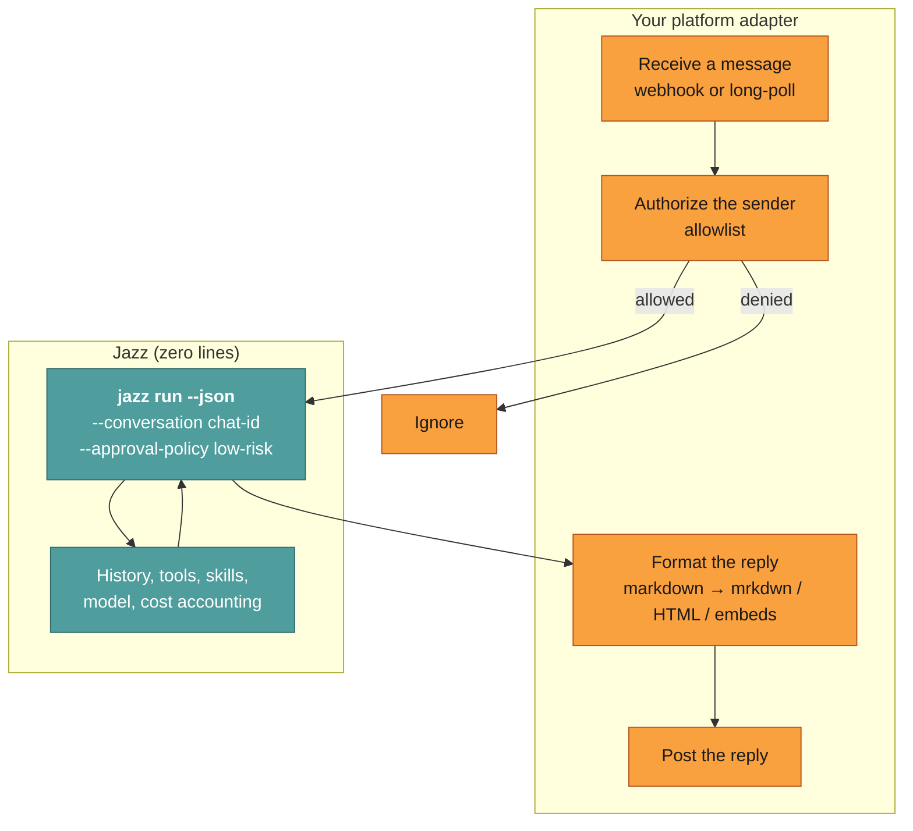
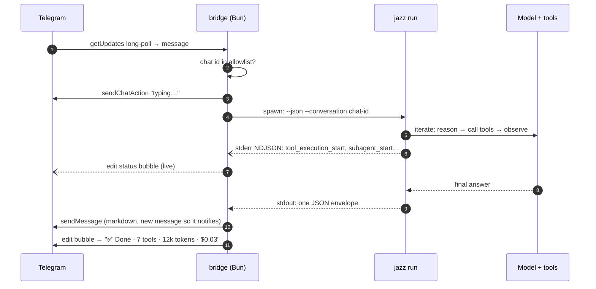
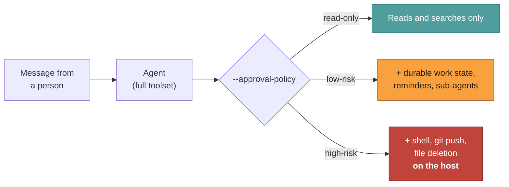

# Chat platforms. Telegram, Discord, iMessage, WhatsApp, your own app

How to put a real tool-using agent into a chat thread.

A Jazz agent in a chat window isn't a chatbot with your logo on it. It's the same agent
that reads your filesystem, runs git, searches the web, and spawns sub-agents: reachable
from your phone.

| Platform         | Status                          | Where                                                                                                             |
| ---------------- | ------------------------------- | ----------------------------------------------------------------------------------------------------------------- |
| **Telegram**     | ✅ Shipped containerized bridge | [`packages/telegram-bot/`](../../packages/telegram-bot/)                                                          |
| **Discord**      | ✅ Shipped containerized bridge | [`packages/discord-bot/`](../../packages/discord-bot/)                                                            |
| **iMessage**     | ✅ Hosted or local-Mac bridge   | [`packages/photon-bot/`](../../packages/photon-bot/) and [`packages/imessage-bot/`](../../packages/imessage-bot/) |
| **WhatsApp**     | ✅ Shipped, linked device       | [`packages/whatsapp-bot/`](../../packages/whatsapp-bot/), `jazz whatsapp`                                         |
| **Slack**        | 🔧 Bring your own bridge        | pattern below                                                                                                     |
| **Google Chat**  | 🔧 Bring your own bridge        | pattern below                                                                                                     |
| **Your own app** | 🔧 Bring your own bridge        | pattern below                                                                                                     |

**Be clear on what ships.** Telegram and Discord are containerized services with
per-conversation model switching, reminders, and live progress. WhatsApp ships as a linked-device
command. iMessage has two implementations: Photon provides a hosted line with no Mac required;
`--local` uses your own Apple account on a Mac. Slack and Google Chat do not ship an adapter.

---

## The bridge pattern

Every chat bridge is the same three responsibilities. Only the middle one is
platform-specific.



You write the orange boxes. You do not write session storage, context management, tool
dispatch, approval logic, or cost tracking. `--conversation` and `--approval-policy`
cover those. See [Headless](./headless.md) for the contract in full.

---

## Telegram (shipped)

```bash
cd packages/telegram-bot/src
cp .env.example .env     # set TELEGRAM_BOT_TOKEN + TELEGRAM_ALLOWED_CHAT_IDS + a model key
docker compose up -d --build
```

That's a working agent in your DMs. For the account-creation steps (bot token, chat id),
see [Reaching your agent from a chat app](../guides/deploy-a-chat-agent.md); for the full
configuration table and security notes, see
[`packages/telegram-bot/README.md`](../../packages/telegram-bot/README.md).

What the Telegram bridge demonstrates: worth reading before you write your own:

| Feature                   | How it works                                                                                                                                                                                                                                                                                      |
| ------------------------- | ------------------------------------------------------------------------------------------------------------------------------------------------------------------------------------------------------------------------------------------------------------------------------------------------- |
| **Per-user agents**       | Each chat gets `tg_<chat_id>.json`, cloned from a template on first contact. `/model` and `/persona` change only that user's experience.                                                                                                                                                          |
| **Per-user isolation**    | Each chat's agent runs as its own Unix user, in its own Jazz home under `/data/chats/tg_<chat_id>/`. One allowlisted person's agent cannot read another's transcripts, memory, secrets or mail credentials: the kernel refuses, rather than a filename convention discouraging it.               |
| **Any-provider `/model`** | Bare `/model` lists the current provider's models; `/model provider/model` (e.g. `/model openrouter/z-ai/glm-5.3-flash`) switches to any provider Jazz supports: set that provider's API key as an env var on the bot first (see `.env.example`).                                                    |
| **Per-chat memory**       | `--conversation <chat_id>`. The bridge itself is stateless.                                                                                                                                                                                                                                       |
| **Live progress**         | `--events` NDJSON on stderr drives a status bubble that updates with thinking, tool calls, and sub-agents, then closes with a `✅ Done · 7 tools · 12k tokens · $0.03` summary.                                                                                                                   |
| **Cancellation**          | A ⏹ button kills the child process mid-run.                                                                                                                                                                                                                                                       |
| **Approvals**             | Each tool needing a human gets its own accept/reject message. A parallel batch of tool calls grows **⚡ Approve all N** / **🚫 Reject all N** so the whole batch clears in one tap, and `/mode` opts a conversation out of prompting altogether (yolo runs at `high-risk`). Both bridges do this. |
| **Reminders**             | `/remind 30m …`, persisted to disk so they survive restarts and fire late if the bridge was down.                                                                                                                                                                                                 |
| **Spend cap**             | `JAZZ_DAILY_COST_CAP_USD`: known `costUSD` is accumulated per day; after an unpriced run, further requests pause until the next UTC day.                                                                                                                                                         |
| **Local inference**       | Point `JAZZ_TELEGRAM_PROVIDER=ollama` at a local model: no provider key or per-message model cost. Tools and telemetry keep their own network policy.                                                                                                                                             |
| **Allowlist**             | Only `TELEGRAM_ALLOWED_CHAT_IDS` are answered; everyone else is silently ignored.                                                                                                                                                                                                                 |

### The message flow



---

## Discord (shipped)

```bash
cd packages/discord-bot/src
cp .env.example .env     # set DISCORD_BOT_TOKEN + an allowlist + a model key
docker compose up -d --build
```

DM the bot, or `@mention` it in an allowlisted channel. For the account-creation steps
(application, intents, invite URL), see
[Reaching your agent from a chat app](../guides/deploy-a-chat-agent.md); for the full configuration
table and mention-gating details, see
[`packages/discord-bot/README.md`](../../packages/discord-bot/README.md).

Same `jazz run` contract as Telegram. What Discord adds on top:

| Feature                   | How it works                                                                                                                                                                                                                                                                                                                                    |
| ------------------------- | ----------------------------------------------------------------------------------------------------------------------------------------------------------------------------------------------------------------------------------------------------------------------------------------------------------------------------------------------- |
| **Mention-gating**        | In servers the bot ignores chatter unless mentioned, replied-to, or already in the thread. DMs always respond.                                                                                                                                                                                                                                  |
| **Thread binding**        | An `@mention` in a channel starts a thread; `--conversation` is the thread id so the rest of the room is not the chat.                                                                                                                                                                                                                          |
| **3-second ack**          | Slash commands and buttons are acknowledged immediately, then the agent run continues asynchronously.                                                                                                                                                                                                                                           |
| **Allowlists**            | Users, channels, and/or guilds. At least one is required.                                                                                                                                                                                                                                                                                       |
| **Any-provider `/model`** | Bare `/model` shows a select menu of the current provider's models; send `/model provider/model` (e.g. `/model openrouter/z-ai/glm-5.3-flash`) as a normal message (not the slash-command menu, which can't take a free-form value) to switch provider outright. Set that provider's API key as an env var on the bot first (see `.env.example`). |

---

## iMessage and WhatsApp (shipped)

```bash
jazz imessage             # hosted line through Photon; no Mac required
jazz imessage --local     # your Apple account; macOS 14+
jazz whatsapp     # links as a device, the way WhatsApp Web does
```

Setup walkthrough: [Reaching your agent from a chat app](../guides/deploy-a-chat-agent.md#imessage).
Full tables: [`packages/imessage-bot/README.md`](../../packages/imessage-bot/README.md),
[`packages/whatsapp-bot/README.md`](../../packages/whatsapp-bot/README.md).

The local iMessage and WhatsApp bridges use the same `jazz run` contract as Telegram. Photon
uses the same Jazz agent surface behind a hosted iMessage transport.

| Concern              | What changes                                                                                                                                                                                                                     |
| -------------------- | -------------------------------------------------------------------------------------------------------------------------------------------------------------------------------------------------------------------------------- |
| **Where it runs**    | Local iMessage needs an awake, signed-in Mac. Photon can run anywhere but carries messages through a third party. WhatsApp needs its linked-device process alive.                                                                |
| **No buttons**       | Approvals arrive as numbered options answered by replying `1` or `2`. A reply matching nothing is treated as an ordinary message, so an ignored prompt never swallows the next question.                                         |
| **No live progress** | iMessage cannot edit a sent message: `🤔 Working…`, a "still working" line at 45s and roughly once a minute after, then the answer. No status bubble to update.                                                                  |
| **Whose account**    | iMessage answers as _you_, so a chat with yourself needs a trigger word to tell questions from the bridge's own replies. Photon gives the agent a line of its own instead: [`packages/photon-bot/`](../../packages/photon-bot/). |
| **Allow-list shape** | Handles (E.164 or Apple ID) and group rowids for iMessage; numbers and group JIDs for WhatsApp. Both deny-by-default; being allowed to DM never admits you to a group.                                                           |
| **Isolation**        | Per-conversation uid sandboxing is a Linux mechanism the containerised bridges use. On a Mac or a linked device every chat shares one `JAZZ_HOME` and runs as your user.                                                         |
| **Sanctioning**      | WhatsApp publishes no API for personal accounts; the bridge speaks the WhatsApp Web protocol via Baileys. Unusual behaviour can get a number limited or banned. Use a dedicated one if it matters.                              |

---

## Slack, Google Chat

No adapter ships. Here's what changes from the shipped bridges, and it really is just the
edges:

| Concern              | Telegram                          | Discord                                           | Slack                                 | Google Chat            |
| -------------------- | --------------------------------- | ------------------------------------------------- | ------------------------------------- | ---------------------- |
| **Inbound**          | `getUpdates` long-poll or webhook | Gateway websocket                                 | Events API webhook (or Socket Mode)   | Chat app webhook       |
| **Conversation key** | `chat_id`                         | DM channel id, or thread id                       | `channel + thread_ts`                 | `space + thread name`  |
| **Reply formatting** | Markdown / HTML                   | Markdown (close to standard)                      | `mrkdwn` (`*bold*`, no `#` headings)  | app card or plain text |
| **Live progress**    | edit the status message           | edit the status message                           | `chat.update` on a placeholder        | update the card        |
| **Ack deadline**     | none                              | **3 s** for interactions                          | **3 s**: ack, then reply async       | **30 s**               |
| **Authorization**    | chat-id allowlist                 | user / channel / guild allowlist + mention-gating | verify signing secret, then allowlist | verify bearer token    |

Two things to get right, both platform-side:

1. **Ack fast, answer later.** Slack will retry a webhook you don't ack within 3 seconds,
   and an agent run takes longer than that. Ack immediately, run `jazz run` in the
   background, and post the answer as a follow-up. Retries are also why you should
   de-duplicate on the platform's event id: otherwise a slow run gets billed twice.
2. **Translate the markdown.** `jazz run` without `--json` gives you raw markdown
   precisely so you can convert it. Slack's `mrkdwn` in particular is not markdown.

Everything else (memory, tools, approvals, cost) you get from the flags.

---

## Sending yourself a message

A bridge is a bot, and a bot can post without being asked. Once one is running you
have a push channel to your own phone that anything on that machine can use: a
script, a cron job, a long-running agent run, another session on another host, you
at a shell. It does not have to be about the bridge, and it does not have to be
about a deploy.

Each bridge ships a `notify.sh` next to it that takes one argument:

```sh
~/jazz/packages/telegram-bot/src/notify.sh "backup finished, 41 GB, no errors"
~/jazz/packages/telegram-bot/src/notify.sh "$(df -h / | tail -1)"
~/jazz/packages/telegram-bot/src/notify.sh "training run 7 done: val loss 0.312"
~/jazz/packages/discord-bot/src/notify.sh "nightly update rolled back, needs a look"
```

It reads the same `.env` the bridge runs on and posts to the first allowed chat
(`TELEGRAM_ALLOWED_CHAT_IDS`, or `DISCORD_ALLOWED_CHANNEL_IDS`).

What makes it worth reaching for over any other alerting: **no run is started and
no model is called.** It is a single API call, so it costs nothing, needs no
provider key, and works while the agent is busy, wedged, or not running at all ,
which is exactly when you most want to hear from the machine. It also means you can
call it from inside something the agent is doing without recursing into a new run.

Chain it onto anything long:

```sh
./long-job.sh && notify.sh "long-job: done" || notify.sh "long-job: FAILED ($?)"
```

Or hand it to `cron`, where it replaces the usual habit of appending to a logfile
nobody opens. That habit has a real cost: a nightly updater on one box failed for
over two weeks before anyone noticed, because its only output went to
`~/jazz-autoupdate.log`. `auto-update.sh` now calls `notify.sh` instead.

It exits non-zero and explains itself if the credentials are missing, so a caller
can note that without failing whatever it was doing:

```sh
notify.sh "..." || echo "(notify failed)"
```

### Doing it without the script

Useful from a machine that has no checkout, or when the script itself is what is
broken. The shape matters more than the URL:

```sh
ENV=~/jazz/packages/telegram-bot/src/.env
token=$(sed -n 's/^TELEGRAM_BOT_TOKEN=//p' "$ENV" | tail -1)
chat=$(sed -n 's/^TELEGRAM_ALLOWED_CHAT_IDS=//p' "$ENV" | tail -1 | cut -d, -f1)

curl -sS -o /dev/null -X POST \
  "https://api.telegram.org/bot${token}/sendMessage" \
  --data-urlencode "chat_id=${chat}" \
  --data-urlencode "text=multi-line messages
work fine this way"
```

Three details that are easy to get wrong:

- **Read the token, don't print it.** Assign it to a variable; never `cat` the
  `.env` or `echo` the token. Anything that reaches a terminal reaches shell
  history, CI logs, and whatever is reading over your shoulder.
- **Use `--data-urlencode`, not a JSON body.** It handles newlines and any `&`,
  `#` or quote in the message without escaping, which matters when the text is
  command output or an error string you did not write.
- **Send no `parse_mode`.** Telegram rejects the whole request if the text does not
  parse as the markup you claimed, and piped-in output is exactly where an
  unbalanced `*` or `_` turns up. Plain text always sends.

Telegram caps a message at 4096 characters and rejects anything longer, so pipe
long output through `tail -c 4000` rather than sending it whole.

Discord's equivalent needs a bot token in an `Authorization: Bot …` header and a
JSON body, so escaping is on you, which is the main reason to prefer `notify.sh`.

## Security for chat surfaces

A chat surface accepts input from **other people**. That changes the threat model in a way
worth being blunt about.



- **Always use an allowlist.** Both bridges and Jazz have one; use both.
- **Default to `low-risk`.** At `high-risk`, a message (or a prompt injection inside a web page the agent fetched) can run arbitrary commands on the host. That is the documented behavior of that tier, not a bug.
- **Know what "yolo" costs.** Both bridges' `/mode yolo` is `high-risk` for that conversation, and it is sticky: it survives `/new` and bridge restarts until someone sets it back to safe. Anyone on the allowlist can set it for their own conversation.
- **Deny dangerous tools explicitly.** `tools` is additive, so omitting `execute_command` does not remove it. Put exact names such as `execute_command` in the agent's `deniedTools`; Jazz applies denials after every grant.
- **Treat the history volume as sensitive.** Transcripts are plaintext JSON under `~/.jazz/history/`.
- **Allowlisting is not isolation.** Two people on the same allowlist share a host, and a Jazz agent has `read_file` and `execute_command`, so without an OS boundary either one's agent can read the other's transcripts, memory and stored credentials. Both bridges give each conversation its own uid and Jazz home for exactly this: [Telegram](../../packages/telegram-bot/README.md#per-chat-isolation), [Discord](../../packages/discord-bot/README.md#per-conversation-isolation). It matters most where the allowlist is a **guild**, since that admits everyone in it. Anything you build yourself needs the same, or a one-person allowlist.
- **A container is not a boundary against the host.** Root, `sudo`, and the `docker` group all read a bridge's volume whatever its uids and file modes say: the daemon runs as root, and the docker group is root-equivalent. On a machine other people administer, treat everything the bot has stored as readable by every admin on it.
- **Cap spend.** Use `costKnown` as well as `costUSD`. The bridges pause subsequent requests after an unpriced run; no dollar cap can guarantee the cost of that first unpriced request.

Full model: [Security](../../SECURITY.md).

---

## Related

- [Headless](./headless.md): the contract every bridge uses
- [`packages/telegram-bot/`](../../packages/telegram-bot/): Telegram reference implementation
- [`packages/discord-bot/`](../../packages/discord-bot/): Discord reference implementation
- [`packages/photon-bot/`](../../packages/photon-bot/): hosted iMessage line
- [`packages/imessage-bot/`](../../packages/imessage-bot/): local iMessage through your Mac
- [`packages/whatsapp-bot/`](../../packages/whatsapp-bot/): WhatsApp, as a linked device
- [Local and air-gapped models](../getting-started/local-models.md): keeping inference local and enforcing egress controls
