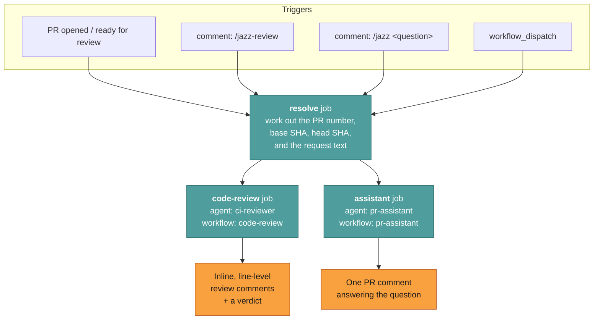
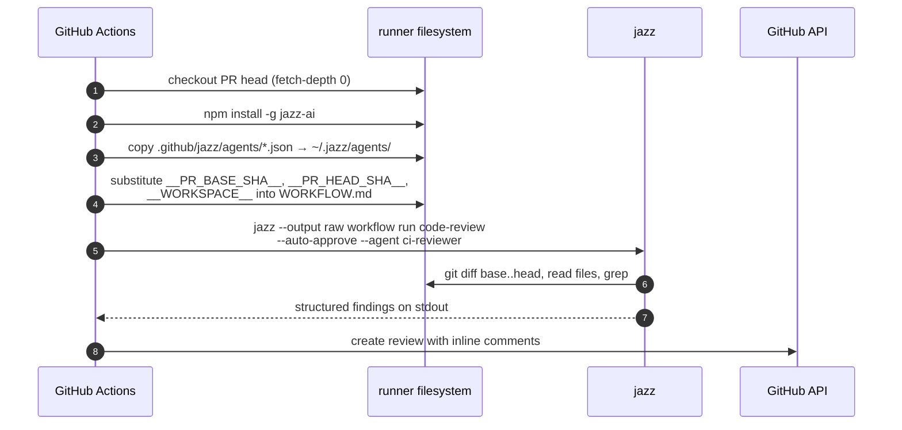

# CI/CD — Jazz in your pipeline

**Reader job:** get an agent reviewing your pull requests and writing your release notes.

Jazz reviews every pull request in this repository, and writes every release's notes. Not
as a demo — as the actual process. This page is how to get the same thing, and how to run
Jazz in any pipeline.

---

## What runs on this repo

Two jobs, three triggers, one workflow file:
[`.github/workflows/jazz.yml`](../../.github/workflows/jazz.yml).



- **`code-review`** runs automatically on non-draft PRs from the same repository, and on demand via `/jazz-review`. It posts **inline comments on specific lines**, not a wall of text at the bottom.
- **`assistant`** answers `/jazz <anything>` on a PR — "summarize this", "why does this work", "is this backwards compatible" — grounded in the real diff and the real code.
- **`resolve`** exists because the three triggers carry PR context in three different shapes. It normalizes them, and reacts 👀 to the triggering comment so you know it's alive.

Release notes work the same way: [`release.yml`](../../.github/workflows/release.yml) bumps
the version, tags it, then runs an agent over every commit since the last tag and creates
the GitHub Release with the result.

---

## Copy it into your repo

```bash
# from your repo root
cp -r path/to/jazz/.github/jazz .github/
cp path/to/jazz/.github/workflows/jazz.yml .github/workflows/
```

Then add **one** repo secret (Settings → Secrets and variables → Actions):

| Secret | When | Purpose |
| --- | --- | --- |
| `OPENROUTER_API_KEY` | if using OpenRouter (the default) | model access |
| `OPENAI_API_KEY` | if pointing the agents at OpenAI | model access |
| `GITHUB_TOKEN` | automatic | read PR context, post comments |

Open a PR, or comment `/jazz summarize this PR`.

Two files will want editing — the defaults are tuned for a TypeScript / Bun / Effect-TS
codebase:

- `.github/jazz/agents/ci-reviewer.json` — model, provider, toolset
- `.github/jazz/workflows/code-review/WORKFLOW.md` — what "a good review" means for *your* stack

Full setup and customization guide:
[`.github/jazz/README.md`](../../.github/jazz/README.md).

---

## How a CI run is wired

The workflow substitutes the PR's SHAs into a workflow template, then runs Jazz headless.



Two flags do the CI-specific work:

- `--output raw` — no ANSI colors, no TUI, no progress spinners. Log-friendly text.
- `--auto-approve` — apply the workflow's own `autoApprove:` policy instead of prompting. There is no human on a runner.

`fetch-depth: 0` matters: the agent needs real history to diff against the base.

---

## Any pipeline, not just GitHub

Nothing above is GitHub-specific except the API calls. The general shape:

```yaml
- run: npm install -g jazz-ai
- run: jazz --output raw workflow run my-review --auto-approve
  env:
    OPENAI_API_KEY: ${{ secrets.OPENAI_API_KEY }}
```

Or skip workflow files entirely and use [`jazz run`](./headless.md) with a dynamic prompt:

```bash
VERDICT=$(git diff origin/main...HEAD | jazz run --json --agent reviewer \
  --approval-policy read-only --timeout 600000)

echo "$VERDICT" | jq -r '.answer'
echo "cost: $(echo "$VERDICT" | jq -r '.costUSD')"

# fail the build on the agent's own verdict
echo "$VERDICT" | jq -e '.ok' > /dev/null || exit 1
```

Because the answer is on stdout and the noise is on stderr, this composes with `jq`,
`tee`, and every other pipeline tool you already use.

---

## Practical notes for unattended runs

| Concern | What to do |
| --- | --- |
| **Runaway cost** | Set `--max-iterations` and `--timeout`. The `--json` envelope reports `costUSD` per run — log it and alert on it. |
| **Fork PRs** | The `code-review` job deliberately only runs for PRs from the same repository. A fork PR can contain a prompt injection *and* a workflow change; don't hand it a provider secret. |
| **Prompt injection via the diff** | The diff is untrusted input. Keep the reviewer at the lowest policy that works — a reviewer needs to *read*, not to `git push`. |
| **Flaky provider** | Jazz retries transient LLM failures with capped exponential backoff (up to 10 attempts, 15-minute ceiling for the whole call), so a single 429 doesn't fail your build. |
| **Reproducibility** | Pin the model in the agent JSON. `latest` aliases move under you. |
| **Provider choice** | CI is where a cheap fast model usually wins. This is one field in the agent config. |

---

## Related

- [Headless](./headless.md) — the `jazz run` contract
- [Cookbook: CI PR reviewer](../cookbook/ci-pr-reviewer.md) — the full workflow file
- [Cookbook: release notes](../cookbook/release-notes-draft.md) — the release recipe
- [`.github/jazz/README.md`](../../.github/jazz/README.md) — setup guide
