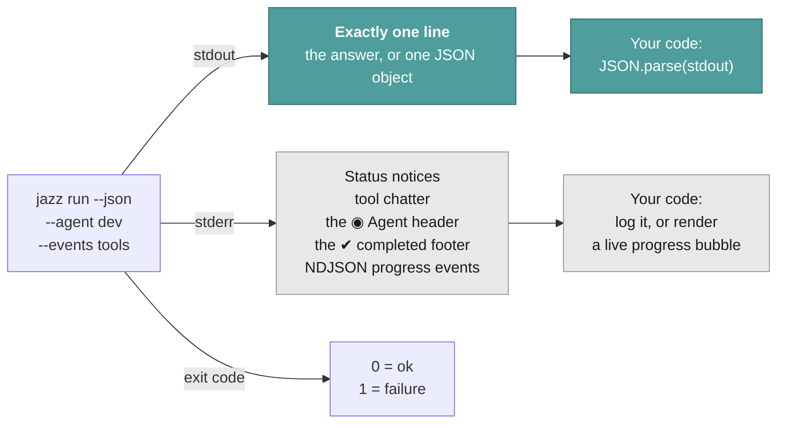
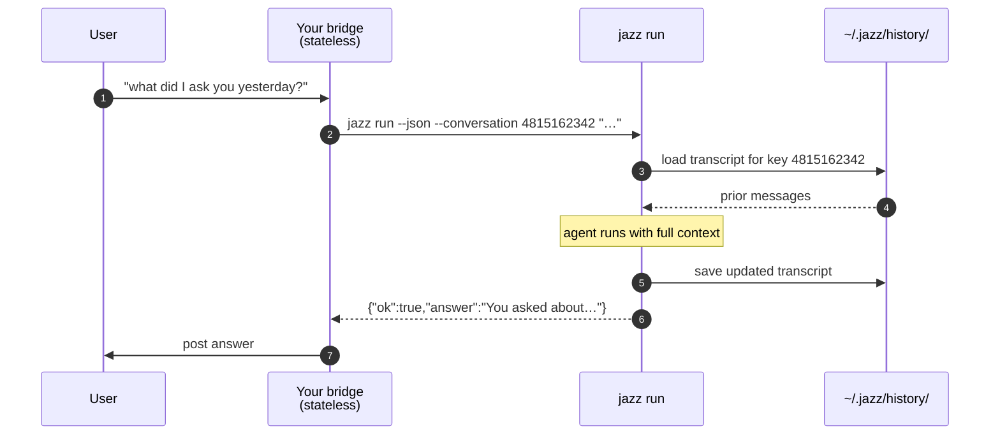

# Headless — the `jazz run` contract

How to call Jazz from your own code and get a parseable result back.

`jazz run` is the surface every non-terminal integration is built on. It takes a dynamic
prompt, runs exactly one agent turn, and prints a clean payload. It is the difference
between "a CLI you use" and "a runtime you build on".

```bash
jazz run --agent assistant "summarize the last 5 commits"
```

---

## The stream contract

This is the design decision that makes everything else possible:

> **stdout carries the payload. stderr carries everything else.**



No mode flags to remember, no log lines to filter out of your JSON, no Ink TUI writing
escape codes into your pipe (`jazz run` forces `JAZZ_NO_TUI=1` internally). You parse
stdout and you're done.

---

## Output modes

### Plain (default)

stdout is the answer as raw markdown, trimmed, with a trailing newline. Raw markdown is
deliberate — it's the easiest thing to translate downstream into Slack `mrkdwn`, Google
Chat formatting, or Telegram HTML.

```bash
$ jazz run --agent assistant "what is 2+2?"
4
```

On failure stdout is **empty** and the message goes to stderr, so `$(...)` capture never
silently yields an error string.

### JSON (`--json`)

stdout is exactly one single-line object. Always one line, always one object — on success
*and* on failure.

```jsonc
// success
{
  "ok": true,
  "answer": "4",
  "costUSD": 0.000182,
  "costKnown": true,
  "tokenUsage": { "promptTokens": 1204, "completionTokens": 6, "totalTokens": 1210 },
  "toolCalls": [{ "id": "call_1", "name": "read_file", "arguments": "{\"path\":\"…\"}" }]
}
```

```jsonc
// failure
{ "ok": false, "error": "Run exceeded the 300000ms timeout.", "costUSD": 0.0041 }
```

Note that the failure envelope still reports `costUSD` — a run that timed out still
spent money, and an unattended deployment needs to account for it.

Successful envelopes also include `costKnown`. When pricing metadata is unavailable,
`costUSD` remains `0` for compatibility and `costKnown` is `false`; consumers must not
interpret that fallback as a free run.

---

## Flags

| Flag                       | Purpose                                                                                                                                            |
| -------------------------- | -------------------------------------------------------------------------------------------------------------------------------------------------- |
| `--agent <id>`             | **Required.** Agent id or name.                                                                                                                    |
| `--json`                   | Emit the single-object envelope instead of raw text.                                                                                               |
| `--conversation <id>`      | Stable conversation key. Loads prior history before the run, saves the updated transcript after. Omit for a stateless one-shot.                    |
| `--approval-policy <p>`    | `read-only` \| `low-risk` \| `high-risk`. Tools above the tier are **declined**, not queued.                                                       |
| `--events <categories>`    | Emit NDJSON progress on stderr: `tools,reasoning,text,usage,approval,subagent,all`.                                                                |
| `--reasoning <effort>`     | `low` \| `medium` \| `high` \| `disable`. Overrides the agent's config for this run.                                                               |
| `--with-vision <p/m>`      | Bind the vision companion for this run, e.g. `anthropic/claude-sonnet-4-5`. Overrides the agent's config. Without a bound companion (flag or config), `analyze_media` fails loudly rather than guessing. |
| `--with-audio <p/m>`       | Same, for the audio companion.                                                                                                                     |
| `--with-video <p/m>`       | Same, for the video companion.                                                                                                                     |
| `--timeout <ms>`           | Abort the run after this many milliseconds.                                                                                                        |
| `--max-iterations <n>`     | Cap the agent's reasoning iterations (default 100).                                                                                                 |
| `--stream` / `--no-stream` | Force streaming on/off. Streaming auto-disables for non-TTY stdout; `--events reasoning`/`text` re-enable it on their own, since those events exist only on the streaming path. |

---

## Prompt input: argument or stdin

The prompt comes from the positional argument, or — when that's absent and stdin isn't a
TTY — from piped stdin.

```bash
jazz run --agent dev "review this diff"          # argument
git diff | jazz run --agent dev                  # stdin
echo "$UNTRUSTED_WEBHOOK_TEXT" | jazz run --agent bot   # stdin, preferred
```

**Use stdin for anything a stranger typed.** Webhook text is untrusted; piping it avoids
shell-escaping it into an argv, which is a whole class of injection bug you don't have to
think about. (It does not make the *content* trusted — see
[Security](../../SECURITY.md).)

---

## Memory without a database

`--conversation <id>` is the feature that makes stateless bridges practical. Pass any
stable key — a Telegram chat id, a Slack thread ts, a support ticket number — and Jazz
handles the transcript for you.



Your bridge stores **nothing**. Storage is LRU-bounded per agent (100 conversations), so
give each external chat its own key and let old ones age out.

Without `--conversation`, each invocation is a clean slate.

---

## Live progress with `--events`

For a chat bridge you usually want to show something before the final answer lands.
`--events` streams newline-delimited JSON on stderr while stdout stays pristine.

```bash
jazz run --json --stream --events tools,subagent --agent dev "audit this repo" \
  2> >(while read -r line; do render_progress "$line"; done)
```

| Category    | Event types emitted                                                              |
| ----------- | -------------------------------------------------------------------------------- |
| `tools`     | `tools_detected`, `tool_call`, `tool_execution_start`, `tool_execution_complete` |
| `reasoning` | `thinking_start`, `thinking_chunk`, `thinking_complete`                          |
| `text`      | `text_start`, `text_chunk`                                                       |
| `usage`     | `stream_start`, `usage_update`, `complete`                                       |
| `approval`  | `approval_required`, `approval_resolved`                                         |
| `subagent`  | `subagent_start`, `subagent_complete`                                            |
| `all`       | every category above                                                             |

`error` events are **always** included regardless of what you select, so a failure can
never be invisible on the live stream.

Streaming auto-disables when stdout is a pipe, which is every headless caller. Tool,
approval and subagent events survive that — the batch path routes them through the same
renderer — but `reasoning` and `text` deltas exist only on the streaming path. Asking for
either category therefore turns streaming back on for you; pass `--no-stream` if you would
rather keep the batch path and take tool events only.

---

## Asking the human something

An unattended run has nobody to ask, so by default the tools that solicit an answer —
`ask_user_question`, `ask_file_picker` — are **not offered to the model at all**. It never
sees them, so it cannot spend a round on a question that will not be answered, and cannot
mistake a blank for a reply and act on it. A run in CI or cron that stopped to ask
something would hang until its timeout for nobody's benefit.

Where a human *is* reachable, the tools come back. That is detected rather than declared
wherever it can be: **stdin being a terminal is enough on its own**, so running `jazz run`
by hand needs no flag — the question is printed and you answer by typing a line, either the
number of an option or something of your own.

```text
❓ Which database?
  1) Postgres — the default
  2) SQLite
Answer (number, or type your own; empty to skip):
```

A chat bridge is the case that cannot be detected: through a pipe it looks exactly like a
cron job. It declares itself with `--interactive-stdin`, and the question then becomes a
line on the event stream instead of a prompt:

```json
{"type":"user_input_required","requestId":"ui-1","question":"When is your appointment?",
 "suggestions":[{"value":"today","label":"Today"},{"value":"tomorrow","label":"Tomorrow"}],
 "allowCustom":true}
```

The run blocks until you write the answer back on **stdin**, exactly as approvals work:

```json
{"type":"user_input_response","requestId":"ui-1","response":"tomorrow"}
```

`response` should be one of the suggestions' `value` fields, though any string is accepted
when `allowCustom` is true. An empty response is treated as no answer: the tool reports
that it could not ask and the model is told to state an assumption or put the question in
its reply instead. Time spent waiting does not count against `--timeout`, so a human can
take as long as they like.

The question is never truncated, unlike other event payloads — a clipped option is one
nobody can meaningfully choose. Both shipped chat bridges pass this flag and render the
suggestions as buttons.

`CI=true` overrides the terminal check, since some runners allocate a pty and a job that
stops to ask something would wait out its timeout for nobody. An explicit
`--interactive-stdin` still wins there, for a bridge running inside a pipeline.

---

## Autonomy

Unattended runs have nobody to ask, so `--approval-policy` decides in advance. Tools
above the tier are **declined** — the agent gets a refusal it can reason about and route
around, rather than hanging forever on a prompt nobody will answer.

| Policy      | Auto-approves                                                  |
| ----------- | -------------------------------------------------------------- |
| *(omitted)* | Nothing. Every gated tool is declined.                         |
| `read-only` | Reading files, search, web requests, `git status`/`log`/`diff` |
| `low-risk`  | + `manage_todos`, `spawn_subagent`                             |
| `high-risk` | + file writes, shell commands, git commit and push             |

Omitting the policy really does grant nothing here. The interactive default auto-approves
read-only and low-risk tools, but that is a statement about prompts it is not worth showing
a person — with nobody to show, an absent policy falls back to declining everything. Shell
commands under `read-only` and `low-risk` are admitted per command by the
[classifier](../internals/tools-and-approval.md#command-classifier), which is what lets
`git log` through without also unlocking `git push`.

> ⚠️ **`low-risk` is narrower than it sounds.** In the built-in toolset it adds only
> `manage_todos`, `update_work_state`, and `spawn_subagent`. Email, calendar, and Obsidian are *skills* that shell
> out via `execute_command` (`unknown`), so a `low-risk` run cannot archive an email. Keep
> the tier low and allowlist the binary instead: `{"autoApprovedCommands": ["himalaya"]}` in
> `~/.jazz/config.json`. See [Tools reference](../reference/tools.md#what-is-not-a-built-in-tool).

Pick the lowest tier that lets the job finish. `high-risk` on a surface that accepts
input from strangers means a prompt injection can run shell commands on that host — see
[Security](../../SECURITY.md).

---

## One-shot run in a sandbox

CI, a review bot, any service that spins up one ephemeral container per job — these all want
the same guarantee: the agent can do whatever the task needs, but nothing it writes should
outlive the container, and it shouldn't be able to tamper with the config it was seeded with.
That's a security requirement, not a filesystem preference — a compromised or misbehaving task
shouldn't be able to plant a persona, poison the model config, or otherwise leave something
behind for the next run to pick up.

The natural-looking way to get there is a read-only root filesystem with a read-only bind mount
straight at `JAZZ_HOME`:

```bash
docker run --rm --read-only --tmpfs /tmp \
  -v /etc/myapp/jazz-config:/home/jazz/.jazz:ro \
  my-image jazz run --agent reviewer
```

This breaks. `JAZZ_HOME` isn't read-only config — jazz writes there too: custom personas
(`jazz persona create`), per-conversation work state and the compaction journal, cached model
metadata. A live read-only mount at that path fails those writes, and depending on what's
running, that shows up anywhere from a hard crash at startup (persona resolution falls through
to listing `~/.jazz/personas`, which tries to create the directory) to a silently-dropped
write nobody notices until task state that was supposed to survive compaction just isn't there.

**Stage the config somewhere else, and copy it into a genuinely writable `JAZZ_HOME` on
container start:**

```bash
docker run --rm --read-only --tmpfs /tmp --tmpfs /home/jazz/.jazz:rw,mode=1777 \
  -v /etc/myapp/jazz-config:/config/jazz:ro \
  my-image sh -c 'cp -r /config/jazz/. /home/jazz/.jazz/ && exec jazz run --agent reviewer'
```

The security guarantee this was after — the agent can't tamper with its own durable config, and
nothing it writes survives past the job — doesn't actually need a read-only permission bit on
`JAZZ_HOME` itself. It only needs whatever the agent writes to be discarded, which `--rm` (or
the container simply never being reused) already does. Copying the seed config into an ephemeral
tmpfs at startup gets you that guarantee while jazz still gets one ordinary, fully-writable home
directory — exactly like every other environment it runs in. The container's read-only root
filesystem is still doing real work here (nothing outside `/tmp` and the seeded tmpfs can be
touched at all); it's specifically a read-only `JAZZ_HOME` that's the wrong tool for isolating
this agent.

If you'd rather not do the copy in the container's own entrypoint, `JAZZ_HOME` also just
respects the environment variable of the same name, so a wrapper script or your own image's
entrypoint can do the copy into any writable location and point `JAZZ_HOME` there instead of
`~/.jazz`.

---

## A complete bridge

Everything above, in one function. This is genuinely the whole integration:

```ts
import { spawn } from "node:child_process";

interface JazzResult {
  ok: boolean;
  answer?: string;
  error?: string;
  costUSD: number;
  costKnown?: boolean;
}

export function askJazz(chatId: string, message: string): Promise<JazzResult> {
  return new Promise((resolve) => {
    const child = spawn("jazz", [
      "run",
      "--json",
      "--agent", "assistant",
      "--conversation", chatId,
      "--approval-policy", "low-risk",
      "--timeout", "300000",
    ]);

    let stdout = "";
    child.stdout.on("data", (chunk) => (stdout += chunk));
    child.stderr.on("data", (chunk) => console.error(chunk.toString()));

    child.stdin.write(message);
    child.stdin.end();

    child.on("close", () => {
      try {
        resolve(JSON.parse(stdout) as JazzResult);
      } catch {
        resolve({ ok: false, error: "jazz produced no JSON envelope", costUSD: 0 });
      }
    });
  });
}
```

Swap `spawn` for your platform's SDK around it and you have a bot. That's exactly what
the [Telegram](./chat-platforms.md) and [Discord](./chat-platforms.md) bridges do.

---

## Related

- [Chat platforms](./chat-platforms.md) — this contract, wired to a real transport
- [CI/CD](./ci-cd.md) — the same contract inside GitHub Actions
- [Tools & approval](../internals/tools-and-approval.md) — how risk tiers are decided
- [CLI Reference](../reference/cli.md) — every command and flag
