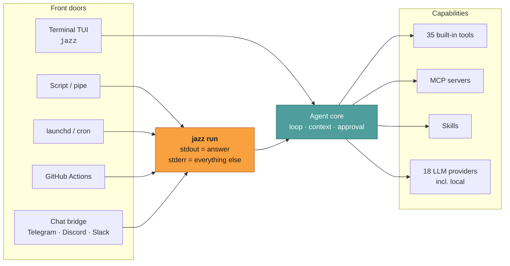
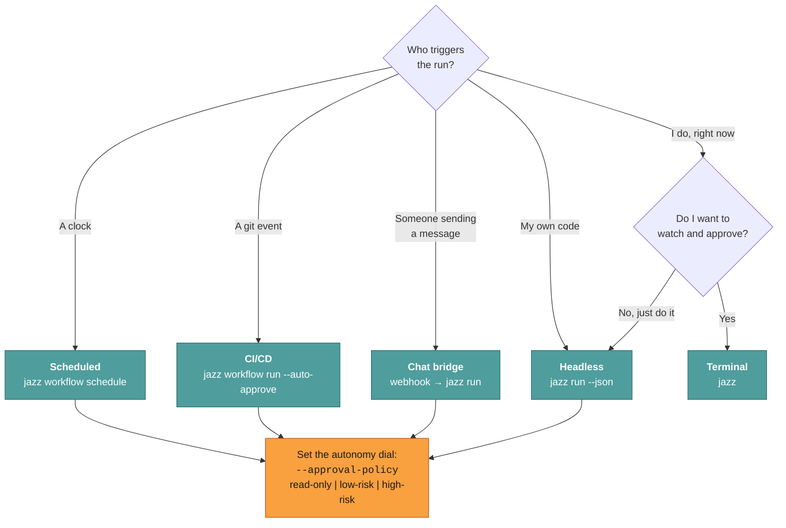

# Where it runs

This page helps you decide how Jazz fits into _your_ setup.

Most agent CLIs are one thing: a terminal REPL. Jazz is a runtime that happens to ship
with a terminal REPL. The same agent — same tools, same config, same memory — also runs
headless in a script, unattended on a schedule, inside a CI job, and behind a chat
webhook.

This section is the map. Start with the matrix, then read the page for the surface you
want.

---

## The surface matrix

| Surface                                                                              | Entry point                        | Human in the loop?             | Status                         |
| ------------------------------------------------------------------------------------ | ---------------------------------- | ------------------------------ | ------------------------------ |
| **[Terminal](../guide/quick-start.md)** — interactive TUI, streaming, slash commands | `jazz`                             | Yes, per tool call             | ✅ Shipped                     |
| **[Headless](./headless.md)** — one-shot, clean stdout, JSON envelope                | `jazz run`                         | Optional (`--approval-policy`) | ✅ Shipped                     |
| **[Scheduled](./scheduled.md)** — launchd / cron, with catch-up for missed slots     | `jazz workflow schedule`           | No                             | ✅ Shipped                     |
| **[CI/CD](./ci-cd.md)** — PR review with inline comments, `/jazz` PR assistant       | `jazz workflow run --auto-approve` | No                             | ✅ Shipped (used on this repo) |
| **[Chat platforms](./chat-platforms.md)** — Telegram, Discord                        | `docker compose up`                | No (policy-gated)              | ✅ Reference bridges           |
| **[Chat platforms](./chat-platforms.md)** — Slack, Google Chat, your own app         | your webhook → `jazz run`          | No (policy-gated)              | 🔧 Bring your own bridge       |

> **On "bring your own bridge":** no Slack/Google Chat adapter ships in this repo
> today. What ships is the contract they'd all use, and complete, deployed
> implementations of it for Telegram and Discord that you copy and re-point at a
> different transport. The transport-specific part is roughly 100 lines. See
> [Chat platforms](./chat-platforms.md).

---

## One primitive, many surfaces

The `! <command>` shell escape is intentionally a terminal-chat affordance. It is not parsed
as a command by `jazz run`, scheduled workflows, CI, or chat bridges; those surfaces must use
their configured approval and authorization policies.

Everything above is the same agent core reached through a different front door. Only two
of those doors are interactive; the rest all funnel through `jazz run`.



The orange box is the whole trick. `jazz run` writes **the answer to stdout and every
other byte to stderr**, so any transport that can spawn a subprocess and post a string
is a complete Jazz client:

```bash
jazz run --json --agent assistant --conversation "$CHAT_ID" "$USER_MESSAGE"
```

Read [Headless](./headless.md) for the full contract.

---

## Choosing a surface



Every non-interactive surface needs one decision: **how much autonomy**. That's a single
flag, and it means the same thing everywhere. See
[Tools & approval](../internals/tools-and-approval.md).

---

## What's shared across every surface

Because surfaces are front doors rather than forks, all of this is identical no matter
how the run started:

- **Agent definitions** — `~/.jazz/agents/*.json`. The Telegram bridge, the Discord bridge, your CI job, and your terminal can all run the _same_ agent, or different ones.
- **Tools, skills, and MCP servers** — one registry. A skill you add is available headless.
- **Approval model** — the same two-phase propose/execute path, with a policy dial instead of a prompt when unattended. There is no separate "unattended mode" to drift out of sync.
- **Conversation history** — `~/.jazz/history/`, keyed by conversation id. A bridge passes its chat id and gets memory for free.
- **Metrics and cost** — every run records tokens and USD to `~/.jazz/telemetry/`, locally.
- **Provider config** — `~/.jazz/config.json`. Switch the whole fleet to a local Ollama model by editing one file.

---

## Next

| Page                                             | What it answers                                                                   |
| ------------------------------------------------ | --------------------------------------------------------------------------------- |
| [Headless](./headless.md)                        | The `jazz run` contract: stdout/stderr, `--json`, memory, live events, exit codes |
| [Chat platforms](./chat-platforms.md)            | How to put an agent in Telegram, Discord, Slack, or your own app                  |
| [CI/CD](./ci-cd.md)                              | PR review, the `/jazz` assistant, release notes, generic CI                       |
| [Scheduled](./scheduled.md)                      | launchd/cron, catch-up, logs, unattended safety                                   |
| [Airgapped & self-hosted](../guide/airgapped.md) | Running the whole stack inside your own network                                   |
