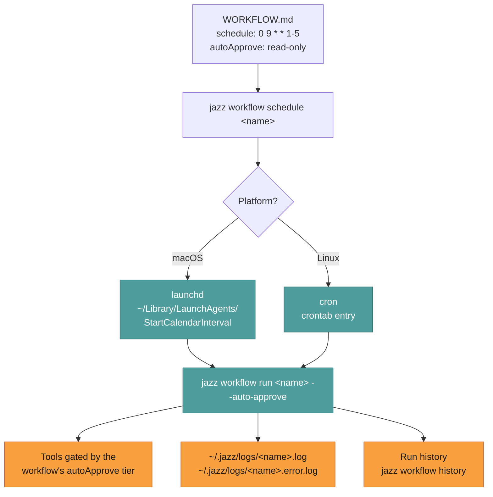

# Scheduled — unattended runs on a clock

How to have Jazz do something every morning without you being there.

A scheduled run is a [workflow](../concepts/workflows.md) handed to your OS scheduler.
Jazz writes the launchd plist or crontab entry for you; from then on the run happens with
no terminal, no TUI, and nobody to answer an approval prompt.

```bash
jazz workflow schedule daily-standup-prep
jazz workflow scheduled                    # confirm it's installed
jazz workflow history daily-standup-prep   # see what happened
```

---

## What actually gets installed



Two platform details worth knowing up front:

- **launchd doesn't do cron arithmetic.** `StartCalendarInterval` accepts plain integers and wildcards only — no step values (`*/15`), no ranges (`1-5`), no lists (`1,3,5`). Jazz expands what it can into multiple entries and rejects what it can't with an explicit error rather than silently scheduling the wrong thing.
- **Schedulers start with a minimal environment.** launchd jobs don't inherit your shell's `PATH`, so Jazz writes an explicit one into the plist. If a workflow shells out to a tool installed somewhere unusual, use an absolute path.

---

## The unattended shift

Scheduled runs differ from terminal runs in exactly one meaningful way: **nobody is there
to say yes.** The workflow's `autoApprove:` tier decides in advance, and anything above the
tier is declined rather than queued.

| `autoApprove` | Auto-approves                                 | Good for                                                                   |
| ------------- | --------------------------------------------- | -------------------------------------------------------------------------- |
| `false`       | Nothing                                       | Not useful when scheduled — the run will stall out on the first gated tool |
| `read-only`   | Reads, search, web, `git status`/`log`/`diff` | Digests, reports, watchdogs                                                |
| `low-risk`    | + `manage_todos`, `spawn_subagent`            | Digests that track state                                                   |
| `high-risk`   | + file writes, shell, git commit and push     | Anything that writes files, or any skill that shells out                   |

> ⚠️ **`low-risk` is narrower than it sounds.** In the built-in toolset it adds only
> `manage_todos`, `update_work_state`, and `spawn_subagent`. Email, calendar, and Obsidian are *skills* that shell
> out via `execute_command` (`unknown`), so a `low-risk` run cannot archive an email. Keep
> the tier low and allowlist the binary instead: `{"autoApprovedCommands": ["himalaya"]}` in
> `~/.jazz/config.json`. See [Tools reference](../reference/tools.md#what-is-not-a-built-in-tool).

Pick the lowest tier that lets the job finish. See
[Tools & approval](../internals/tools-and-approval.md) for how tiers are assigned.

---

## Missed runs and catch-up

Neither launchd nor cron fires a job whose slot passed while the machine was asleep. A 6 AM
workflow on a laptop that wakes at 9 simply doesn't run.

Jazz handles this explicitly rather than pretending otherwise:

```bash
jazz workflow catchup      # list what missed its slot, pick, run
```

Catch-up is age-bounded — by default a missed run older than 24 hours is not worth running
anymore, and per-workflow `maxCatchUpAge` overrides that. A "good morning" briefing at
4 PM is noise, not recovery.

If the schedule genuinely can't be missed, run Jazz somewhere always-on. Same commands,
different host: see [Airgapped & self-hosted](../guide/airgapped.md), and
[Scheduling: behavior & limitations](../concepts/scheduling.md) for the full treatment
including keep-awake options and always-on device setups.

---

## Debugging a scheduled run

```bash
jazz workflow scheduled                  # is it actually installed?
jazz workflow history <name>             # did it run? what did it do?
tail -f ~/.jazz/logs/<name>.log          # stdout
tail -f ~/.jazz/logs/<name>.error.log    # stderr
jazz workflow run <name> --auto-approve  # reproduce it by hand, same policy
```

That last command is the one to reach for first — it runs the identical code path the
scheduler uses, in your terminal, where you can see it.

Most scheduled-run failures are one of three things: the machine was asleep (see above), a
tool was declined by the policy tier, or a binary the workflow shells out to isn't on the
minimal `PATH`.

---

## Related

- [Workflows](../concepts/workflows.md) — the file format and frontmatter
- [Scheduling: behavior & limitations](../concepts/scheduling.md) — sleep, catch-up, always-on hosts
- [Cookbook](../cookbook/index.md) — seven scheduled recipes with install steps
- [Headless](./headless.md) — for dynamic prompts instead of a fixed workflow file
