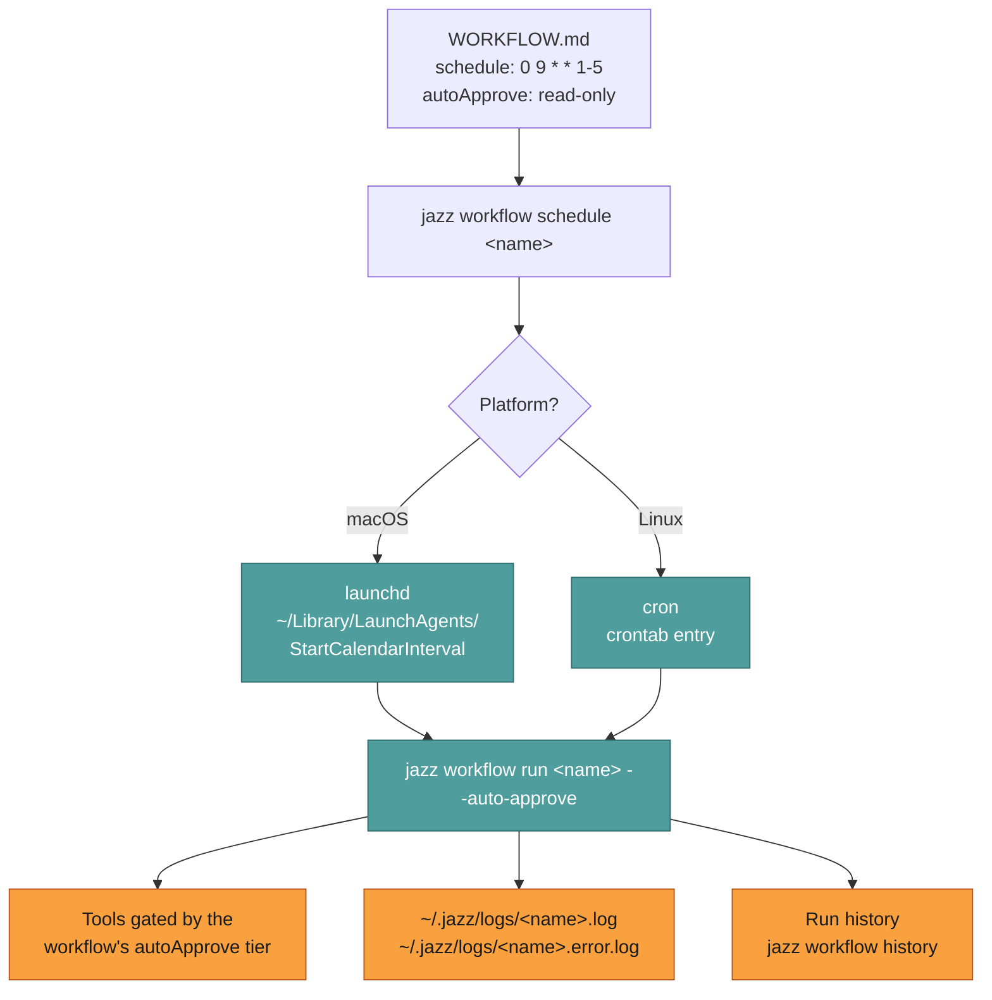

# Scheduled runs on a clock

How to have Jazz do something every morning without you being there.

For an always-on host without launchd or cron, switch to in-process mode and run `jazz daemon`.
The daemon then checks due schedules once per minute and runs each latest due slot once. This
mode is opt-in; launchd and cron remain the defaults on supported platforms.

```bash
jazz config set scheduler.mode in-process   # persists across restarts
# or, for a single run without touching config:
JAZZ_SCHEDULER=in-process jazz daemon
```

You can also flip this from **Scheduler** in `jazz config`. See
[Configuration → `scheduler`](../configure/jazz.md#scheduler) for both settings.

A scheduled run is a [workflow](../concepts/workflows.md) handed to your OS scheduler.
Jazz writes the launchd plist or crontab entry for you; from then on the run happens with
no terminal, no TUI, and nobody to answer an approval prompt.

```bash
jazz workflow schedule daily-standup-prep
jazz workflow scheduled                    # confirm it's installed
jazz workflow history daily-standup-prep   # see what happened
```

---

## What actually gets installed



Two platform details worth knowing up front:

- **launchd doesn't do cron arithmetic.** `StartCalendarInterval` accepts plain integers and wildcards only: no step values (`*/15`), no ranges (`1-5`), no lists (`1,3,5`). Jazz expands what it can into multiple entries and rejects what it can't with an explicit error rather than silently scheduling the wrong thing.
- **Schedulers start with a minimal environment.** launchd jobs don't inherit your shell's `PATH`, so Jazz writes an explicit one into the plist. If a workflow shells out to a tool installed somewhere unusual, use an absolute path.

---

## The unattended shift

Scheduled runs differ from terminal runs in exactly one meaningful way: **nobody is there
to say yes.** The workflow's `autoApprove:` tier decides in advance, and anything above the
tier is declined rather than queued.

| `autoApprove` | Auto-approves                                                     | Good for                                                 |
| ------------- | ----------------------------------------------------------------- | -------------------------------------------------------- |
| `false`       | Nothing                                                           | The agent receives a decline for every gated tool        |
| `read-only`   | Reads, search, web, `git status`/`log`/`diff`                     | Digests, reports, watchdogs                              |
| `low-risk`    | + work-state/todo writes, subagents, low-risk classified commands | Digests that track state                                 |
| `high-risk`   | + file writes, shell, git commit and push                         | Anything that writes files, or any skill that shells out |

> ⚠️ **`low-risk` is narrower than it sounds.** It includes durable work-state, memory,
> reminders, triggers, and subagents, but not arbitrary mutation. Email, calendar, and Obsidian are _skills_ that shell
> out via `execute_command` (`unknown`), so a `low-risk` run cannot archive an email. Keep
> the tier low and allowlist the binary instead: `{"autoApprovedCommands": ["himalaya"]}` in
> `~/.jazz/config.json`. See the [tool inventory](../tools/index.md#what-is-not-a-built-in-tool).

Pick the lowest tier that lets the job finish. See
[Tools & approval](../maintainers/tool-lifecycle.md) for how tiers are assigned.

---

## Sleep, missed runs, and catch-up

macOS and Linux behave differently here, and the difference decides whether you need catch-up
at all.

**launchd fires on wake.** Jazz installs a `StartCalendarInterval` job, and from
`man launchd.plist`: _"Unlike cron which skips job invocations when the computer is asleep,
launchd will start the job the next time the computer wakes up. If multiple intervals transpire
before the computer is woken, those events will be coalesced into one event upon wake from
sleep."_ A 6 AM workflow on a laptop you open at 9 runs at 9, once, even if it slept through
three days of slots. Powered off is different: nothing is scheduled to wake the machine, so the
slot passes.

**cron skips.** A slot that passes while a Linux box is asleep or off never runs. Standard cron
has no memory of missed jobs. `anacron` does, but it needs root and does not exist on macOS,
so Jazz does not build on it.

Either way, catch-up is explicit rather than automatic:

```bash
jazz workflow catchup      # list what missed its slot, pick, run
```

It is age-bounded: a missed run older than 24 hours is skipped, and per-workflow
`maxCatchUpAge` overrides that. A "good morning" briefing at 4 PM is noise, not recovery. The
separate `catchUpOnRestart` flag covers the in-process daemon, meaning a slot missed because the
daemon was stopped rather than because the machine was asleep.

### If the schedule really cannot be missed

In rough order of how much they cost you:

- **Pick a forgiving time.** Hourly, or 9 AM instead of 6 AM, gives the machine more chances to
  be awake. Cheapest fix, and usually enough.
- **Keep the machine awake** while a daemon runs: `caffeinate -i jazz daemon` on macOS,
  `systemd-inhibit --what=sleep jazz daemon` on Linux.
- **Wake it on purpose.** macOS can schedule a wake or power-on:
  `sudo pmset repeat wakeorpoweron MTWRFSU 05:55:00` for a 6 AM job.
- **Run it somewhere always on**, such as a home server, a VPS, or a Raspberry Pi. Same commands,
  different host, and the one answer that actually holds for a schedule with consequences.

---

## Debugging a scheduled run

```bash
jazz workflow scheduled                  # is it actually installed?
jazz workflow history <name>             # did it run? what did it do?
tail -f ~/.jazz/logs/<name>.log          # stdout
tail -f ~/.jazz/logs/<name>.error.log    # stderr
jazz workflow run <name> --auto-approve  # reproduce it by hand, same policy
```

That last command is the one to reach for first. It runs the identical code path the scheduler
uses, in your terminal, where you can see it.

Most scheduled-run failures are one of three things: the machine was asleep (see above), a
tool was declined by the policy tier, or a binary the workflow shells out to isn't on the
minimal `PATH`.

---

## Related

- [Workflows](../concepts/workflows.md): the file format and frontmatter
- [Automation](../features/automation.md): the other unattended shapes, and when to pick which
- [Guides](../guides/index.md): scheduled recipes with install steps
- [Headless](./headless.md): for dynamic prompts instead of a fixed workflow file
