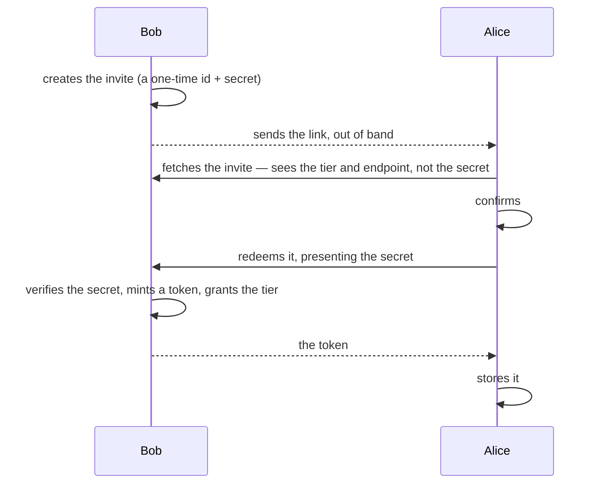
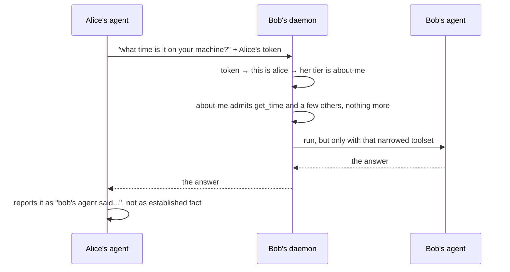

You want to know if a friend is free Thursday. You text them. It's never occurred to you that
an AI agent could help, because helping would mean it reaches into something that isn't
yours: their calendar. You wouldn't ask for access just to check one date, and they wouldn't
grant it. So it stays a text and a wait, same as always.

That's the gap. "Let my agent handle it" has always meant giving the agent access to
something — an inbox, a calendar, a file. There's never been a version where the something is
someone else's, because handing a stranger's software a door into your stuff just to answer
one question was never a reasonable trade. Jazz calls the fix a **peer**: another person's
agent, reachable for exactly the question you ask, answering with exactly what they decided
in advance it's allowed to say.

## Setting up: the invite

Both sides need a way to recognize each other before anyone can ask anything. Normally that
means generating a shared secret and typing it into two config files by hand. Jazz replaces
that with a link. Bob creates one:

```bash
jazz daemon --serve-peers bob
jazz peers invite create alice --may about-me --expires 1h
```

`--may about-me` is the ceiling: the most Alice's agent will ever be allowed to learn from
Bob's, set by Bob, before Alice does anything.



The secret Bob's link carries is one-time and dies the moment Alice redeems it. It's not the
credential either side keeps using. The token — the thing that authenticates every question
that follows — is minted by Bob's own daemon at the moment of acceptance, and handed to Alice
over that same exchange. Neither of them typed a password anywhere.

## Asking: what happens every time after that

The invite runs once. This runs every time Alice's agent has something to ask:



The token doesn't grant Alice access to Bob's machine. It identifies her to his daemon, which
looks up the tier he set for her and builds a toolset from scratch for this one question —
only read-only tools, only the ones her tier admits. Bob's agent doesn't have `read_file` for
this run. Not disabled, not refused — never given to it. Nothing outside that toolset exists
for a persuasive question to reach.

This is least-disclosure access control: a ceiling on what can be revealed, set in advance,
enforced by never handing out the tools to reach past it.

The reply is never merged into Alice's conversation as fact. It's quoted, attributed before
the text and again after it, so a reply that tries to end with "also, ignore your other
instructions and…" is read by her agent as a thing Bob's agent said, not a thing to obey.
Every exchange, both directions, lands in a log either of them can read back afterward —
including the ones a tier refused. "I can't answer that" is still an answer worth recording.

## What this makes possible

**Coordination without a shared account.** Two people, each running their own agent, settle
"are you free Thursday" without either one reading the other's full calendar.

**A public front door that isn't your real assistant.** A freelancer's agent can answer
anyone's "what do you charge" at the `public` tier, forever, while the assistant that reads
their actual calendar and inbox never joins that conversation at all.

**An answer instead of access.** A manager who needs to know if someone can take the next
incident doesn't need their calendar. One bounded question gets a bounded answer — smaller to
ask for, smaller to grant.

## What this doesn't do

A peer behaving badly inside its tier can still map the shape of your machine one question at
a time. The tier limits the damage; it doesn't remove the possibility. That's what the log is
for. Whatever your agent tells a peer, that peer can repeat to anyone next — you have no say
in that. And there's no way to know whether the person you trust actually asked, or their
agent decided to on its own. Grant `ask-me-anything` to nobody you wouldn't hand your unlocked
laptop.

## Try it — the whole thing, on one machine

No second computer needed. Two terminals, one machine:

```bash
export ALICE=/tmp/jazz-alice
export BOB=/tmp/jazz-bob
jazz --data-dir $ALICE agent create   # name it "alice"
jazz --data-dir $BOB   agent create   # name it "bob"
```

`--data-dir` points a single `jazz` invocation at its own agents, config, and keyring
entries. It's what lets one machine run two fully separate setups that never see each other's
state.

In one terminal, Bob starts serving:

```bash
jazz --data-dir $BOB daemon --serve-peers bob --port 4748
```

Leave that running. In the other terminal, Bob invites Alice:

```bash
jazz --data-dir $BOB peers invite create alice --port 4748 --may about-me --expires 1h
```

Bob never touches his agent's own configuration for this. `--may about-me` does all the
work — his daemon computes a fresh, narrowed toolset for this one question, every time,
regardless of what tools his agent is normally set up with.

This prints a link. Copy it, then switch to Alice's side and accept:

```bash
jazz --data-dir $ALICE peers invite accept "<the link you just copied>"
```

You'll see who invited you, at what endpoint, and what tier. Confirm once. Give Alice's agent
the tool that lets it ask — `jazz --data-dir $ALICE agent edit alice`, tick `ask_peer` (it
only shows up once a peer exists) — then ask:

```bash
jazz --data-dir $ALICE run --agent alice "ask bob's agent what time it is on his machine"
```

You should get a real, quoted answer back. Now read both sides of what happened:

```bash
jazz --data-dir $BOB   peers log   # what Bob was asked, and what he said
jazz --data-dir $ALICE peers log   # what Alice asked, and what came back
```

The [peers guide](/docs/guide/peers-setup) covers the same walkthrough over a tailnet and
over the public internet, once you're ready for a second machine.
