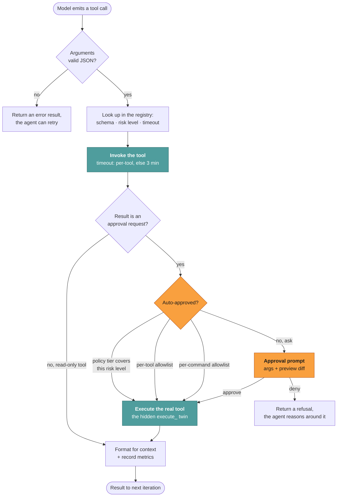
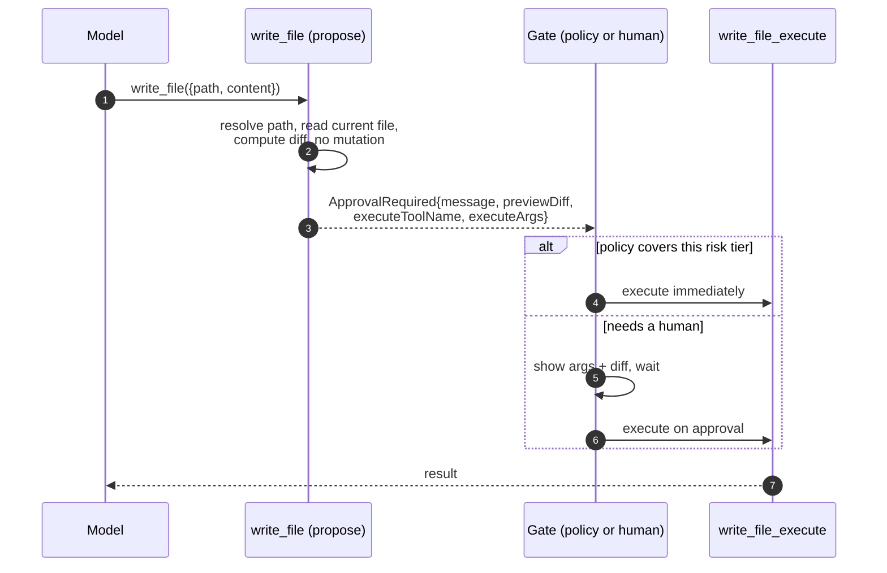
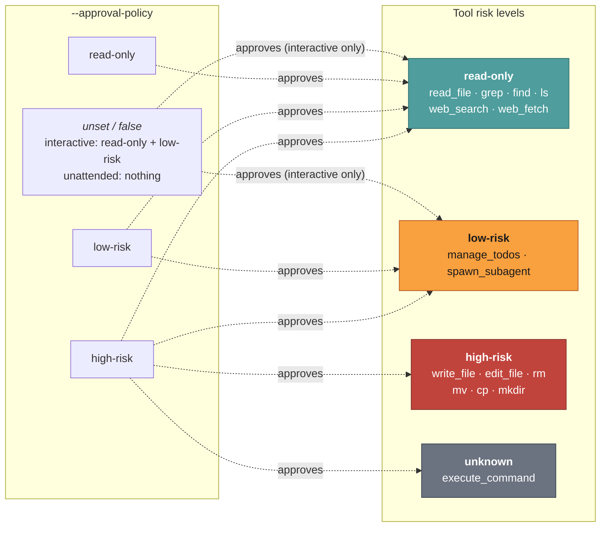

Most agents that can write files do it by letting the model emit a tool call and
then running it. The safety story is "we'll ask you before the dangerous ones."
That story has a hole you only notice after the fact: to show you a useful preview
of what a write *will* do, something has to read the target file and compute the
diff. If the tool that shows you the preview is the same tool that performs the
write, then "preview" and "do it" are the same action with a question mark in
front of it.

Jazz closes that hole structurally. A gated tool is two tools. One the model can
see and call; it does real work and returns a description of what it would do, but
mutates nothing. The other is invisible to the model and performs the mutation.
Between them sits a gate. This post walks the whole mechanism, from the registry
split to the command classifier that decides what runs unattended.

## The split, at the source

Every gated built-in registers as a pair. From `register-tools.ts`:

```ts
const writeTools = fs.write();
yield* registerTool(writeTools.approval);   // "write_file"  - visible to the model
yield* registerTool(writeTools.execute);    // "write_file_execute" - hidden

const editTools = fs.edit();
yield* registerTool(editTools.approval);
yield* registerTool(editTools.execute);
// ... mkdir, rm, mv, cp, and execute_command too
```

The model only ever sees the `approval` half: `write_file`, `edit_file`, `rm`.
The `execute` twins exist in the registry, but the model cannot name them, so it
cannot call them. The approve step returns an `ApprovalRequired` result carrying
the preview plus the name of the twin and its exact arguments; the gate is what
invokes the twin.

That separation is the whole trick. The propose step has to do work to be useful,
resolving the path, reading the current file, computing the diff. Because it is a
different tool from the one that writes, doing that work costs nothing: it cannot
write. "Here is the exact diff, approve?" is only possible because the thing that
computed the diff is not the thing that applies it.

## One lifecycle, two gates

Here is a single tool call from emit to result. The only branch is *who* answers
the gate: a human at a terminal, or a policy set in advance. The path is otherwise
identical.



The diagram is the same one in the
[tools and approval reference](/docs/internals/tools-and-approval), reproduced here
because it is the spine of the whole design.

## Why a pair, not a flag

The alternative is a `dangerous: true` attribute on one tool, and the gate decides
whether to run it. That fails at the one moment it matters: the moment you want to
show the user a preview. You cannot show "here is the diff" without reading the
file and computing the diff, which means the same code that previews also has the
file open and ready. Splitting into two tools means the preview tool's contract is
"return a description," and the only thing that can breach the filesystem is a tool
the model literally cannot address.

The sequence makes the boundary explicit:



## The gate is one dial, not two systems

Risk tiers are declared on every tool. One policy decides what runs without a human:



The policy is read through a getter, not captured once, so a mid-run change takes
effect immediately. That is how Shift+Tab mode switching works in the TUI, and why
a tool queued behind another can pick up a policy that changed while it waited.

## The hardest case: a shell command

`execute_command` is declared `unknown`, because the command decides its own blast
radius. Jazz cannot classify it from a static tier, so it asks the cheap harness
model whether this particular command is `read-only`, `low-risk`, or `high-risk`,
and the tier then applies to the verdict as it would to any declared level. So
`--approval-policy read-only` runs `git log` unattended without also unlocking `rm`,
and an interactive session skips the prompt for a listing but still asks about a
push.

The classifier is deliberately narrow about what it may read: the command, always,
plus the last five user requests (capped at 800 characters) when the session is
interactive, so an ambiguous command can be lowered only when the person at the
keyboard asked for that milder action. Assistant turns are never included, because
the agent proposing the command also wrote those turns, so quoting them back would
let a model that has been talked into something by a web page supply its own
corroborating evidence. On a bridge or a headless run there is no conversation at
all, so the classifier skips and the absent policy approves nothing.

Fail closed: timeouts, provider errors, empty replies, and anything other than the
exact token `read-only` or `low-risk` stay `high-risk`. A clearly mutating command
stays `high-risk` regardless of context.

## Why this is the moat, not a checkbox

The property that makes the whole thing worth building: interactive and unattended
runs go down the *same* path. The only difference is who answers the gate. There is
no separate headless mode that can drift out of sync with the interactive one, no
second code path where a write "just happens" because nobody was there to ask. The
agent you trust to run while you sleep is the same agent, gated the same way, that
you watch in the terminal. That is the part most agent runtimes quietly get wrong,
and it is the part Jazz treats as the actual product.

The companion piece, [the harness is the product](/blog/the-harness-is-the-product),
tours the rest of that product. The full mechanism, with the concurrency and
shell-defenses sections, is in
[tools and approval](/docs/internals/tools-and-approval).
