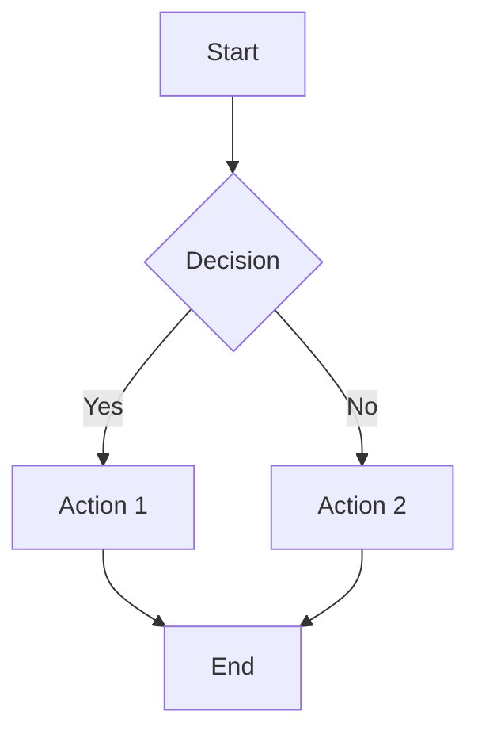

# Obsidian CLI

Use `obsidian-cli` (Yakitrak) to manage notes and vaults. There is no native canvas subcommand, but you can create `.canvas` files by writing JSON Canvas to the vault and opening them.

## When to Use

- User asks about Obsidian CLI usage or automation
- User wants to open/search/create/move/delete notes in a vault
- User wants to view or edit YAML frontmatter
- User asks for canvases or `.canvas` files

## Quick Start

1. **Set default vault** (optional but convenient):
   - `obsidian-cli set-default "VaultName"`
   - `obsidian-cli print-default`
2. **Common note operations**:
   - `obsidian-cli open "Note.md"`
   - `obsidian-cli search`
   - `obsidian-cli search-content "term"`
   - `obsidian-cli create "New Note.md" --content "Hello"`
   - `obsidian-cli move "Old.md" "New.md"`
   - `obsidian-cli delete "Old.md"`
   - `obsidian-cli print "Note.md"`
3. **Frontmatter**:
   - `obsidian-cli fm "Note.md" --print`
   - `obsidian-cli fm "Note.md" --edit --key "status" --value "done"`

## Obsidian's Full Power: Rich Markdown Features

Obsidian supports advanced markdown features. **Use these liberally** to create beautiful, rich notes!

### LaTeX Math

Use LaTeX for mathematical expressions:

**Inline math**: `$E = mc^2$` renders as $E = mc^2$

**Block math**: 
```
$$
\int_{-\infty}^{\infty} e^{-x^2} dx = \sqrt{\pi}
$$
```

**Examples**:
- Equations: `$\frac{dy}{dx} = 2x$`
- Matrices: `$\begin{bmatrix} a & b \\ c & d \end{bmatrix}$`
- Complex: `$$\sum_{n=1}^{\infty} \frac{1}{n^2} = \frac{\pi^2}{6}$$`

### Images and Media

**Local images**: `![[image.png]]` or ``

**Remote images**: ``

**Sized images**: `![[image.png|300]]` or ``

**When creating rich notes, fetch relevant images online**:
```markdown
# Machine Learning Overview


The architecture consists of...
```

### Callouts (Colored Blocks)

Create beautiful, colored callouts for emphasis:

```markdown
> [!note]
> This is a blue note callout

> [!tip]
> This is a green tip callout

> [!warning]
> This is an orange warning callout

> [!danger]
> This is a red danger callout

> [!info]
> This is a light blue info callout

> [!success]
> This is a green success callout

> [!question]
> This is a yellow question callout

> [!example]
> This is a purple example callout

> [!quote]
> This is a gray quote callout
```

**Foldable callouts**: Add `-` or `+` to make them collapsible:
```markdown
> [!note]- Click to expand
> Hidden content here
```

### Advanced Markdown

**Highlights**: `==highlighted text==`

**Comments**: `%% This is a comment, won't render %%`

**Footnotes**: `Text with footnote[^1]` and `[^1]: Footnote content`

**Tables**:
```markdown
| Column 1 | Column 2 | Column 3 |
| -------- | -------- | -------- |
| Data 1   | Data 2   | Data 3   |
```

**Task lists**:
```markdown
- [ ] Incomplete task
- [x] Complete task
- [>] Forwarded task
- [<] Scheduled task
```

**Embeds**: `![[Other Note]]` embeds another note inline

**Links**: `[[Internal Link]]` or `[External](https://example.com)`

**Tags**: `#tag` or `#nested/tag`

### Code Blocks with Syntax Highlighting

````markdown
```python
def hello():
    print("Hello, World!")
```

```typescript
const greet = (): void => {
  console.log("Hello!");
};
```
````

### Mermaid Diagrams




## Editor Mode

Some commands support `--editor` (uses `$EDITOR`, defaults to `vim`) for terminal editing instead of opening the app. Use for quick edits:

- `obsidian-cli search --editor`
- `obsidian-cli search-content "term" --editor`
- `obsidian-cli create "Note.md" --open --editor`
- `obsidian-cli move "Old.md" "New.md" --open --editor`

## Canvas Power: Visual Thinking with Colors

There is no built-in `create canvas` command. Create a `.canvas` file with JSON content, then open it in Obsidian. **Use colors liberally to organize ideas visually!**

### Canvas Node Colors

Obsidian supports 6 colors for canvas nodes:
- **`"1"`**: Red (for critical/urgent)
- **`"2"`**: Orange (for warnings/important)
- **`"3"`**: Yellow (for ideas/notes)
- **`"4"`**: Green (for completed/success)
- **`"5"`**: Blue (for information/process)
- **`"6"`**: Purple (for creative/special)

### Text Nodes with Colors and Markdown

Text nodes support **full markdown** including LaTeX, callouts, images, etc.

```bash
cat > "Project Vision.canvas" << 'EOF'
{
  "nodes": [
    {
      "id": "vision",
      "type": "text",
      "text": "# Project Vision\n\n> [!tip] Core Goal\n> Build the best automation platform\n\n$$\nSuccess = Quality \\times Speed\n$$",
      "x": 0,
      "y": 0,
      "width": 400,
      "height": 300,
      "color": "5"
    },
    {
      "id": "milestone",
      "type": "text",
      "text": "## Milestone 1\n\n- [x] Research\n- [x] Design\n- [ ] Implementation",
      "x": 500,
      "y": 0,
      "width": 300,
      "height": 250,
      "color": "4"
    },
    {
      "id": "blocker",
      "type": "text",
      "text": "> [!danger] Blocker\n> Need API access",
      "x": 900,
      "y": 0,
      "width": 300,
      "height": 150,
      "color": "1"
    }
  ],
  "edges": [
    {
      "id": "e1",
      "fromNode": "vision",
      "toNode": "milestone",
      "color": "5",
      "label": "implements"
    },
    {
      "id": "e2",
      "fromNode": "milestone",
      "toNode": "blocker",
      "color": "1",
      "label": "blocked by"
    }
  ]
}
EOF
obsidian-cli open "Project Vision.canvas"
```

### File Nodes (Link to Notes)

Reference existing notes in your vault:

```bash
cat > "Knowledge Map.canvas" << 'EOF'
{
  "nodes": [
    {
      "id": "overview",
      "type": "file",
      "file": "Overview.md",
      "x": 0,
      "y": 0,
      "width": 400,
      "height": 300,
      "color": "3"
    },
    {
      "id": "details",
      "type": "file",
      "file": "Technical Details.md",
      "x": 500,
      "y": 0,
      "width": 400,
      "height": 300,
      "color": "5"
    }
  ],
  "edges": [
    {
      "id": "link",
      "fromNode": "overview",
      "toNode": "details"
    }
  ]
}
EOF
obsidian-cli open "Knowledge Map.canvas"
```

### Link/URL Nodes

Embed web content:

```bash
cat > "Resources.canvas" << 'EOF'
{
  "nodes": [
    {
      "id": "docs",
      "type": "link",
      "url": "https://obsidian.md/",
      "x": 0,
      "y": 0,
      "width": 400,
      "height": 300,
      "color": "5"
    }
  ]
}
EOF
obsidian-cli open "Resources.canvas"
```

### Canvas with Images

Text nodes can contain image embeds:

```bash
cat > "Visual Guide.canvas" << 'EOF'
{
  "nodes": [
    {
      "id": "diagram",
      "type": "text",
      "text": "# Architecture\n\n\n\nThe system consists of...",
      "x": 0,
      "y": 0,
      "width": 500,
      "height": 400,
      "color": "5"
    }
  ]
}
EOF
obsidian-cli open "Visual Guide.canvas"
```

### Styled Edges

Edges can have colors and labels:

```json
{
  "edges": [
    {
      "id": "edge1",
      "fromNode": "node1",
      "toNode": "node2",
      "color": "1",
      "label": "depends on",
      "fromSide": "right",
      "toSide": "left"
    }
  ]
}
```

**Edge sides**: `"top"`, `"right"`, `"bottom"`, `"left"`

## Real-World Examples: Combining Features

### Example 1: Rich Technical Note with Everything

```bash
obsidian-cli create "Machine Learning Guide.md" --content "$(cat << 'EOF'
---
tags: [ml, ai, tutorial]
status: in-progress
created: 2026-02-03
---

# Machine Learning Guide

> [!tip] Learning Path
> This guide covers fundamental ML concepts with visual examples.

## Neural Networks


A neural network consists of layers of interconnected nodes. The mathematical model:

$$
y = f\left(\sum_{i=1}^{n} w_i x_i + b\right)
$$

Where:
- $w_i$ = weights
- $x_i$ = inputs
- $b$ = bias
- $f$ = activation function

> [!warning] Common Pitfall
> Don't forget to normalize your input data!

## Training Process

\`\`\`mermaid
graph LR
    A[Input Data] --> B[Forward Pass]
    B --> C[Calculate Loss]
    C --> D[Backpropagation]
    D --> E[Update Weights]
    E --> B
\`\`\`

## Key Metrics

| Metric    | Formula                 | Use Case                 |
| --------- | ----------------------- | ------------------------ |
| Accuracy  | $\frac{TP + TN}{Total}$ | Classification           |
| Precision | $\frac{TP}{TP + FP}$    | Minimize false positives |
| Recall    | $\frac{TP}{TP + FN}$    | Minimize false negatives |

## Implementation

\`\`\`python
import numpy as np

def sigmoid(x):
    return 1 / (1 + np.exp(-x))

# Simple neuron
weights = np.array([0.5, -0.2, 0.1])
inputs = np.array([1.0, 2.0, 3.0])
bias = 0.5

output = sigmoid(np.dot(weights, inputs) + bias)
\`\`\`

> [!success] Next Steps
> - [ ] Implement full network
> - [ ] Train on dataset
> - [ ] Evaluate performance

==Key Takeaway==: Neural networks learn through iterative weight updates based on error feedback.

## Resources

- [[Deep Learning Fundamentals]]
- [[Optimization Algorithms]]
- [[Model Evaluation]]

#ml/neural-networks #tutorial
EOF
)"
```

### Example 2: Project Planning Canvas with Colors

```bash
# First create the project notes
obsidian-cli create "Phase 1.md" --content "# Phase 1: Research\n\n- [x] Market analysis\n- [x] Competitor research"
obsidian-cli create "Phase 2.md" --content "# Phase 2: Development\n\n- [ ] Backend API\n- [ ] Frontend UI"
obsidian-cli create "Phase 3.md" --content "# Phase 3: Launch\n\n- [ ] Beta testing\n- [ ] Production deploy"

# Create colored canvas
cat > "Project Roadmap.canvas" << 'EOF'
{
  "nodes": [
    {
      "id": "vision",
      "type": "text",
      "text": "# 🚀 Product Vision\n\n> [!tip] Goal\n> Build the best automation platform\n\n## Success Criteria\n- 1000+ users\n- <100ms response time\n- 99.9% uptime",
      "x": -400,
      "y": 0,
      "width": 350,
      "height": 300,
      "color": "6"
    },
    {
      "id": "phase1",
      "type": "file",
      "file": "Phase 1.md",
      "x": 0,
      "y": -100,
      "width": 300,
      "height": 250,
      "color": "4"
    },
    {
      "id": "phase2",
      "type": "file",
      "file": "Phase 2.md",
      "x": 350,
      "y": -100,
      "width": 300,
      "height": 250,
      "color": "3"
    },
    {
      "id": "phase3",
      "type": "file",
      "file": "Phase 3.md",
      "x": 700,
      "y": -100,
      "width": 300,
      "height": 250,
      "color": "5"
    },
    {
      "id": "risk",
      "type": "text",
      "text": "> [!danger] Risks\n> - API rate limits\n> - Scalability concerns\n> - Security vulnerabilities",
      "x": 350,
      "y": 200,
      "width": 300,
      "height": 200,
      "color": "1"
    },
    {
      "id": "metrics",
      "type": "text",
      "text": "## 📊 Key Metrics\n\n| KPI | Target | Current |\n|-----|--------|--------|\n| Users | 1000 | 0 |\n| MRR | $10k | $0 |\n| NPS | 50+ | - |",
      "x": 0,
      "y": 200,
      "width": 300,
      "height": 200,
      "color": "2"
    }
  ],
  "edges": [
    {
      "id": "e1",
      "fromNode": "vision",
      "toNode": "phase1",
      "color": "6",
      "label": "starts with"
    },
    {
      "id": "e2",
      "fromNode": "phase1",
      "toNode": "phase2",
      "color": "4",
      "label": "then"
    },
    {
      "id": "e3",
      "fromNode": "phase2",
      "toNode": "phase3",
      "color": "3",
      "label": "then"
    },
    {
      "id": "e4",
      "fromNode": "phase2",
      "toNode": "risk",
      "color": "1",
      "label": "faces"
    }
  ]
}
EOF

obsidian-cli open "Project Roadmap.canvas"
```

### Example 3: Research Note with Images and LaTeX

```bash
obsidian-cli create "Quantum Computing.md" --content "$(cat << 'EOF'
# Quantum Computing Basics


> [!info] Quantum Superposition
> Unlike classical bits, qubits can exist in multiple states simultaneously.

## Mathematical Foundation

The state of a qubit is represented as:

$$
|\psi\rangle = \alpha|0\rangle + \beta|1\rangle
$$

where $|\alpha|^2 + |\beta|^2 = 1$

## Quantum Gates

\`\`\`mermaid
graph LR
    A[|0⟩] -->|H| B[Superposition]
    B -->|CNOT| C[Entanglement]
    C -->|Measure| D[Classical Output]
\`\`\`

### Hadamard Gate

$$
H = \frac{1}{\sqrt{2}}\begin{bmatrix} 1 & 1 \\ 1 & -1 \end{bmatrix}
$$

> [!example] Application
> Creates equal superposition: $H|0\rangle = \frac{1}{\sqrt{2}}(|0\rangle + |1\rangle)$

## Quantum Algorithms

| Algorithm | Speedup           | Use Case  |
| --------- | ----------------- | --------- |
| Shor's    | Exponential       | Factoring |
| Grover's  | Quadratic         | Search    |
| VQE       | Problem-dependent | Chemistry |

==Key Insight==: Quantum computers leverage superposition and entanglement for exponential speedups on specific problems.
EOF
)"
```

## Best Practices: Use Obsidian to Its Full Potential

**🎨 Always create rich, beautiful notes:**
- Use **callouts** for emphasis and organization
- Add **LaTeX** for any mathematical concepts
- Include **images** (fetch from web when relevant)
- Use **colors** in canvases to categorize and organize
- Add **Mermaid diagrams** for workflows and processes
- Use **highlights** `==text==` for important points
- Structure with **headers**, **lists**, and **tables**

**🖼️ Image Best Practices:**
- When creating educational/technical content, **fetch relevant images** from reputable sources
- Use Wikipedia Commons, official documentation, or public domain sources
- Always include descriptive alt text
- Consider sizing: `` for width control
- For diagrams, consider creating Mermaid diagrams instead

**🎨 Canvas Design Principles:**
- Use **colors** to group related concepts (blue for processes, green for completed, red for blockers)
- Add **labels** to edges to show relationships
- Position nodes logically (left-to-right for processes, top-to-bottom for hierarchies)
- Use **text nodes** with markdown for rich context
- Mix **file nodes** (link to notes) and **text nodes** (inline content)

**📝 Content Creation Strategy:**
When users ask for notes/documentation:
1. **Structure**: Use headers, callouts, and lists
2. **Visual**: Add relevant images, diagrams, or LaTeX
3. **Rich formatting**: Use highlights, bold, italics, tables
4. **Links**: Connect to related notes
5. **Metadata**: Add frontmatter (tags, dates, status)

## Technical Constraints

- All file paths are relative to the vault root (unless you provide absolute paths)
- Use quotes around file names with spaces
- `.canvas` files are plain JSON; Obsidian will detect them automatically
- Prefer `print-default --path-only` when you need the vault path for scripts
- Text nodes in canvas support full markdown syntax
- Canvas colors are strings: "1" through "6"
- Images can be local `![[image.png]]` or remote ``
