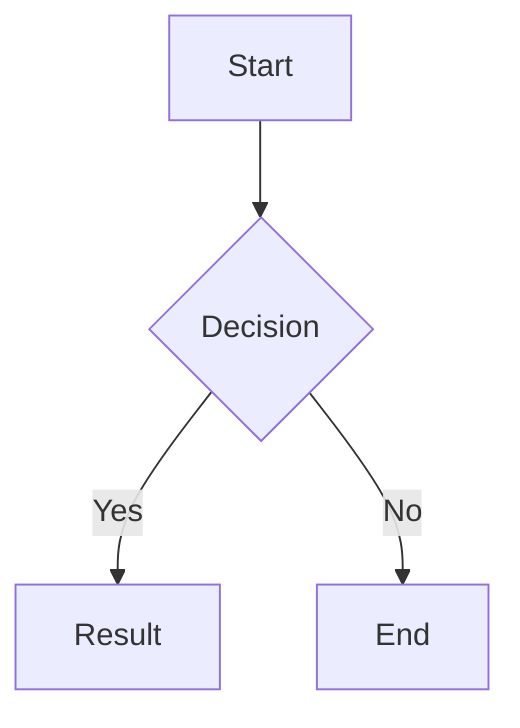

# Obsidian Rich Markdown Reference

Obsidian extends standard Markdown with several powerful features.

## Callouts
```markdown
> [!type] Title
> Content
```
Types: `note`, `tip`, `info`, `todo`, `question`, `success`, `warning`, `failure`, `danger`, `bug`, `example`, `quote`.
Add `+` or `-` after the type (e.g., `[!note]-`) to make it collapsible.

## LaTeX Math
- Inline: `$E=mc^2$`
- Block:
  ```
  $$
  \frac{-b \pm \sqrt{b^2-4ac}}{2a}
  $$
  ```
MathJax is also supported

## Mermaid Diagrams


## Internal Links & Embeds
- Link: `[[Note Name]]` or `[[Note Name|Alias]]`
- Embed: `![[Note Name]]` (renders the content of the note inline)
- Image: `![[image.png|300]]` (300px wide)

## Advanced Formatting
- Highlight: `==text==`
- Comment: `%% comment %%`
- Footnote: `[^1]` and `[^1]: content`
- Task List: `- [ ]`, `- [x]`, `- [/]` (half done), `- [>]` (deferred)
